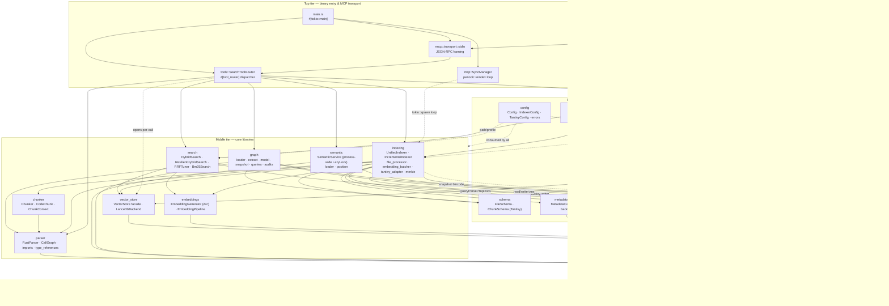

# file-search-mcp — Architecture

## Overview

`file-search-mcp` (crate `rust-code-mcp-final`) is a single-crate Rust Model Context Protocol server that indexes and analyzes Rust codebases on demand. It combines Tantivy BM25 keyword search, LanceDB dense-vector search (with locally-loaded `fastembed` ONNX embeddings), `ra_ap_*` rust-analyzer crates for syntax/HIR-driven analysis, and a heed/LMDB-backed persisted hypergraph snapshot to expose ~50 MCP tools over JSON-RPC stdio. A single binary boots a Tokio runtime, spawns a periodic background `SyncManager` for incremental reindexing, and serves the rmcp tool router until the client disconnects.

## System diagram



## Module overview table

| Module | Type | Purpose | Key entry points |
| --- | --- | --- | --- |
| `main.rs` | bin | Tokio entrypoint; boots tracing-to-stderr, builds shared `SyncManager`, spawns periodic sync, serves rmcp over stdio. | `main()` (`#[tokio::main]`) |
| `lib.rs` | lib | Crate-root manifest; declares every subsystem with `#![warn(unreachable_pub, dead_code)]`. | `pub mod` declarations only |
| `bin/test_tools_direct.rs` | bin | Standalone smoke-test that drives `RustParser`/IO against a sibling project, bypassing MCP. | `main()` |
| `schema` | util | Tantivy schemas for file-level and symbol-aware chunk documents. | `FileSchema`, `ChunkSchema` |
| `metadata_cache` | util | sled-backed persistent file metadata + content-hash cache for incremental indexing. | `MetadataCache`, `FileStat`, `FileMetadata` |
| `config` | lib | Default + env-overridden `Config`, derived paths, indexer/Tantivy size-tier profiles, error/retry helpers. | `Config::from_env`, `IndexerConfig::for_codebase_size`, `ErrorContextExt` |
| `security` | lib | Glob-based sensitive-path filter + regex-based secrets scanner. | `SensitiveFileFilter::should_index`, `SecretsScanner::scan` |
| `parser` | lib | `ra_ap_syntax`-driven AST extraction: symbols, call graph, imports, type refs. | `RustParser::parse_source_complete`, `CallGraph::build_from_ast`, `extract_imports_from_ast` |
| `chunker` | lib | Per-symbol chunking with module/import/call context and overlap windows. | `Chunker::chunk_file`, `CodeChunk::format_for_embedding` |
| `embeddings` | lib | `fastembed` AllMiniLML6V2 inference (CUDA + CPU), sync/async, batched, single mutex around the model. | `EmbeddingGenerator::{embed, embed_async, embed_batch}`, `EmbeddingPipeline::process_chunks` |
| `vector_store` | lib | LanceDB-backed dense-vector store with cosine search and merge-insert upserts behind a `VectorStoreBackend` trait. | `VectorStore::{upsert_chunks, search, delete_chunks, clear_collection}` |
| `indexing` | lib | Top-level ingestion pipeline: walk → parse → chunk → embed → Tantivy + LanceDB; Merkle change detection, error categorization, consistency check. | `UnifiedIndexer::index_directory_parallel`, `IncrementalIndexer::index_with_change_detection`, `ConsistencyChecker::check` |
| `search` | lib | BM25 (Tantivy) + dense vector hybrid search fused via Reciprocal Rank Fusion; resilient fallback wrapper; offline RRF k tuner. | `HybridSearch::search`, `ResilientHybridSearch::search`, `Bm25Search`, `RRFTuner::tune_k` |
| `semantic` | lib | Process-wide rust-analyzer `AnalysisHost`+`Vfs` cache for `goto_definition`, `find_all_refs`, symbol search. | `SEMANTIC` (`LazyLock<Mutex<SemanticService>>`), `SemanticService::get_or_load`, `position::goto_definition` |
| `graph` | lib | HIR-driven extraction → in-memory `ExtractionModel` → heed/LMDB snapshot → query/audit layer (unsafe, channel, derive, docs, fn-body, recursion). | `graph::build_and_persist`, `OpenedSnapshot::*` queries, `unsafe_audit`, `fn_body_audit`, `recursion_check` |
| `mcp` | lib | Background `SyncManager` actor: tracked-directory set behind `Arc<RwLock>`, periodic + on-demand incremental reindex. | `SyncManager::with_defaults`, `run`, `track_directory`, `sync_now` |
| `tools` | lib | rmcp `ToolRouter` shell with ~50 MCP tools spanning search, indexing, analysis, hypergraph, audits, health, cache control. | `SearchToolRouter`, `ProjectPaths::from_directory`, `query_tools::search`, `index_tool::index_codebase`, `graph_tools::*` |
| `metrics` | lib | Pure indexing observability: counters, latency samples, phase timers, memory monitor; one `tracing::info!` summary. | `IndexingMetrics::log_summary`, `PhaseTimer`, `MemoryMonitor` |
| `monitoring` | lib | Concurrent BM25/vector/Merkle health probe + on-disk versioned Merkle snapshot rotation. | `HealthMonitor::check_health`, `BackupManager::{create_backup, restore_latest}` |

## Data flow

### Indexing flow (file → chunker → embeddings → Tantivy + LanceDB)

```
Workspace dir
   │
   ▼
WalkDir(.rs)  ─►  FileSystemMerkle (SHA-256 leaves, bincode snapshot under XDG)
   │                    │
   │                    ▼
   │            ChangeSet{added, modified, deleted}
   ▼
SensitiveFileFilter ─►  MetadataCache.has_stat_changed ─►  read source ─►  SecretsScanner
   │                                                                            │
   ▼                                                                            ▼
RustParser::parse_source_complete ───►  ParseResult{symbols, imports, calls, types}
   │
   ▼
Chunker::chunk_file ────────────────►  Vec<CodeChunk>  (per-symbol + overlap)
   │
   ▼
EmbeddingBatcher.calculate_safe_batch_size  (MemoryMonitor + gpu_batch_size)
   │
   ▼  format_for_embedding  ▼
EmbeddingGenerator::embed_batch  (fastembed AllMiniLML6V2, CUDA→CPU fallback,
                                  Arc<Mutex<TextEmbedding>>, tokio spawn_blocking)
   │
   ├──────────────►  TantivyAdapter.index_chunks ─►  IndexWriter ─►  Tantivy dir
   │                                                                  (commit per batch)
   └──────────────►  VectorStore.upsert_chunks    ─►  LanceDbBackend.merge_insert ─►  LanceDB dir
                                                                  (atomic per batch)
   ▼
MetadataCache.update_file_metadata (sled)   +   IndexingMetrics.log_summary (tracing)
```

Parallelism: Phase 1 (parse/chunk) runs across the Rayon global pool from `index_directory_parallel`; Phase 2 (embed/Tantivy/LanceDB) runs single-threaded on the coordinator task. Memory above 85% triggers a 5 s `tokio::time::sleep` cool-down.

### Search flow (MCP query → tools → search → Tantivy + LanceDB → ranked results)

```
MCP client (stdio JSON-RPC)
   │
   ▼
rmcp transport ─► SearchToolRouter::search (Parameters<SearchParams>)
   │
   ▼
ProjectPaths::from_directory (SHA-256 dir hash → cache/tantivy/vector paths)
   │
   ▼
query_tools::search ─► Bm25Search::new (open or rebuild via UnifiedIndexer.ensure_indexed)
   │                                              │
   │                                              └─► clean_stale_index, reindex, reopen
   ▼
HybridSearch::search_with_k(query, limit)
   │
   ├── tokio::join! ──┐
   │                  │
   │   Vector arm:    │   BM25 arm (spawn_blocking):
   │   EmbeddingGenerator::embed_async(query) ─► VectorStore.search (LanceDB cosine)
   │                                              QueryParser over content/symbol_name/docstring
   │                                              ─► TopDocs::with_limit(candidate_count)
   │                                              ─► hydrate chunk_json to (ChunkId, score, CodeChunk)
   ▼
reciprocal_rank_fusion_core (vector_weight/(k+rank+1) + bm25_weight/(k+rank+1))
   │
   ▼
Vec<SearchResult>{chunk, bm25_score, vector_score, ranks}
   │
   ▼
SyncManager::track_directory(dir) (live-watch registration)
   │
   ▼
CallToolResult::success(Content::text(...)) ─► JSON-RPC response on stdout
```

`ResilientHybridSearch` overlays the same fan-out with `Arc`-shared backends and an `AtomicBool` fallback flag: if both backends fail the call falls back to BM25-only, then vector-only, before erroring.

### Graph / audit flow (project → loader → hypergraph → queries/audits)

```
Workspace dir
   │
   ▼
graph::loader::load(workspace) ─► ra_ap_load_cargo ─► RootDatabase + Vfs ─► filter_local_crates
   │
   ▼
graph::extract::extract()  (sequential pipeline)
   │
   ├─► bindings (DefMap walk → def_to_node + Binding rows)
   ├─► impls    (Method/AssocConst/AssocType/EnumVariant)
   ├─► attributes (Semantics walk → docs + #[attrs])
   ├─► signatures (FunctionSignature, hir_trim)
   ├─► statics    (StaticMetadata)
   └─► usages     (Definition::usages → Usage rows + UsageCategory)
   │
   ▼
ExtractionModel (in-memory)
   │
   ▼
graph::storage::compute_fingerprint  (workspace hash)
   │     ┌── matches existing snapshot? ──► open_current (no HIR work)
   ▼     │
graph::snapshot::build_and_persist
   │
   ▼
heed::Env  (typed sub-DBs: nodes, bindings, contains, usages, signatures, statics, meta)
   │
   ▼  publish_current → atomic CURRENT pointer swap
   │
   ▼
OpenedSnapshot::{lookup_by_qualified_name, imports_of, who_calls, calls_from, call_graph,
                 dead_pub_in_crate, crate_edges, overlaps, module_tree, workspace_stats, ...}
   │
   ├── snapshot-only audits: derive_audit, docs_audit, recursion_check, mut_static_audit
   └── AST-driven audits (re-load LoadedWorkspace, use ast_resolve for turbofish-safe calls):
       unsafe_audit, channel_capacity_audit, fn_body_audit
   │
   ▼
graph_tools enrich rows (file/span, qualified labels) ─► json_result ─► CallToolResult
```

### Semantic flow (file:line → ra_ap_ide → definition / references)

```
MCP request: find_definition(project, file, line, column)
   │
   ▼
SEMANTIC.lock() (LazyLock<Mutex<SemanticService>>, process-wide)
   │
   ▼
SemanticService.get_or_load(canonicalized project_path)
   │      ┌── HashMap hit? ──► reuse (AnalysisHost, Vfs)
   ▼      │
loader::load_project (CargoConfig{no_deps:true} + LoadCargoConfig{prefill_caches,
                       num_cpus::physical workers}) ─► ra_ap_load_cargo::load_workspace_at
   │
   ▼
position::goto_definition / find_references / symbol_search / find_references_by_name
   │
   ├── path_to_file_id  (Path::canonicalize → VfsPath → FileId)
   ├── to_offset        (LineIndex: 1-based line/col → TextSize)
   ▼
host.analysis() snapshot ─► Analysis::{goto_definition, find_all_refs, symbol_search}
   │
   ▼
nav_target_to_location (FileId → PathBuf, focus_range → 1-based line/col, name)
   │
   ▼
Vec<Location> (sorted, dedup_by neighbours for find_references_by_name)
```

## On-disk layout

### Source tree (`src/`)

```
src/
├── lib.rs                         # crate manifest
├── main.rs                        # Tokio + rmcp stdio entrypoint
├── schema.rs                      # FileSchema + ChunkSchema
├── metadata_cache.rs              # sled-backed MetadataCache
├── bin/
│   └── test_tools_direct.rs       # smoke-test binary
├── chunker/                       # Chunker / CodeChunk / ChunkId
├── config/
│   ├── mod.rs                     # Config, default_data_dir, env overrides
│   ├── errors.rs                  # ErrorContextExt, is_retryable, ErrorMessage
│   └── indexer.rs                 # IndexerConfig / TantivyConfig size tiers
├── embeddings/
│   ├── mod.rs                     # EmbeddingGenerator, EmbeddingPipeline
│   └── error.rs                   # EmbeddingError
├── graph/                         # loader, extract, bindings, impls, attributes,
│                                  # signatures, statics, usages, model, ids,
│                                  # hir_trim, ast_resolve, snapshot, storage,
│                                  # queries, unsafe_audit, channel_audit,
│                                  # derive_audit, docs_audit, fn_body_audit,
│                                  # recursion_check
├── indexing/                      # unified, incremental, indexer_core,
│                                  # file_processor, embedding_batcher, merkle,
│                                  # tantivy_adapter, consistency, retry,
│                                  # error / errors
├── mcp/
│   ├── mod.rs                     # re-exports
│   └── sync.rs                    # SyncManager (Arc<RwLock<HashSet<PathBuf>>>)
├── metrics/
│   ├── mod.rs                     # IndexingMetrics, PhaseTimer
│   └── memory.rs                  # MemoryMonitor (sysinfo)
├── monitoring/
│   ├── mod.rs                     # re-exports
│   ├── health.rs                  # HealthMonitor + ComponentHealth
│   └── backup.rs                  # BackupManager (versioned Merkle snapshots)
├── parser/
│   ├── mod.rs                     # RustParser facade
│   ├── call_graph.rs              # CallGraph
│   ├── imports.rs                 # use-tree flattening
│   └── type_references.rs         # TypeReference + context
├── search/
│   ├── mod.rs                     # HybridSearch, VectorSearch, RRF core
│   ├── bm25.rs                    # Bm25Search (Tantivy)
│   ├── resilient.rs               # ResilientHybridSearch
│   ├── error.rs                   # SearchError
│   └── rrf_tuner.rs               # offline k tuning
├── security/
│   ├── mod.rs                     # SensitiveFileFilter (glob)
│   └── secrets.rs                 # SecretsScanner (regex)
├── semantic/
│   ├── mod.rs                     # SEMANTIC LazyLock<Mutex<SemanticService>>
│   ├── loader.rs                  # ra_ap_load_cargo bootstrap
│   └── position.rs                # path/line→FileId/TextSize, query verbs
├── tools/                         # search_tool_router (rmcp #[tool_router]),
│                                  # search_tool (Param structs), project_paths,
│                                  # indexing_tools, health_tool, clear_cache_tool,
│                                  # index_tool, query_tools, analysis_tools,
│                                  # graph_tools
└── vector_store/
    ├── mod.rs                     # VectorStore facade, VectorStoreConfig
    ├── traits.rs                  # VectorStoreBackend trait
    ├── lancedb.rs                 # LanceDbBackend
    └── error.rs                   # VectorStoreError
```

### Persisted state (XDG / project data dir)

Resolved via `directories::ProjectDirs("dev", "rust-code-mcp", "search")`, falling back to `./data` (or `.rust-code-mcp/`) when unavailable. Each tracked workspace gets its own subtree keyed by a SHA-256 hash of the canonical workspace dir (`ProjectPaths::dir_hash`):

```
<XDG-data>/                                  # e.g. ~/.local/share/rust-code-mcp/search
├── tantivy/<dir_hash>/                      # BM25 segments + meta.json (per workspace)
├── cache/<dir_hash>/                        # sled MetadataCache (stat + content hash)
├── vectors/<dir_hash>/                      # LanceDB dir; table 'vectors',
│                                            # BTree indices on id / file_path / symbol_kind
├── <sha16>.snapshot                         # bincode FileSystemMerkle snapshot (per workspace)
└── graph/                                   # heed/LMDB hypergraph (graph::storage)
    ├── <workspace_hash>/
    │   ├── snapshots/<graph_id>/            # one LMDB env per build
    │   │   ├── data.mdb / lock.mdb          # heed Env (typed sub-DBs:
    │   │   │                                #   nodes, bindings, contains,
    │   │   │                                #   usages, signatures, statics, meta)
    │   │   └── manifest.json                # fingerprint + snapshot metadata
    │   └── CURRENT                          # atomic pointer to active graph_id
```

`MerkleSnapshot` files are written directly; `BackupManager` rotates timestamped copies (`merkle_v{ver}.{unix_ts}.snapshot`) under a configured `backup_dir` with retention-count-based pruning.

## Concurrency model

- **Tokio runtime.** `#[tokio::main]` installs the default multi-thread runtime. Two long-lived futures coexist: the rmcp service (`ServiceExt::serve(stdio())`) and a `tokio::spawn`ed `SyncManager::run` loop. The process exits when stdin closes or the service errors out; the spawned sync task has no graceful-shutdown handshake.
- **MCP transport.** rmcp framing uses newline-delimited JSON-RPC over stdin/stdout. Stdout is reserved for protocol frames, so all logging is pinned to stderr via `tracing_subscriber::fmt` with ANSI disabled. Every `*Params` struct deserializes via `Parameters<T>` and dispatches through the `#[tool_router]` macro on `SearchToolRouter`.
- **Shared state.**
  - `Arc<SyncManager>` is the single shared handle between the MCP handlers and the periodic background loop.
  - `tracked_dirs: Arc<tokio::sync::RwLock<HashSet<PathBuf>>>` inside `SyncManager` — async-aware reads/writes; each tick takes a read snapshot.
  - `SEMANTIC: LazyLock<Mutex<SemanticService>>` — process-wide singleton; coarse-grained — every semantic verb serializes through one mutex (because `AnalysisHost` is `!Sync`).
  - `EmbeddingGenerator.model: Arc<Mutex<TextEmbedding>>` — single ONNX session serialized across all sync/async/batch paths.
  - `ResilientHybridSearch` keeps `Arc<Bm25Search>`, `Arc<VectorStore>`, `Arc<EmbeddingGenerator>` plus an `Arc<AtomicBool>` fallback flag (relaxed ordering, informational only).
  - `MemoryMonitor` lives behind `Arc<Mutex<...>>` inside `EmbeddingBatcher`.
  - `ErrorCollector: Arc<Mutex<Vec<ErrorDetail>>>` is shared across Rayon workers in the parse/chunk phase.
  - LMDB read concurrency: `OpenedSnapshot::*` opens fresh `read_txn`s per query; heed MVCC lets readers and a single writer (snapshot publish) coexist.
- **Blocking pools.**
  - **Rayon global pool.** `UnifiedIndexer::index_directory_parallel` Phase 1 uses `par_iter().filter_map(...)` to parse + chunk files; each task constructs its own `RustParser` to keep tree-sitter / `ra_ap_syntax` state thread-local.
  - **`tokio::task::spawn_blocking`.** Used for (a) `Bm25Search::search` inside the search fan-out, (b) `EmbeddingGenerator::embed_async` / `embed_batch_async` to drive ONNX inference off the runtime, (c) `graph::build_and_persist` from `graph_tools::build_hypergraph`.
  - **Tantivy internal threads.** `IndexWriter` is opened with `writer_with_num_threads(num_threads, num_threads * memory_budget_mb * MiB)`; Tantivy spawns merge threads internally.
  - **rust-analyzer load.** `LoadCargoConfig` is given `num_cpus::get_physical()` worker threads with `prefill_caches=true` for ~120 ms cold loads.
- **Channels.** None. Coordination is exclusively `tokio::join!` fan-out (search, health), `Arc<RwLock>` snapshots (sync), or shared `Arc<Mutex>` (model/cache/sync state). The periodic sync loop is timer-driven by `tokio::time::interval`.
- **Error isolation.** Per-file failures funnel into typed `IndexingError` variants and are categorized (`Permanent` / `Transient`) by keyword match in `categorize_error`. The sync loop catches per-directory errors and continues. Stale-index recovery in `query_tools::search` is non-fatal: clean and reindex transparently in the same call.
- **Drop semantics.** `TantivyAdapter::drop` rolls back the writer to release the lockfile; `UnifiedIndexer::drop` delegates to that. `OpenedSnapshot` readers pin the previous `graph_id` until they close, so a writer building a new snapshot never invalidates in-flight reads.
- **Determinism.** Outside of `ChunkId` UUIDv4 generation and HashMap iteration order in fusion, all extraction, ranking, and audit pipelines are deterministic over their inputs.

## Links

Per-module architecture documents:

- [chunker](architecture/chunker.md)
- [config](architecture/config.md)
- [embeddings](architecture/embeddings.md)
- [graph](architecture/graph.md)
- [indexing](architecture/indexing.md)
- [mcp](architecture/mcp.md)
- [metrics](architecture/metrics.md)
- [monitoring](architecture/monitoring.md)
- [parser](architecture/parser.md)
- [root (lib.rs / main.rs / schema / metadata_cache)](architecture/root.md)
- [search](architecture/search.md)
- [security](architecture/security.md)
- [semantic](architecture/semantic.md)
- [tools](architecture/tools.md)
- [vector_store](architecture/vector_store.md)
