# file-search-mcp — Architecture

## Overview

`file-search-mcp` (crate `rust-code-mcp-final`) is a single-crate Rust Model Context Protocol server (built on the `rmcp` SDK) that exposes 50+ tools for code search, on-demand indexing, and rust-analyzer-driven HIR analysis of Rust workspaces. It runs as a stdio JSON-RPC server, indexes source trees with Tantivy BM25 + locally-loaded `fastembed` dense embeddings stored in LanceDB, and builds a content-addressed, heed/LMDB-backed persisted **hypergraph snapshot** of every workspace it touches. Cross-crate queries (imports/exports, call graph, dead-pub, overlaps, module tree, workspace stats, re-export chains) and audit passes (unsafe, mut-static, derive, missing-docs, channel-capacity, fn-body, recursion) read exclusively from that snapshot, while the rename, find_definition, and find_references tools route through a process-wide `AnalysisHost` cache.

## System diagram

```mermaid
graph TD
    subgraph TIER_TOP["Top tier — entry & MCP transport"]
        TBIN["bin/test_tools_direct.rs<br/>standalone smoke test"]
        MAIN["main.rs<br/>#[tokio::main]<br/>tracing → stderr"]
        STDIO["rmcp::transport::stdio<br/>JSON-RPC framing"]
        ROUTER["tools::SearchToolRouter<br/>#[tool_router] dispatcher<br/>50+ tools"]
        SYNCMGR["mcp::SyncManager<br/>periodic reindex loop"]
    end

    subgraph TIER_MID["Middle tier — tool fan-out"]
        QUERY["query_tools<br/>search · read_file_content<br/>get_similar_code"]
        ANALYSIS["analysis_tools<br/>find_definition · find_references<br/>rename_symbol · get_dependencies<br/>get_call_graph · analyze_complexity"]
        GRAPHT["graph_tools<br/>build_hypergraph · imports/exports<br/>who_calls/calls_from/call_graph<br/>dead_pub · overlaps · module_tree<br/>workspace_stats · audits · codemap"]
        INDEXT["index_tool · indexing_tools<br/>incremental + force reindex"]
        CACHET["clear_cache_tool<br/>(include_hypergraph)"]
        HEALTHT["health_tool"]
    end

    subgraph TIER_FOUND["Foundation tier — engines"]
        INDEXING["indexing<br/>UnifiedIndexer · IncrementalIndexer<br/>file_processor · embedding_batcher<br/>tantivy_adapter · merkle"]
        SEARCH["search<br/>HybridSearch · ResilientHybridSearch<br/>Bm25Search · RRFTuner"]
        GRAPH["graph<br/>loader · extract · model · snapshot<br/>queries · codemap · audits<br/>(channel/derive/docs/fn_body/recursion/unsafe)"]
        SEMANTIC["semantic<br/>SEMANTIC LazyLock<Mutex><br/>loader · position · rename"]
        PARSER["parser<br/>RustParser · CallGraph<br/>imports · type_references"]
        EMBED["embeddings<br/>EmbeddingGenerator (Arc<Mutex>)<br/>EmbeddingPipeline"]
        VSTORE["vector_store<br/>VectorStore facade<br/>LanceDbBackend"]
        CHUNKER["chunker<br/>Chunker · CodeChunk · ChunkContext"]
        MCPMOD["mcp/<br/>SyncManager (Arc<RwLock>)"]
        CONFIG["config<br/>Config · IndexerConfig<br/>TantivyConfig · errors"]
        SECURITY["security<br/>SensitiveFileFilter<br/>SecretsScanner"]
        METRICS["metrics<br/>IndexingMetrics · PhaseTimer<br/>MemoryMonitor (tracing-only)"]
        MONITOR["monitoring<br/>HealthMonitor · BackupManager"]
    end

    subgraph TIER_EXT["External boundaries"]
        TANTIVY[("Tantivy index dir<br/>BM25 segments")]
        LANCE[("LanceDB dir<br/>vector table + BTree idx")]
        HEED[("heed / LMDB<br/>graph/<ws_hash>/<br/>snapshots/<graph_id>/")]
        SLED[("sled DB<br/>metadata cache")]
        ONNX[("fastembed ONNX<br/>AllMiniLML6V2<br/>CUDA + CPU")]
        RA[("rust-analyzer crates<br/>RootDatabase · Vfs · HIR<br/>Analysis · Rename")]
        FS[("Workspace .rs files")]
        MCPCLIENT[("MCP client<br/>stdio JSON-RPC")]
        XDG[("XDG data dir<br/>~/.local/share/<br/>rust-code-mcp/search")]
    end

    MCPCLIENT <-->|JSON-RPC frames| STDIO
    STDIO --> ROUTER
    MAIN --> STDIO
    MAIN --> ROUTER
    MAIN --> SYNCMGR
    SYNCMGR -.tokio::spawn loop.-> INDEXING

    ROUTER --> QUERY
    ROUTER --> ANALYSIS
    ROUTER --> GRAPHT
    ROUTER --> INDEXT
    ROUTER --> CACHET
    ROUTER --> HEALTHT

    QUERY --> SEARCH
    QUERY --> INDEXING
    QUERY -.track_directory.-> MCPMOD
    INDEXT --> INDEXING
    INDEXT -.track_directory.-> MCPMOD
    ANALYSIS --> SEMANTIC
    ANALYSIS --> PARSER
    GRAPHT --> GRAPH
    GRAPHT --> EMBED
    CACHET --> GRAPH
    HEALTHT --> MONITOR

    INDEXING --> CHUNKER
    INDEXING --> PARSER
    INDEXING --> EMBED
    INDEXING --> VSTORE
    INDEXING --> SECURITY
    INDEXING --> METRICS
    INDEXING -->|Tantivy writer| TANTIVY
    INDEXING -.snapshot bincode.-> XDG

    CHUNKER --> PARSER
    SEARCH --> EMBED
    SEARCH --> VSTORE
    SEARCH -->|QueryParser/TopDocs| TANTIVY

    GRAPH --> PARSER
    GRAPH --> RA
    GRAPH -->|read/write txns| HEED

    SEMANTIC --> RA
    EMBED --> ONNX
    VSTORE --> LANCE
    INDEXING --> SLED

    CONFIG -.consumed by all.-> TIER_FOUND
    MONITOR --> SEARCH
    MONITOR --> VSTORE
    MONITOR --> INDEXING

    INDEXING --> FS
    SEMANTIC --> FS
    GRAPH --> FS

    TBIN -.bypasses MCP.-> PARSER
```



The diagram has three tiers:

- **Top tier** is the binary skin: `main.rs` boots a Tokio runtime, installs a stderr-only tracing subscriber (stdout is reserved for JSON-RPC framing), constructs the shared `Arc<SyncManager>`, spawns the periodic incremental-indexing loop, and hands the `SearchToolRouter` to `rmcp::transport::stdio`. A standalone smoke-test binary (`bin/test_tools_direct.rs`) exists alongside but never touches MCP.
- **Middle tier** is the tool surface: `SearchToolRouter` is a single rmcp `#[tool_router]` host that fans out every `tools/call` to one of seven domain submodules — `query_tools`, `analysis_tools`, `graph_tools`, `index_tool`, `indexing_tools`, `clear_cache_tool`, and `health_tool`. `graph_tools` alone exposes 35+ tools backed by the persisted hypergraph.
- **Foundation tier** is the engine room: ingestion (`indexing`, `chunker`, `parser`, `embeddings`, `vector_store`), querying (`search`), HIR analysis (`semantic`, `graph`), sync (`mcp/`), and cross-cutting modules (`config`, `security`, `metrics`, `monitoring`).
- **External boundaries** are stdio, the filesystem (workspace `.rs` files), the XDG data directory (Tantivy + LanceDB + sled + heed/LMDB + Merkle snapshot stores), the fastembed ONNX session, and the rust-analyzer crates.

## Module overview table

| Module | Type | Purpose | Key entry points |
| --- | --- | --- | --- |
| `main.rs` | bin | Tokio entrypoint; boots tracing-to-stderr, builds shared `SyncManager`, spawns periodic sync, serves rmcp over stdio. | `main()` (`#[tokio::main]`) |
| `lib.rs` | lib root | Module manifest; declares every subsystem with `#![warn(unreachable_pub, dead_code)]`. | `pub mod` declarations |
| `bin/test_tools_direct.rs` | bin | Standalone smoke-test that drives `RustParser`/IO against a sibling project, bypassing MCP. | `main()` |
| `schema` | util | Tantivy schemas for file-level and symbol-aware chunk documents. | `FileSchema`, `ChunkSchema` |
| `metadata_cache` | util | sled-backed persistent file metadata + content-hash cache for incremental indexing. | `MetadataCache`, `FileStat`, `FileMetadata` |
| `chunker` | lib | Per-symbol chunking with module/import/call context and overlap windows; emits embedding-ready strings. | `Chunker::chunk_file`, `CodeChunk::format_for_embedding`, `ChunkId` |
| `config` | lib | Default + env-overridden `Config`, derived paths, indexer/Tantivy size-tier profiles, error/retry helpers. | `Config::from_env`, `IndexerConfig::for_codebase_size`, `ErrorContextExt`, `is_retryable` |
| `embeddings` | lib | `fastembed` AllMiniLML6V2 inference (CUDA + CPU), sync/async, batched, single mutex around the model. | `EmbeddingGenerator::{embed, embed_async, embed_batch}`, `EmbeddingPipeline::process_chunks` |
| `graph` | lib | HIR-driven extraction → in-memory `ExtractionModel` → heed/LMDB snapshot → query/audit/codemap layer. New audits added: channel, derive, docs, fn-body, recursion, unsafe, mut-static. Plus statics, signatures, attributes, `hir_trim`, `ast_resolve`, impls, and the task-conditioned codemap. | `graph::build_and_persist`, `OpenedSnapshot::*` queries, `build_codemap`, `unsafe_audit`, `fn_body_audit`, `recursion_check`, `channel_capacity_audit`, `derive_audit`, `docs_audit`, `mut_static_audit` |
| `indexing` | lib | Top-level ingestion pipeline: walk → parse → chunk → embed → Tantivy + LanceDB; Merkle change detection, error categorization, consistency check. | `UnifiedIndexer::index_directory_parallel`, `IncrementalIndexer::index_with_change_detection`, `ConsistencyChecker::check` |
| `mcp` | lib | Background `SyncManager` actor: tracked-directory set behind `Arc<RwLock>`, periodic + on-demand incremental reindex. | `SyncManager::with_defaults`, `run`, `track_directory`, `sync_now` |
| `metrics` | lib | Indexing observability: counters, latency samples, phase timers, memory monitor. Single `tracing::info!` summary; `print_summary` forwards to `log_summary` (no stdout). | `IndexingMetrics::log_summary`, `PhaseTimer`, `MemoryMonitor` |
| `monitoring` | lib | Concurrent BM25 + vector + Merkle health probe; versioned Merkle snapshot rotation. | `HealthMonitor::check_health`, `BackupManager::{create_backup, restore_latest}` |
| `parser` | lib | `ra_ap_syntax`-driven AST extraction: symbols, call graph, imports, type refs. | `RustParser::parse_source_complete`, `CallGraph::build_from_ast`, `extract_imports_from_ast`, `build_type_references_from_ast` |
| `search` | lib | BM25 (Tantivy) + dense vector hybrid search fused via Reciprocal Rank Fusion; resilient fallback wrapper; offline RRF k tuner. | `HybridSearch::search`, `ResilientHybridSearch::search`, `Bm25Search`, `RRFTuner::tune_k` |
| `security` | lib | Glob-based sensitive-path filter + regex-based secrets scanner. | `SensitiveFileFilter::should_index`, `SecretsScanner::scan` |
| `semantic` | lib | Process-wide rust-analyzer `AnalysisHost`+`Vfs` cache for `goto_definition`, `find_all_refs`, symbol search, and the new `rename` preview module (text edits + file moves, no file writes). | `SEMANTIC` (`LazyLock<Mutex<SemanticService>>`), `SemanticService::{get_or_load, symbol_search, find_references_by_name, rename_by_name}`, `position::goto_definition` |
| `tools` | lib | rmcp `ToolRouter` shell with 50+ MCP tools spanning search, indexing, analysis, hypergraph, audits, codemap, health, cache control. | `SearchToolRouter`, `ProjectPaths::from_directory`, `query_tools::search`, `index_tool::index_codebase`, `graph_tools::*` |
| `vector_store` | lib | LanceDB-backed dense-vector store with cosine search and merge-insert upserts behind a `VectorStoreBackend` trait. | `VectorStore::{upsert_chunks, search, delete_chunks, clear_collection}` |

## Data flow

The server is shaped by four major data paths: **indexing**, **search**, **analysis**, and **MCP dispatch**.

### Indexing flow (filesystem → tantivy + vectors + sled cache)

```
Workspace dir
   │
   ▼
WalkDir(.rs)  ─►  FileSystemMerkle (SHA-256 leaves, bincode snapshot under XDG)
   │                    │
   │                    ▼
   │            ChangeSet{added, modified, deleted}
   ▼
SensitiveFileFilter ─►  MetadataCache.has_stat_changed ─►  read source ─►  SecretsScanner
   │                                                                            │
   ▼                                                                            ▼
RustParser::parse_source_complete ───►  ParseResult{symbols, imports, calls, types}
   │
   ▼
Chunker::chunk_file ────────────────►  Vec<CodeChunk>  (per-symbol + overlap)
   │
   ▼
EmbeddingBatcher.calculate_safe_batch_size  (MemoryMonitor + gpu_batch_size)
   │
   ▼  format_for_embedding  ▼
EmbeddingGenerator::embed_batch  (fastembed AllMiniLML6V2, CUDA→CPU fallback,
                                  Arc<Mutex<TextEmbedding>>, tokio spawn_blocking)
   │
   ├──────────────►  TantivyAdapter.index_chunks ─►  IndexWriter ─►  Tantivy dir
   │                                                                  (commit per batch)
   └──────────────►  VectorStore.upsert_chunks    ─►  LanceDbBackend.merge_insert ─►  LanceDB dir
                                                                  (atomic per batch)
   ▼
MetadataCache.update_file_metadata (sled)   +   IndexingMetrics.log_summary (tracing)
```

Parallelism: Phase 1 (parse/chunk) runs across the **Rayon global pool** from `index_directory_parallel`; Phase 2 (embed/Tantivy/LanceDB) runs single-threaded on the coordinator task. Memory above 85% triggers a 5 s `tokio::time::sleep` cool-down before the next batch is launched.

### Search flow (MCP query → hybrid backend → ranked results)

```
MCP client (stdio JSON-RPC)
   │
   ▼
rmcp transport ─► SearchToolRouter::search (Parameters<SearchParams>)
   │
   ▼
ProjectPaths::from_directory (SHA-256 dir hash → cache/tantivy/vector paths)
   │
   ▼
query_tools::search ─► Bm25Search::new (open or rebuild via UnifiedIndexer.ensure_indexed)
   │                                              │
   │                                              └─► clean_stale_index, reindex, reopen
   ▼
HybridSearch::search_with_k(query, limit)
   │
   ├── tokio::join! ──┐
   │                  │
   │   Vector arm:    │   BM25 arm (spawn_blocking):
   │   EmbeddingGenerator::embed_async(query)        Bm25Search::search
   │   ─► VectorStore.search (LanceDB cosine)        ─► QueryParser over content/symbol_name/docstring
   │                                                 ─► TopDocs::with_limit(candidate_count)
   │                                                 ─► hydrate chunk_json to (ChunkId, score, CodeChunk)
   ▼
reciprocal_rank_fusion_core (vector_weight/(k+rank+1) + bm25_weight/(k+rank+1))
   │
   ▼
Vec<SearchResult>{chunk, bm25_score, vector_score, ranks}
   │
   ▼
SyncManager::track_directory(dir) (live-watch registration)
   │
   ▼
CallToolResult::success(Content::text(...)) ─► JSON-RPC response on stdout
```

`ResilientHybridSearch` overlays the same fan-out with `Arc`-shared backends and an `AtomicBool` fallback flag: if both backends fail, the call retries BM25-only, then vector-only, before erroring.

### Analysis flow (project → snapshot → audits / codemap → JSON response)

```
Workspace dir
   │
   ▼
graph::loader::load(workspace) ─► ra_ap_load_cargo ─► RootDatabase + Vfs ─► filter_local_crates
   │
   ▼
graph::extract::extract()  (sequential pipeline)
   │
   ├─► bindings    (DefMap walk → def_to_node + Binding rows)
   ├─► impls       (Method / AssocConst / AssocType / EnumVariant)
   ├─► attributes  (Semantics walk → docs + #[attrs])
   ├─► signatures  (FunctionSignature + hir_trim)
   ├─► statics     (StaticMetadata)
   └─► usages      (Definition::usages → Usage rows + UsageCategory)
   │
   ▼
ExtractionModel (in-memory)
   │
   ▼
graph::storage::compute_fingerprint  (workspace hash)
   │     ┌── matches existing snapshot? ──► open_current (skip HIR work — fast path)
   ▼     │
graph::snapshot::build_and_persist
   │
   ▼
heed::Env  (typed sub-DBs: nodes, bindings, contains, usages,
            signatures, statics, meta; DUP_SORT secondary indices)
   │
   ▼  publish_current → atomic CURRENT pointer swap
   │
   ▼
OpenedSnapshot::{lookup_by_qualified_name, imports_of, who_calls, calls_from,
                 call_graph, dead_pub_in_crate, crate_edges, overlaps,
                 module_tree, workspace_stats, enum_variants, recursive_callers_count, ...}
   │
   ├── snapshot-only audits: derive_audit, docs_audit, recursion_check, mut_static_audit,
   │                         dead_pub_report, pub_use_pub_type_audit
   └── AST-driven audits   : unsafe_audit, channel_capacity_audit, fn_body_audit
   │                         (re-load LoadedWorkspace, use ast_resolve for
   │                          turbofish-safe call resolution)
   │
   ▼
graph_tools enrich rows (file/span, qualified labels)
   │
   ▼  json_result (pretty JSON, NodeId rendered as 64-char hex)
   ▼
CallToolResult::success(Content::text(...)) ─► JSON-RPC response on stdout
```

The semantic verbs (`find_definition`, `find_references`, `symbol_search`, `rename_symbol`) follow a separate but related path through `SEMANTIC.lock()`:

```
SEMANTIC.lock()                                 (LazyLock<Mutex<SemanticService>>, process-wide)
   │
   ▼
SemanticService.get_or_load(canonical project_path)
   │     ┌── HashMap hit? ──► reuse (AnalysisHost, Vfs)
   ▼     │
loader::load_project (no_deps + prefill_caches)
   │
   ▼
host.analysis()  ─►  Analysis::{goto_definition, find_all_refs, symbol_search, rename}
   │
   ▼
position::nav_target_to_location  /  rename::source_change_to_preview
   │
   ▼
Vec<Location>   or   RenamePreview { edits, file_moves }   (no disk writes)
```

### MCP dispatch (rmcp → router → handler → backend → JSON)

```
JSON-RPC frame on stdin
   │
   ▼
rmcp::transport::stdio (newline-delimited framing)
   │
   ▼
SearchToolRouter (#[tool_router])
   │
   ▼   resolves method by name, deserializes JSON into matching *Params struct,
   │   wraps as Parameters<T>
   ▼
async fn handler on SearchToolRouter
   │
   ▼   threads self.sync_manager.as_ref() where relevant; performs Option defaulting
   ▼
domain submodule (query_tools / analysis_tools / graph_tools /
                  index_tool / indexing_tools / clear_cache_tool / health_tool)
   │
   ▼   may spawn_blocking for heavy work (build_hypergraph, AST audits);
   │   may use SEMANTIC mutex for analysis; opens OpenedSnapshot per call for graph tools
   ▼
typed response struct → json_result (graph tools) / format_results (search)
   │
   ▼
CallToolResult::success(Content::text(...))
   │
   ▼
rmcp encodes JSON-RPC response → stdout
```

Validation failures map to `McpError::invalid_params`; runtime failures (poisoned mutex, snapshot open, join error, internal pipeline error) map to `McpError::internal_error`. Stale Tantivy indexes are detected, cleaned, and rebuilt transparently within the same `search` call.

## On-disk layout

### Source tree (`src/`)

```
src/
├── lib.rs                         # crate manifest
├── main.rs                        # Tokio + rmcp stdio entrypoint
├── schema.rs                      # FileSchema + ChunkSchema
├── metadata_cache.rs              # sled-backed MetadataCache
├── bin/
│   └── test_tools_direct.rs       # smoke-test binary
├── chunker/                       # Chunker / CodeChunk / ChunkId
├── config/
│   ├── mod.rs                     # Config, default_data_dir, env overrides
│   ├── errors.rs                  # ErrorContextExt, is_retryable, ErrorMessage
│   └── indexer.rs                 # IndexerConfig / TantivyConfig size tiers
├── embeddings/
│   ├── mod.rs                     # EmbeddingGenerator, EmbeddingPipeline
│   └── error.rs                   # EmbeddingError
├── graph/                         # loader · extract · bindings · impls
│                                  # attributes · signatures · statics · usages
│                                  # model · ids · hir_trim · ast_resolve
│                                  # snapshot · storage · queries · codemap
│                                  # unsafe_audit · channel_audit · derive_audit
│                                  # docs_audit · fn_body_audit · recursion_check
├── indexing/                      # unified · incremental · indexer_core
│                                  # file_processor · embedding_batcher · merkle
│                                  # tantivy_adapter · consistency · retry
│                                  # error / errors
├── mcp/
│   ├── mod.rs                     # re-exports
│   └── sync.rs                    # SyncManager (Arc<RwLock<HashSet<PathBuf>>>)
├── metrics/
│   ├── mod.rs                     # IndexingMetrics, PhaseTimer
│   └── memory.rs                  # MemoryMonitor (sysinfo)
├── monitoring/
│   ├── mod.rs                     # re-exports
│   ├── health.rs                  # HealthMonitor + ComponentHealth
│   └── backup.rs                  # BackupManager (versioned Merkle snapshots)
├── parser/
│   ├── mod.rs                     # RustParser facade
│   ├── call_graph.rs              # CallGraph
│   ├── imports.rs                 # use-tree flattening
│   └── type_references.rs         # TypeReference + context
├── search/
│   ├── mod.rs                     # HybridSearch, VectorSearch, RRF core
│   ├── bm25.rs                    # Bm25Search (Tantivy)
│   ├── resilient.rs               # ResilientHybridSearch
│   ├── error.rs                   # SearchError
│   └── rrf_tuner.rs               # offline k tuning
├── security/
│   ├── mod.rs                     # SensitiveFileFilter (glob)
│   └── secrets.rs                 # SecretsScanner (regex)
├── semantic/
│   ├── mod.rs                     # SEMANTIC LazyLock<Mutex<SemanticService>>
│   ├── loader.rs                  # ra_ap_load_cargo bootstrap
│   ├── position.rs                # path/line→FileId/TextSize, query verbs
│   └── rename.rs                  # rust-analyzer rename preview (no disk writes)
└── tools/                         # search_tool_router (#[tool_router])
                                   # search_tool (Param structs alias)
                                   # project_paths · indexing_tools
                                   # query_tools · analysis_tools · graph_tools
                                   # index_tool · clear_cache_tool · health_tool
```

### Persisted state (XDG / data dir)

Resolved via `directories::ProjectDirs("dev", "rust-code-mcp", "search")`, falling back to `./data` (or `.rust-code-mcp/`) when unavailable. Each tracked workspace gets its own subtree keyed by a SHA-256 hash of the canonical workspace dir (`ProjectPaths::dir_hash`):

```
<XDG-data>/                                  # e.g. ~/.local/share/rust-code-mcp/search
├── tantivy/<dir_hash>/                      # BM25 segments + meta.json (per workspace)
├── cache/<dir_hash>/                        # sled MetadataCache (stat + content hash)
├── vectors/<dir_hash>/                      # LanceDB dir; table 'vectors',
│                                            #   BTree indices on id / file_path / symbol_kind
├── <sha16>.snapshot                         # bincode FileSystemMerkle snapshot (per workspace)
└── graph/                                   # heed / LMDB hypergraph (graph::storage)
    └── <workspace_hash>/
        ├── snapshots/<graph_id>/            # one LMDB env per build
        │   ├── data.mdb / lock.mdb          # heed Env (typed sub-DBs:
        │   │                                #   nodes, bindings, contains,
        │   │                                #   usages, signatures, statics, meta)
        │   └── manifest.json                # fingerprint + snapshot metadata
        └── CURRENT                          # atomic pointer to active graph_id
```

`MerkleSnapshot` files are written directly; `BackupManager` rotates timestamped copies (`merkle_v{ver}.{unix_ts}.snapshot`) under a configured `backup_dir` with retention-count pruning. `clear_cache(include_hypergraph=true)` recursively removes the appropriate `graph/<workspace_hash>/` (or the entire `graph/` parent for workspace-wide wipes) so the next `build_hypergraph` performs a full HIR re-index.

## Concurrency model

- **Tokio runtime.** `#[tokio::main]` installs the default multi-thread runtime. Two long-lived futures coexist: the rmcp service (`ServiceExt::serve(stdio())`) and a `tokio::spawn`ed `SyncManager::run` loop. The process exits when stdin closes or the service errors out; the spawned sync task has no graceful-shutdown handshake — it terminates with the runtime.
- **MCP transport.** rmcp framing uses newline-delimited JSON-RPC over stdin/stdout. **Stdout is reserved for protocol frames**, so all logging is pinned to stderr via `tracing_subscriber::fmt` with ANSI disabled. `Config::print_summary`, `IndexingMetrics::print_summary`, and the `monitoring::health` report all route through `tracing::info!`; no `println!` exists on any production path. Every `*Params` struct deserializes via `Parameters<T>` and dispatches through the `#[tool_router]` macro on `SearchToolRouter`.
- **Shared state.**
  - `Arc<SyncManager>` is the single shared handle between the MCP handlers and the periodic background loop.
  - `tracked_dirs: Arc<tokio::sync::RwLock<HashSet<PathBuf>>>` inside `SyncManager` — async-aware reads/writes; each tick takes a read snapshot.
  - `SEMANTIC: LazyLock<Mutex<SemanticService>>` — process-wide singleton. Coarse-grained: every semantic verb serializes through one mutex (because `AnalysisHost` is `!Sync`). `rename_by_name` and `find_references_by_name` hold the lock for the full query span.
  - `EmbeddingGenerator.model: Arc<Mutex<TextEmbedding>>` — single ONNX session serialized across all sync/async/batch paths.
  - `ResilientHybridSearch` keeps `Arc<Bm25Search>`, `Arc<VectorStore>`, `Arc<EmbeddingGenerator>` plus an `Arc<AtomicBool>` fallback flag (relaxed ordering, informational only).
  - `MemoryMonitor` lives behind `Arc<Mutex<...>>` inside `EmbeddingBatcher`.
  - `ErrorCollector: Arc<Mutex<Vec<ErrorDetail>>>` is shared across Rayon workers in the parse/chunk phase.
  - LMDB read concurrency: `OpenedSnapshot::*` opens a fresh `read_txn` per query; heed MVCC lets readers and a single writer (snapshot publish) coexist. Each graph tool opens a fresh `OpenedSnapshot` per call.
  - Per-`NodeId` embedding cache (used by `similar_to_item`, `semantic_overlaps`, `build_codemap`) is keyed by content hash + `EMBEDDER_VERSION`; stale entries are re-embedded transparently.
- **Blocking pools.**
  - **Rayon global pool.** `UnifiedIndexer::index_directory_parallel` Phase 1 uses `par_iter().filter_map(...)` to parse + chunk files; each task constructs its own `RustParser` to keep tree-sitter / `ra_ap_syntax` state thread-local.
  - **`tokio::task::spawn_blocking`.** Used for (a) `Bm25Search::search` inside the search fan-out, (b) `EmbeddingGenerator::embed_async` / `embed_batch_async` to drive ONNX inference off the runtime, (c) `graph::build_and_persist` from `graph_tools::build_hypergraph`, (d) all `loader::load`-backed audits (`unsafe_audit`, `mut_static_audit`, `missing_docs_audit`, `derive_audit`, `recursion_check`, `channel_capacity_audit`, `fn_body_audit`, `pub_use_pub_type_audit`).
  - **Tantivy internal threads.** `IndexWriter` is opened with `writer_with_num_threads(num_threads, num_threads * memory_budget_mb * MiB)`; Tantivy spawns merge threads internally.
  - **rust-analyzer load.** `LoadCargoConfig` is given `num_cpus::get_physical()` worker threads with `prefill_caches=true` for ~120 ms cold loads.
- **Channels.** None. Coordination is exclusively `tokio::join!` fan-out (search, health), `Arc<RwLock>` snapshots (sync), or shared `Arc<Mutex>` (model/cache/sync state). The periodic sync loop is timer-driven by `tokio::time::interval` with a 5-second warm-up sleep before the first tick.
- **Atomic counters.** `IndexingMetrics` holds plain `u64` counters mutated through `&mut self` (no `AtomicU64`); the only `AtomicBool` lives inside `ResilientHybridSearch::fallback_mode`.
- **Error isolation.** Per-file failures funnel into typed `IndexingError` variants and are categorized (`Permanent` / `Transient`) by keyword match in `categorize_error`. The sync loop catches per-directory errors and continues. Stale-index recovery in `query_tools::search` is non-fatal: clean and reindex transparently in the same call.
- **Drop semantics.** `TantivyAdapter::drop` rolls back the writer to release the lockfile; `UnifiedIndexer::drop` delegates to that. `OpenedSnapshot` readers pin the previous `graph_id` until they close, so a writer building a new snapshot never invalidates in-flight reads.
- **Determinism.** Outside of `ChunkId` UUIDv4 generation and HashMap iteration order in fusion, all extraction, ranking, audit, and rename-preview pipelines are deterministic over their inputs (rename edits are explicitly sorted by `(file_path, start_line, start_column)`).

## Links

Per-module architecture documents:

- [chunker](architecture/chunker.md)
- [config](architecture/config.md)
- [embeddings](architecture/embeddings.md)
- [graph](architecture/graph.md)
- [indexing](architecture/indexing.md)
- [mcp](architecture/mcp.md)
- [metrics](architecture/metrics.md)
- [monitoring](architecture/monitoring.md)
- [parser](architecture/parser.md)
- [root (lib.rs / main.rs / schema / metadata_cache)](architecture/root.md)
- [search](architecture/search.md)
- [security](architecture/security.md)
- [semantic](architecture/semantic.md)
- [tools](architecture/tools.md)
- [vector_store](architecture/vector_store.md)
