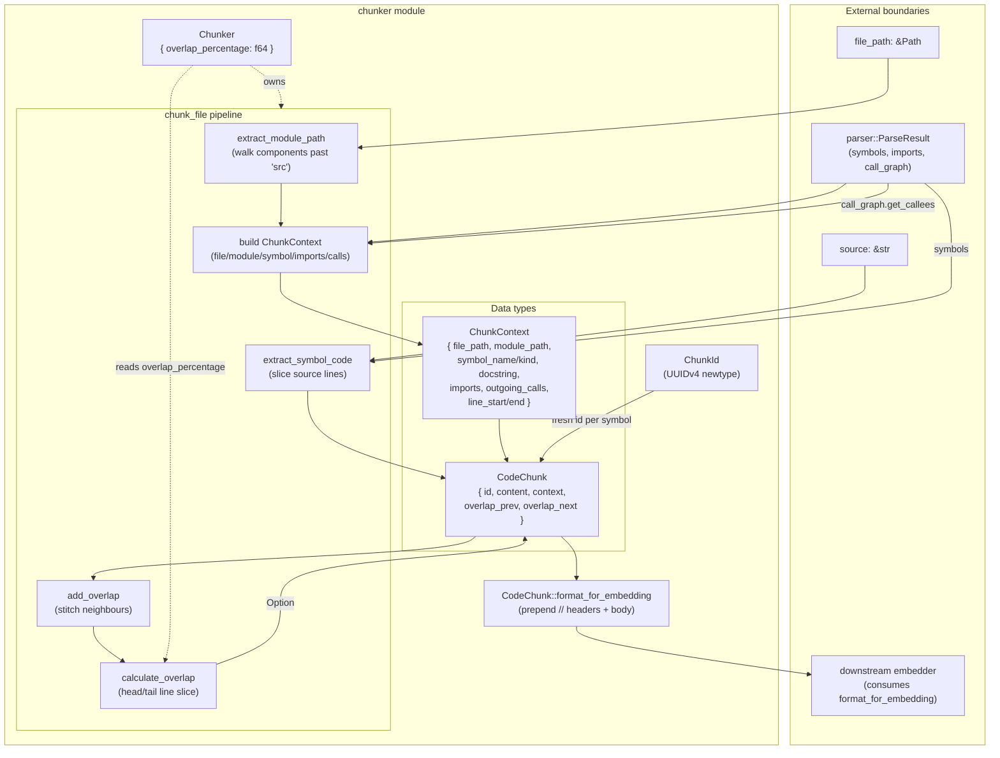

# chunker — Architecture

## Overview

The `chunker` module converts a parsed Rust source file into a sequence of per-symbol `CodeChunk`s, each enriched with module/import/call-graph context and overlap windows that bridge adjacent chunks. It is the bridge between the parser layer (which produces `Symbol`s and a `CallGraph`) and the embedding pipeline (which consumes formatted text). The module owns chunk identity (`ChunkId`, UUIDv4-backed) and the embedding-ready string format.

## Mermaid diagram

## Module responsibilities

| Module | Role | Key types |
| --- | --- | --- |
| `chunker` (root) | Public API surface: chunk identity, chunk struct + embedding format, and the `Chunker` driver. | `ChunkId`, `CodeChunk`, `ChunkContext`, `Chunker` |
| `ChunkId` | Opaque, comparable chunk identifier backed by UUIDv4; supports `new`, `to_string`, `from_string`, `Default`. | `ChunkId(Uuid)` |
| `CodeChunk` / `ChunkContext` | Carrier for one symbol's source slice plus the metadata needed by the embedder; `format_for_embedding` renders the canonical header+body string. | `CodeChunk`, `ChunkContext` |
| `Chunker` driver | Orchestrates chunking of a `ParseResult`: derives module path, slices symbol code, pulls call-graph callees, builds chunks, and stitches overlap. | `Chunker { overlap_percentage }` |
| `extract_module_path` (private) | File-path → `crate::a::b` segment vector, walking components past `src` and stripping `.rs`/`mod`. | `Vec<String>` |
| `extract_symbol_code` (private) | Bounds-safe slicing of `source` by the symbol's 1-indexed line range. | `String` |
| `add_overlap` / `calculate_overlap` (private) | Compute per-chunk previous/next overlap windows as a `ceil(percentage * lines)` head/tail slice of neighbouring content. | `Option<String>` |

## Data flow

1. **Entry.** A caller invokes `Chunker::chunk_file(file_path, source, parse_result)` after the parser has produced a `ParseResult` with `symbols`, `imports`, and a `call_graph`.
2. **Module path derivation.** `extract_module_path` walks `file_path.components()`, replacing `src` with `"crate"` and stripping `.rs`/`mod` segments to yield a `Vec<String>` like `["crate", "foo", "bar"]`.
3. **Import projection.** The full `parse_result.imports` is mapped once into a flat `Vec<String>` of import paths shared across every chunk for the file.
4. **Per-symbol chunking.** For each `Symbol`:
   - `extract_symbol_code` slices `source` by `[start_line-1, end_line)` with `saturating_sub` and `min` clamping for safety.
   - `parse_result.call_graph.get_callees(&symbol.name)` is converted to owned `String`s for outgoing calls.
   - A `ChunkContext` is built from the file path, cloned module path, symbol metadata (name/kind/docstring/line range), the shared imports, and the outgoing-call list.
   - A `CodeChunk` wraps a fresh `ChunkId::new()`, the extracted code, the context, and `None` overlaps.
5. **Overlap stitching.** After all chunks are collected, `add_overlap` walks the slice and, for each interior chunk, fills `overlap_prev` from the previous chunk's tail (`calculate_overlap(prev.content, from_end=false)` taking leading lines? — actually leading lines of prev) and `overlap_next` from the current chunk's tail. Each overlap is `ceil(percentage * lines)` lines, joined with `\n`, or `None` when there is no neighbour or no lines to take.
6. **Consumption.** A consumer later calls `CodeChunk::format_for_embedding` which prepends `// File:`, `// Location:`, optional `// Module:`, `// Symbol:`, optional `// Purpose:`, capped `// Imports:` (≤5), capped `// Calls:` (≤5), a blank line, and finally the body — producing a single `String` ready for the embedding model.

## Concurrency / integration model

- **Pure, synchronous, single-threaded.** `Chunker::chunk_file` performs no I/O, spawns no tasks, and holds no locks; all work is in-memory transformation over borrowed inputs. `&self` is read-only throughout.
- **No interior mutability or shared state.** `Chunker` is a small `Copy`-style config struct (`overlap_percentage: f64`); it carries no caches, no channels, no `Arc`/`Mutex`. It is trivially `Send + Sync` and can be reused across files or threads without coordination.
- **External boundaries.**
  - *Upstream:* takes `&Path`, `&str` (source), and `&ParseResult` from the parser layer. The only methods called on `parse_result` are field reads (`imports`, `symbols`) and `call_graph.get_callees(&str)`.
  - *Downstream:* emits `Vec<CodeChunk>`. Consumers (the embedder/pipeline) call `CodeChunk::format_for_embedding(&self) -> String` to materialize the embedding payload. `ChunkId::to_string`/`from_string` form the stable wire format for chunk identity (e.g. for persistence keyed by chunk id).
- **Error surface.** `chunk_file` and `extract_symbol_code` return `Result<_, Box<dyn std::error::Error>>` so they can propagate upstream parse-result indexing failures and `ChunkId::from_string` parse errors uniformly; the happy path allocates only `Vec<String>`/`String` buffers.
- **Determinism.** Output ordering follows `parse_result.symbols` order; the only nondeterminism is `ChunkId::new` UUID generation (intentional, for unique identity).
