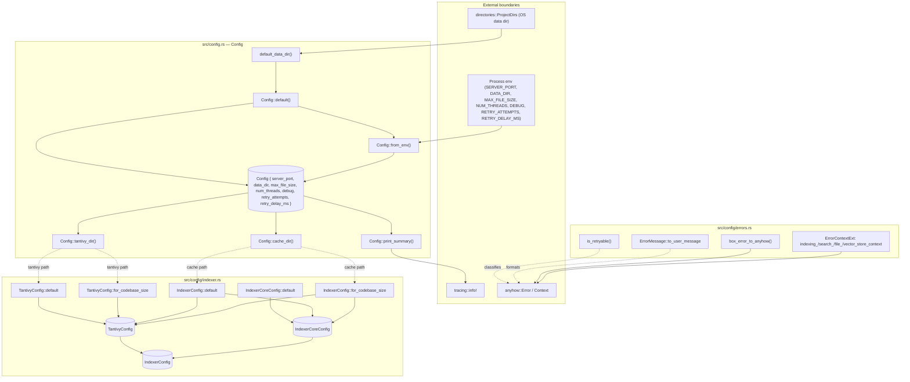

# config — Architecture

## Overview

The `config` module owns the server's configuration surface: it produces a baseline `Config`, layers environment-variable overrides on top, derives subsystem paths (Tantivy index, on-disk cache), and emits a structured summary. Two sibling submodules extend it: `errors` provides shared formatting / contextual wrappers / retry classification, and `indexer` builds size-tiered indexer and Tantivy profiles. Together they form the read-only knobs every other subsystem consults at boot.

## Mermaid diagram

## Module responsibilities

| Module | Role | Key types |
| --- | --- | --- |
| `config` (`src/config.rs`) | Top-level server configuration: defaults, env overrides, derived paths, summary logging | `Config`, `default_data_dir` |
| `config::errors` (`src/config/errors.rs`) | Shared error rendering, contextual `Result` extensions, retry classification, legacy-error bridging | `ErrorMessage`, `ErrorContextExt`, `box_error_to_anyhow`, `is_retryable` |
| `config::indexer` (`src/config/indexer.rs`) | Build size-tiered indexer/Tantivy configuration profiles with conservative defaults | `IndexerConfig`, `IndexerCoreConfig`, `TantivyConfig` |

## Data flow

1. **Boot** — the binary calls `Config::from_env()`. It seeds a `Config::default()` (which calls `default_data_dir()` against `directories::ProjectDirs`, falling back to `./data`), then probes each environment variable; malformed or absent values silently retain defaults.
2. **Path derivation** — callers ask the populated `Config` for `tantivy_dir()` and `cache_dir()`, which `join` `"tantivy"` / `"cache"` onto `data_dir`.
3. **Profile construction** — those derived paths flow into `IndexerConfig::for_codebase_size(loc, cache, tantivy)` (or the `default` variant), which selects a tier (`<100k` / `<1M` / else) and assembles an `IndexerCoreConfig` plus a `TantivyConfig`. `TantivyConfig::for_codebase_size` mirrors the same tiering for index-only callers.
4. **Observability** — `Config::print_summary()` formats `num_threads == 0` as `"auto"` and emits a single `tracing::info!` event; stdout is intentionally untouched because MCP stdio mode reserves it for JSON-RPC frames.
5. **Error path** — fallible operations elsewhere call `ErrorContextExt` adapters (`indexing_context`, `search_context`, `file_context`, `vector_store_context`) to lazily attach domain context via `anyhow::Context::with_context`. `box_error_to_anyhow` bridges legacy `Box<dyn Error>` values, `ErrorMessage::to_user_message` renders user-facing strings, and `is_retryable` lowercases the error and substring-matches transient phrases (`timeout`, `connection`, `would block`, `try again`, `unavailable`).

## Concurrency / integration model

- **Shared state:** `Config` and the `*Config` profile structs are plain `Send + Sync` value types — built once at startup and consumed by reference (or cloned `PathBuf`s). There are no locks, channels, or background tasks owned by this module.
- **External boundaries:**
  - Reads process environment via `std::env::var` (one-shot, at startup).
  - Reads OS data directory via `directories::ProjectDirs`.
  - Emits structured logs via `tracing::info!` (never stdout, to preserve the MCP JSON-RPC framing on stdio).
  - Produces `anyhow::Error` values consumed across the rest of the workspace.
- **Integration points:** downstream subsystems pull `Config::tantivy_dir()` / `Config::cache_dir()` and feed them into `IndexerConfig::for_codebase_size` (or `TantivyConfig::for_codebase_size`) to obtain tier-tuned `(memory_budget_mb, num_threads, max_file_size, gpu_batch_size)` budgets. Error helpers are invoked at every fallible call site that wants uniform context strings or retry hints.
- **Failure model:** environment parsing is best-effort and silent — invalid values fall back to defaults rather than aborting the process, so operators get a deterministic boot even with malformed env. Retry classification is heuristic (substring match) and conservative.
