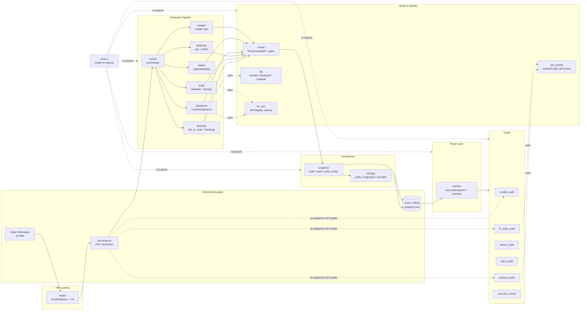

# graph — Architecture

## Overview

The `graph` module is the core extraction-and-query engine of the workspace: it loads a Cargo workspace into a `RootDatabase` + `Vfs` via rust-analyzer, walks the resulting HIR to produce an in-memory `ExtractionModel` of nodes / bindings / usages / signatures / statics, persists that model to a content-addressed LMDB (heed) snapshot, and exposes a read-only query layer plus a family of audit passes (unsafe, channel, derive, docs, fn-body, recursion, mut-static, dead-pub, overlaps) on top of the snapshot. It is the substrate that every MCP tool ultimately reads from.

## Mermaid diagram

## Module responsibilities

| Module | Role | Key types |
| --- | --- | --- |
| `loader` | Load a Cargo workspace into a populated `RootDatabase` + `Vfs`; filter to local crates. | `LoadedWorkspace`, `Crate` (filtered) |
| `extract` | Top-level orchestrator that drives the extraction pipeline end-to-end. | `extract()` entry point |
| `bindings` | Walk every crate's `DefMap`, build `def_to_node`, emit `Binding` records (declared/named/glob/extern). | `Binding`, `BindingKind`, `BindingVisibility` |
| `impls` | Emit `Method`, `AssocConst`, `AssocType`, `EnumVariant` Item nodes from inherent impls / traits / enums. | `ItemKind::Method` etc. |
| `attributes` | Recursively visit modules/items/impls and attach outer attributes + doc comments to nodes. | (mutates `Node::attributes`) |
| `signatures` | Render structured function signatures with HIR-trimmed type strings. | `FunctionSignature`, `SelfKind`, `Param`, `GenericBound` |
| `statics` | Capture each `static`'s type string and `is_mut` flag. | `StaticMetadata` |
| `usages` | Emit a `Usage` row per non-import reference, classified by `UsageCategory`. | `Usage`, `UsageCategory` |
| `model` | In-memory `ExtractionModel` and every node/edge/record type. | `ExtractionModel`, `Node`, `NodeKind`, `ItemKind`, `Namespace` |
| `ids` | Stable SHA-256 NodeId / BindingId / UsageId + workspace-root hash. | `NodeId`, `BindingId`, `UsageId`, `workspace_hash()` |
| `hir_trim` | Strip default type-parameter noise from HIR-display strings. | `trim_hir_display()` |
| `ast_resolve` | Turbofish-safe AST `CallExpr` -> HIR `Function` resolver, shared across audits. | `resolve_call_to_function()` |
| `snapshot` | Build/persist the LMDB graph from a model; open existing snapshots; provide read/write txns. | `OpenedSnapshot`, `build_and_persist()`, `persist_loaded()` |
| `storage` | Filesystem layout, env tuning, fingerprinting, manifest IO, typed sub-DB creation. | `GraphPaths`, `GraphEnvOptions`, `GraphDatabases`, `compute_fingerprint()` |
| `queries` | Read-side query layer: name lookup, imports/exports, call graph, audits, overlaps, module tree, stats. | `OpenedSnapshot::*` query methods, every result-row struct |
| `unsafe_audit` | Find every `unsafe { }` block and SAFETY-comment heuristic, with enclosing fn. | `UnsafeFinding` |
| `channel_audit` | Detect channel-constructor call sites with capacity extraction. | `ChannelFinding`, `ChannelAuditOpts` |
| `derive_audit` | Find ADT items missing required derives. | `DeriveFinding`, `AuditOpts` |
| `docs_audit` | Find `pub` items lacking `///` docs. | `MissingDocsFinding` |
| `fn_body_audit` | Pattern-match function bodies for risky idioms (unwrap, panic, unbounded loop, await-in-guard, transmute, self-recursion). | `FnBodyFinding`, `FnBodyAuditOpts`, `RawFinding` |
| `recursion_check` | DFS over the persisted call graph to enumerate cycles. | (cycle records) |
| `mod` (graph::mod) | Module file declaring the public surface and re-exports. | n/a |

## Data flow

The pipeline runs in a strict producer-consumer chain rooted in rust-analyzer and terminating in LMDB-backed query/audit calls:

1. **Workspace -> HIR.** `loader::load()` canonicalizes the workspace dir, runs `ra_ap_load_cargo`, and returns a populated `RootDatabase` + `Vfs`. `filter_local_crates()` then narrows the crate list to workspace-local origins so extraction never crawls registry deps.
2. **HIR -> ExtractionModel.** `extract::extract()` orchestrates the pipeline in a fixed order so each phase can rely on its predecessors:
   - `emit_crate()` seeds Workspace / Crate / Module nodes.
   - `bindings::extract_bindings()` walks every `DefMap`, populates the `def_to_node: HashMap<ModuleDefId, NodeId>` map (which every later phase reads), and emits `Binding` records.
   - `impls::extract_impl_items()` extends `def_to_node` with assoc items and enum variants.
   - `attributes::extract_attributes()` re-walks via `Semantics` to attach docs and `#[...]` strings onto existing nodes.
   - `signatures::extract_signatures()` and `statics::extract_statics()` emit the per-fn/per-static metadata records (running HIR-display strings through `hir_trim`).
   - `usages::extract_usages()` emits one `Usage` row per `Definition::usages()` reference, classified into a single `UsageCategory` by precedence.
3. **Model -> snapshot.** `snapshot::build_and_persist()` first computes a `compute_fingerprint()` over the workspace and short-circuits if the existing snapshot's fingerprint matches; otherwise it loads + extracts + calls `persist_loaded()`, which opens a `heed::Env` via `GraphPaths` / `GraphEnvOptions`, runs `write_model()` inside a single write txn (writing to typed sub-DBs: nodes, bindings, contains, usages, signatures, statics, meta), and finally calls `publish_current()` to atomically swap a `CURRENT` pointer file to the new graph id.
4. **Snapshot -> queries.** Consumers call `snapshot::open_current()` (or `open_specific(graph_id)`) to obtain an `OpenedSnapshot` whose impl block in `queries` provides the entire read API: `lookup_by_qualified_name`, `imports_of` / `exports_of`, `who_imports`, `usages_of`, `who_calls` / `calls_from` / `call_graph` / `call_graph_rec`, `dead_pub_report`, `crate_edges`, `overlaps`, `module_tree`, `workspace_stats`, etc. Internal helpers (`bindings_for_*`, `usages_for_*`) iterate the DUP_SORT sub-DBs.
5. **Snapshot + (re-loaded HIR) -> audits.** Audits split into two flavors:
   - **Snapshot-only** (`derive_audit`, `docs_audit`, `recursion_check`, `mut_static_audit`, `dead_pub_*`) read exclusively from the persisted LMDB.
   - **AST-driven** (`unsafe_audit`, `channel_audit`, `fn_body_audit`) take a `LoadedWorkspace` *and* a snapshot — they re-walk source AST via `Semantics` (using `ast_resolve` for turbofish-safe call resolution) and then use the snapshot to map enclosing fns back to NodeIds.

## Concurrency / integration model

- **Single-process, mostly synchronous.** Extraction is a sequential pipeline against rust-analyzer's `RootDatabase` (which carries its own salsa-style query cache). The order of phases inside `extract()` is load-bearing — `attributes` / `signatures` / `usages` all read the `def_to_node` map populated by `bindings` and `impls`.
- **Thread-local DB attachment.** Phases that use `ra_ap_hir::Semantics` call `attach_db(db)` to install the database in a thread-local before constructing `Semantics::new(db)`. This is the integration contract with rust-analyzer's HIR layer.
- **Persisted heed/LMDB store.** `storage` defines the on-disk layout under `default_data_dir()` keyed by workspace hash: a `snapshots/<graph_id>/` tree per build, a `manifest.json` per snapshot, and a `CURRENT` pointer file. `GraphEnvOptions` tunes map-size / max-dbs / max-readers. Sub-databases are created with three typed flavors (`open_or_create_str_bytes`, `open_or_create_bytes_bincode`, `open_or_create_bytes_bytes`) so that fixed-shape rows use bincode while DUP_SORT secondary indices use raw bytes.
- **Atomic publish.** `publish_current()` is the only mutator of the `CURRENT` pointer; readers always go through `open_current()`, which means multiple readers can safely coexist with a writer building a new snapshot — readers pin the previous graph id until they close.
- **Read concurrency via heed RO-txns.** Every query method opens a fresh `read_txn()` (or accepts one passed in for batch operations). Heed's MVCC guarantees consistent reads. Write txns are used only inside `write_model()` and during snapshot publish; the rest of the system is read-only against LMDB.
- **Reuse short-circuit.** `build_and_persist()` compares the workspace fingerprint against the current snapshot's manifest before any HIR work. When fingerprints match, no rust-analyzer load happens at all — the existing snapshot is opened and returned. This is the primary integration point with the MCP server's tool-call hot path.
- **Cross-cutting helpers.** `ast_resolve::resolve_call_to_function()` is the canonical way for any audit to turn a syntactic `CallExpr` into a HIR `Function` (handling closures, fn pointers, tuple-struct/variant constructors uniformly). `resolve_workspace_relative()` is duplicated across audits as a small Vfs-path-stripping helper. `canonical_function_path()` (in `channel_audit`, reused by `fn_body_audit`) builds the `crate::seg::seg::fn_name` string used to round-trip into the snapshot via `lookup_by_qualified_name`.
