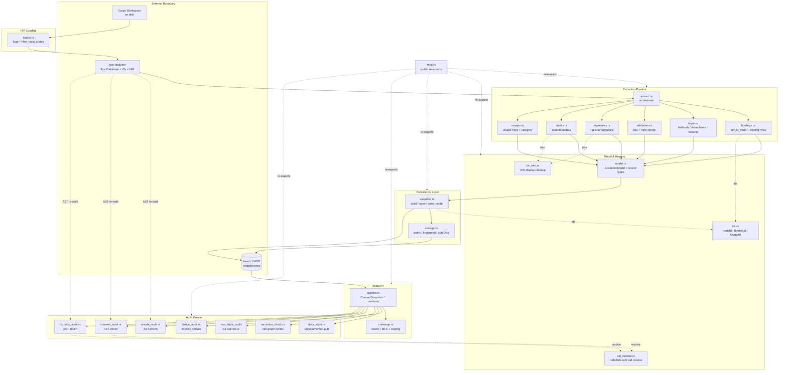

# graph — Architecture

## Overview

The `graph` module is the workspace's HIR-driven extraction and analysis engine: it loads a Cargo workspace through rust-analyzer, walks the resulting HIR with a suite of focused extractors, and serializes the assembled `ExtractionModel` into a content-addressed LMDB (heed) snapshot. Every downstream capability — read-only queries, audit passes (unsafe, channel, derive, docs, fn-body, recursion, mut-static, dead-pub), and the task-conditioned `codemap` projection — is layered on top of that single persisted snapshot, which acts as the shared substrate for the MCP server's tool surface.

## Mermaid diagram

## Module responsibilities

| Module | Role | Key types |
| --- | --- | --- |
| `mod` | Declare sub-modules and re-export the crate's public API surface. | (re-exports only) |
| `model` | In-memory `ExtractionModel` plus every node / binding / usage / signature / static record type. | `ExtractionModel`, `Node`, `NodeKind`, `ItemKind`, `Namespace`, `Binding`, `BindingKind`, `BindingVisibility`, `Usage`, `UsageCategory`, `FunctionSignature`, `SelfKind`, `Param`, `GenericBound`, `StaticMetadata`, `EmbeddingRecord` |
| `ids` | Stable SHA-256-based identifiers and a workspace-root hash. | `NodeId`, `BindingId`, `UsageId`, `workspace_hash()` |
| `loader` | Drive `ra_ap_load_cargo` and narrow the crate set to workspace-local origins. | `LoadedWorkspace`, `filter_local_crates()` |
| `extract` | Top-level orchestrator that sequences every extraction phase. | `extract()`, `emit_crate()` |
| `bindings` | Walk every `DefMap`, build the `def_to_node` map, emit `Binding` records per scope entry. | `extract_bindings()`, `Binding`, `BindingVisibility` |
| `impls` | Emit `Method`, `AssocConst`, `AssocType`, and `EnumVariant` Item nodes from inherent impls / traits / enums. | `extract_impl_items()` |
| `attributes` | Re-walk modules via `Semantics` to attach outer attributes and normalized doc comments. | `extract_attributes()`, `visit_module()` |
| `signatures` | Build structured per-function signatures with trimmed HIR-display strings. | `extract_signatures()`, `build_signature()` |
| `statics` | Capture each `static`'s trimmed type string and `is_mut` flag. | `extract_statics()`, `StaticMetadata` |
| `usages` | Emit one `Usage` row per non-import reference, classified by precedence. | `extract_usages()`, `classify_category()` |
| `hir_trim` | Strip default type-parameter noise (`Global`, `RandomState`, `BuildHasherDefault`, `LazyLock` init) from HIR-display strings. | `trim_hir_display()` |
| `ast_resolve` | Turbofish-safe `CallExpr` → HIR `Function` resolver shared by the AST-driven audits. | `resolve_call_to_function()` |
| `snapshot` | Build, persist, and open content-addressed LMDB snapshots; provide read/write txns and lazy span caches. | `OpenedSnapshot`, `build_and_persist()`, `persist_loaded()`, `write_model()`, `open_current()` |
| `storage` | Filesystem layout, env tuning, fingerprint/graph-id computation, manifest IO, typed sub-DB creation. | `GraphPaths`, `GraphEnvOptions`, `GraphDatabases`, `compute_fingerprint()`, `graph_id_for()` |
| `queries` | Read-side query layer covering lookup, imports/exports, call graph, dead-pub, mut-static, overlaps, module tree, workspace stats, attribute search, function filters, re-export chains, crate edges, and metrics. | `OpenedSnapshot::*` query methods plus every result-row struct (`DeadPubFinding`, `CrateEdge`, `OverlapsReport`, `CallGraphNode`, `MutStaticFinding`, `ModuleTreeNode`, `WorkspaceStats`, `CrateMetric`, `ReExportChain`, …) |
| `codemap` | Build a task-conditioned subgraph (seeds → BFS → BM25/proximity/cosine scoring → budget prune → projected hierarchy) and render it as JSON / Mermaid / outline. | `Codemap`, `CodemapNode`, `CodemapEdge`, `CodemapOptions`, `EmbeddingPolicy`, `build_codemap()` |
| `derive_audit` | Flag ADT items missing a configured set of required derives. | `DeriveFinding`, `AuditOpts` |
| `docs_audit` | Flag `pub` items lacking `///` doc comments, with binding-derived effective visibility. | `MissingDocsFinding` |
| `recursion_check` | DFS over the persisted call graph to enumerate canonicalized fn cycles. | `recursion_check()` cycle records |
| `unsafe_audit` | Walk every local file's AST to find `unsafe { }` blocks, SAFETY-comment hints, and the enclosing fn. | `UnsafeFinding` (via `OpenedSnapshot::unsafe_audit`) |
| `channel_audit` | Detect tokio / std / crossbeam / flume channel-constructor call sites and extract capacity literals. | `ChannelFinding`, `ChannelAuditOpts` |
| `fn_body_audit` | Pattern-match fn bodies for risky idioms (unwrap, panic, unbounded loop, await-in-guard, transmute, self-recursion). | `FnBodyFinding`, `FnBodyAuditOpts`, `RawFinding` |

## Data flow

The pipeline runs as a strict producer-consumer chain, rooted in rust-analyzer and terminating in audit reports / codemap renderings:

1. **Workspace → HIR.** `loader::load()` canonicalizes the workspace dir, calls `ra_ap_load_cargo`, and returns a populated `RootDatabase` + `Vfs`. `filter_local_crates()` narrows the crate list so extraction never crawls registry deps. This step is skipped entirely when the cached snapshot's fingerprint already matches the workspace (see step 5).

2. **HIR → ExtractionModel.** `extract::extract()` runs the phases in a fixed order so each can rely on its predecessors:
   - `emit_crate()` seeds Workspace / Crate / Module nodes.
   - `bindings::extract_bindings()` walks every `DefMap`, populates `def_to_node: HashMap<ModuleDefId, NodeId>` (used by every later phase), and emits `Binding` records (declared / named-import / glob / extern-crate) with encoded visibility.
   - `impls::extract_impl_items()` extends `def_to_node` with assoc items and enum variants.
   - `attributes::extract_attributes()` re-walks via `Semantics` to attach docs and `#[…]` strings onto existing nodes.
   - `signatures::extract_signatures()` and `statics::extract_statics()` emit per-fn / per-static metadata records, routing every HIR-display string through `hir_trim::trim_hir_display`.
   - `usages::extract_usages()` emits one `Usage` row per `Definition::usages()` reference, collapsing `ReferenceCategory` bitflags into a single `UsageCategory` by precedence.

3. **Model → snapshot.** `snapshot::write_model()` serializes the assembled `ExtractionModel` into typed LMDB sub-databases inside a single write txn: `nodes`, `bindings`, `contains`, `usages`, `signatures`, `statics`, `meta`, plus DUP_SORT secondary indices keyed by `from_module`, `target`, `consumer`, and `consumer_function`. Each binding / usage is keyed by a stable id produced via `binding_id_for()` / `usage_id_for()` (SHA-256 over identifying components).

4. **Snapshot publish.** `snapshot::publish_current()` is the only mutator of the `CURRENT` pointer: it atomically swaps the file to point at the freshly written `graph_id` directory. Readers always go through `open_current()` or `open_specific()`, so an in-flight reader pins the previous graph id until close.

5. **Reuse short-circuit.** `snapshot::build_and_persist()` first computes a `compute_fingerprint()` over the workspace (file mtimes / sizes / paths). If it matches the current snapshot's `manifest.json`, no rust-analyzer load happens — the existing snapshot is opened and returned. This is the primary hot-path for the MCP server.

6. **Snapshot → queries.** Consumers obtain an `OpenedSnapshot` and call methods on `queries`: `lookup_by_qualified_name` (with re-export hop budget), `imports_of` / `exports_of` / `reexports_of` / `declared_reexports_of`, `who_imports`, `usages_of` / `usages_in` / `who_uses_summary`, the call-graph family (`who_calls`, `calls_from`, `call_graph`, `call_graph_rec`, `callers_in_crate`, `recursive_callers_count`), `dead_pub_report`, `mut_static_audit`, `items_with_attribute`, `functions_with_filter`, `pub_use_pub_type_audit`, `re_export_chain`, `crate_edges` / `forbidden_dependency_check` / `crate_dependency_metric`, `overlaps`, `module_tree`, `workspace_stats`, and `enum_variants`.

7. **Snapshot → codemap.** `codemap::build_codemap()` sits on top of `queries`: it resolves seeds (override names, search hits, or BM25 hits via `build_bm25_by_node`), BFS-expands the neighborhood through `callees_of` / `referrers_of`, scores nodes (BM25 + proximity + optional cosine via `EmbeddingPolicy`), prunes to a configured budget while preserving seeds, projects the retained set into a filtered module tree, and renders as JSON, Mermaid, or indented outline.

8. **Snapshot → audits.** Audits split into two flavors:
   - **Snapshot-only** (`derive_audit`, `docs_audit`, `recursion_check`, `OpenedSnapshot::mut_static_audit`, the `dead_pub_*` queries) read exclusively from LMDB. `recursion_check` reconstructs an adjacency list from `usages` and runs a DFS with canonicalized-cycle dedup. `derive_audit` joins items with their bindings to determine effective visibility before parsing `#[derive(...)]` attribute strings.
   - **AST-driven** (`unsafe_audit_impl`, `channel_capacity_audit`, `fn_body_audit`) take both a `LoadedWorkspace` and a snapshot. They re-walk source AST through `Semantics`, use `ast_resolve::resolve_call_to_function()` for turbofish-safe call resolution, build canonical `crate::seg::seg::fn_name` paths via `canonical_function_path()` to look up enclosing fns in the snapshot, and skip `cfg(test)`-gated sites via `enclosed_by_cfg_test()`.

## Concurrency / integration model

- **Single-process, synchronous pipeline.** Extraction is a strictly sequential walk against rust-analyzer's `RootDatabase` (which itself carries a salsa-style query cache). The phase order in `extract()` is load-bearing: `attributes`, `signatures`, `usages`, and the per-item passes all rely on the `def_to_node` map produced by `bindings` and extended by `impls`.

- **Thread-local DB attachment.** Phases that construct `ra_ap_hir::Semantics` call `attach_db(db)` to install the database in a thread-local before `Semantics::new(db)`. This is the integration contract with rust-analyzer's HIR layer and must be honored by every audit that performs a fresh AST walk.

- **Persisted heed/LMDB store.** `storage` defines the on-disk layout under `default_data_dir()`, keyed by workspace hash: a `snapshots/<graph_id>/` tree per build, one `manifest.json` per snapshot, and a `CURRENT` pointer file. `GraphEnvOptions` tunes `map_size`, `max_dbs`, and `max_readers`. Sub-databases are created with three typed flavors (`open_or_create_str_bytes`, `open_or_create_bytes_bincode`, `open_or_create_bytes_bytes`) so fixed-shape rows use bincode while DUP_SORT secondary indices stay as raw bytes for prefix iteration.

- **Atomic publish, MVCC reads.** `publish_current()` is the sole mutator of `CURRENT`. Every query method opens a fresh `read_txn()` (or accepts one passed in for batch operations); heed's MVCC guarantees consistent reads, so many readers can coexist with a writer building a new snapshot. Write txns appear only inside `write_model()` and during snapshot publish.

- **Single-snapshot audit cooperation.** All audits — whether snapshot-only or AST-driven — share one `OpenedSnapshot` handle. The snapshot's lazy span / line-to-byte caches (`OpenedSnapshot::span_index()`, `OpenedSnapshot::line_to_byte()`) amortize per-file parsing across multiple audit calls and across the `codemap` BFS, so a single MCP session that runs unsafe + channel + fn-body audits only pays for span construction once per file.

- **AST audits as opt-in HIR re-walks.** The AST-driven audits (`unsafe_audit`, `channel_audit`, `fn_body_audit`) are the only consumers that pull rust-analyzer back in after the snapshot exists. They re-load the workspace via `loader::load()`, then cross-reference each finding against the snapshot using `canonical_function_path()` + `lookup_by_qualified_name()` to attach NodeIds. Snapshot-only audits avoid this cost entirely.

- **Cross-cutting helpers and small duplication.** `resolve_workspace_relative()` (a Vfs-path stripper) is duplicated across `impls`, `usages`, `unsafe_audit`, `channel_audit`, and `fn_body_audit`. `canonical_function_path()` is defined in `channel_audit` and reused by `fn_body_audit`. `enclosed_by_cfg_test()` / `item_has_cfg_test()` are shared between the AST audits. These are deliberately tiny and copy-pasted rather than promoted to a shared util, since they sit on hot per-file walks.

- **Integration with the MCP server.** The MCP tool surface enters this module almost exclusively through `OpenedSnapshot` query methods plus `build_codemap()`. Tool calls that mutate (re-indexing, cache clearing) route through `build_and_persist()` and `publish_current()`; tool calls that read are pure heed RO-txn scans, which is why the fingerprint short-circuit in step 5 of the data flow is the single most important latency lever in the system.
