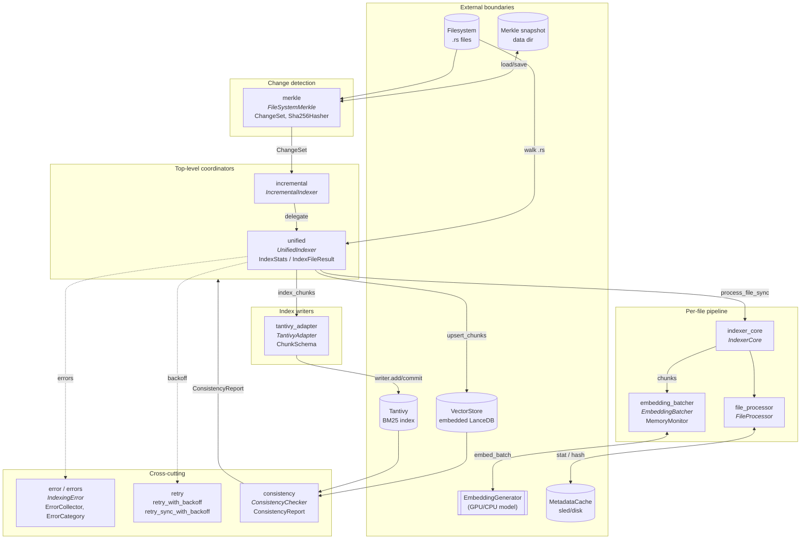

# indexing — Architecture

## Overview

The `indexing` module is the workspace's ingestion pipeline: it walks a Rust codebase, parses and chunks each `.rs` file, generates embeddings, and writes the results into both a Tantivy text index and a LanceDB-backed vector store. It owns the change-detection (Merkle-snapshot), throttling (memory- and GPU-aware batching), error categorization, and consistency-checking machinery that surrounds those writes, exposing the high-level `UnifiedIndexer` and `IncrementalIndexer` entry points to the rest of the system.

## Mermaid diagram

## Module responsibilities

| Module | Role | Key types |
|---|---|---|
| `mod` | Declares submodules and re-exports the public surface. | (re-exports only) |
| `consistency` | Cross-checks Tantivy and vector-store contents to detect divergence. | `ConsistencyChecker`, `ConsistencyReport` |
| `embedding_batcher` | Batches chunk embedding under memory- and GPU-aware limits. | `EmbeddingBatcher`, `MemoryMonitor` |
| `error` | Defines the unified indexing error type. | `IndexingError` |
| `errors` | Collects, categorizes, and queries per-file failures. | `ErrorCollector`, `ErrorDetail`, `ErrorCategory`, `categorize_error` |
| `file_processor` | Filters, change-detects, and persists per-file metadata. | `FileProcessor`, `MetadataCache`, `SecretsScanner`, `SensitiveFileFilter` |
| `incremental` | Drives Merkle-snapshot–based incremental reindexing. | `IncrementalIndexer`, `get_snapshot_path` |
| `indexer_core` | Bundles file processing, parsing, chunking, and embedding into a per-file pipeline. | `IndexerCore`, `IndexerCoreConfig`, `ProcessedFile` |
| `merkle` | Builds, persists, and diffs SHA-256 Merkle trees over `.rs` files. | `FileSystemMerkle`, `ChangeSet`, `MerkleSnapshot`, `Sha256Hasher`, `FileNode` |
| `retry` | Generic exponential-backoff retry helpers (sync + async). | `retry_with_backoff`, `retry_sync_with_backoff` |
| `tantivy_adapter` | Wraps a Tantivy `Index` and writer for chunk-oriented operations. | `TantivyAdapter`, `TantivyConfig`, `ChunkSchema`, `Bm25Search` |
| `unified` | Top-level indexer coordinating parsing, embedding, Tantivy, and the vector store. | `UnifiedIndexer`, `IndexStats`, `IndexFileResult`, `IndexingMetrics` |

## Data flow

The pipeline is layered so that each stage rejects work as early as possible to keep the embedding model — the most expensive step — fed only with files that actually need re-indexing.

1. **Discovery.** `UnifiedIndexer::collect_rust_files` (or `IncrementalIndexer` via `FileSystemMerkle::from_directory`) walks the codebase with `WalkDir`, collecting `.rs` paths and counting walk errors.
2. **Change detection.** For incremental runs, `merkle::FileSystemMerkle` SHA-256-hashes every leaf, builds a `MerkleTree<Sha256Hasher>`, and compares the new root against a `bincode`-serialized snapshot under `ProjectDirs("dev", "rust-code-mcp", "search")`. Mismatches produce a `ChangeSet { added, modified, deleted }`; `process_changes` dispatches each set into `delete_file_chunks` and/or `index_file`.
3. **Per-file gating.** `IndexerCore::process_file_sync` runs `FileProcessor::should_process_file` (sensitive-file filter + size cap), `has_stat_changed` (mtime/len from `MetadataCache`), reads the contents, runs `check_secrets`, then `has_file_changed` (content hash). Any short-circuit returns `Skipped` or `Unchanged`.
4. **Parse and chunk.** A fresh per-thread `RustParser` parses the source via `parse_source_complete`; `Chunker::chunk_file` slices the parse tree into `CodeChunk`s wrapped as a `ProcessedFile { path, content, chunks, parse_duration }`.
5. **Embedding.** Chunks flow into `EmbeddingBatcher::generate_embeddings_batched`, which formats each via `CodeChunk::format_for_embedding`, splits into windows of `gpu_batch_size`, and dispatches each window through `EmbeddingGenerator::embed_batch`. `calculate_safe_batch_size` consults `MemoryMonitor` (with a 15 MB-per-file heuristic, capped by CPU count and a hard ceiling of 100) to decide outer batch size.
6. **Dual write.**
   - Text side: `TantivyAdapter::index_chunks` builds Tantivy documents (`chunk_id`, `content`, `symbol_name`, `symbol_kind`, `file_path`, `module_path`, `docstring`, `chunk_json`) via the `ChunkSchema` and pushes them through the `IndexWriter`.
   - Vector side: chunks are zipped with embeddings into `(ChunkId, Vec<f32>, CodeChunk)` triples and `VectorStore::upsert_chunks` writes to embedded LanceDB.
7. **Metadata and metrics.** `FileProcessor::update_file_metadata` persists `(content_hash, mtime, len)` to the metadata cache. `IndexingMetrics` accumulates parse / embed / index durations, file latencies, peak memory, and cache-hit rate; `finalize_metrics` logs the summary.
8. **Commit.** `TantivyAdapter::commit` is called after every parallel batch (and at the end of `index_directory`); the vector store is durable per upsert. `clear_all_data` wipes the metadata cache, all Tantivy docs, and the LanceDB collection together.
9. **Consistency.** Out-of-band, `ConsistencyChecker::check` enumerates Tantivy chunk IDs by walking every `SegmentReader`'s store and reads `VectorStore::count`, producing a `ConsistencyReport` with structured logging.

## Concurrency / integration model

- **Async runtime.** The public surface (`UnifiedIndexer::index_file`, `index_directory*`, `IncrementalIndexer::index_with_change_detection`, `ConsistencyChecker::check`) is `async`, driven by the host Tokio runtime. The vector store and embedding APIs are awaited; Tantivy writes are synchronous and run on the calling task.
- **Parallel ingest.** `index_directory_parallel` is the throughput path. It runs in batches of `calculate_safe_batch_size`:
  - **Phase 1 (CPU-bound, Rayon).** `par_iter().filter_map(...)` invokes `process_file_sync` across the Rayon global pool to parse and chunk in parallel. Each task constructs its own `RustParser` to keep tree-sitter handles thread-local.
  - **Phase 2 (single-task).** Successful `ProcessedFile`s are flattened, embedded in a single `generate_embeddings_batched` call, written to Tantivy, and upserted to LanceDB. Tantivy is committed after every batch.
- **Memory throttling.** Between batches, `IndexerCore::memory_usage_percent` is checked; above 85% the loop awaits `tokio::time::sleep(Duration::from_secs(5))` to let allocators reclaim. `MemoryMonitor` lives behind `Arc<Mutex<...>>` inside `EmbeddingBatcher`, so concurrent reads of usage stats serialize on a short critical section.
- **Shared state.** `ErrorCollector` (`Arc<Mutex<Vec<ErrorDetail>>>`) is shared across Rayon workers in Phase 1; failures are categorized by `categorize_error` (keyword match on the error message) into `Permanent`/`Transient` and folded into `IndexStats` by `process_batch_errors`. `MetadataCache`, the Tantivy `IndexWriter`, and the `VectorStore` handle are owned by `UnifiedIndexer` and accessed from the single coordinator task in Phase 2 — there is no writer contention.
- **External APIs.**
  - `EmbeddingGenerator` (cloneable handle) — model inference, called from the coordinator task only.
  - `tantivy::Index` + `IndexWriter` — opened or created in `TantivyAdapter::new` with `writer_with_num_threads(num_threads, num_threads * memory_budget_mb * MiB)`; Tantivy spawns its own merge threads internally. `Drop` rolls back to release the lockfile.
  - `VectorStore` (embedded LanceDB) — created under `cache_path.parent()/vectors/<collection_name>`; cloneable for read-side consumers via `vector_store_cloned`.
  - `ProjectDirs` data directory — Merkle snapshots persist to `<data>/<sha16>.snapshot` via `bincode`.
  - `MetadataCache` — keyed by stringified path; stat- and content-hash entries.
- **Retry surface.** `retry_with_backoff` (async, `tokio::time::sleep`) and `retry_sync_with_backoff` (blocking `std::thread::sleep`) are exposed as generic helpers for callers to wrap flaky external calls; the indexing core itself surfaces typed errors and lets the caller decide.
- **Error model.** All per-file failures funnel into `IndexingError` (`Io`, `Embedding`, `VectorStore`, `Parser`, `Cache`); `?`-propagation is preserved up to `index_file`, which returns `IndexFileResult::{Indexed, Unchanged, Skipped}` so directory-level loops can update `IndexStats` without unwinding the whole batch.
- **Drop semantics.** `TantivyAdapter::drop` rolls back the writer to release the index lock; `UnifiedIndexer::drop` only logs (its `TantivyAdapter` field handles cleanup).
