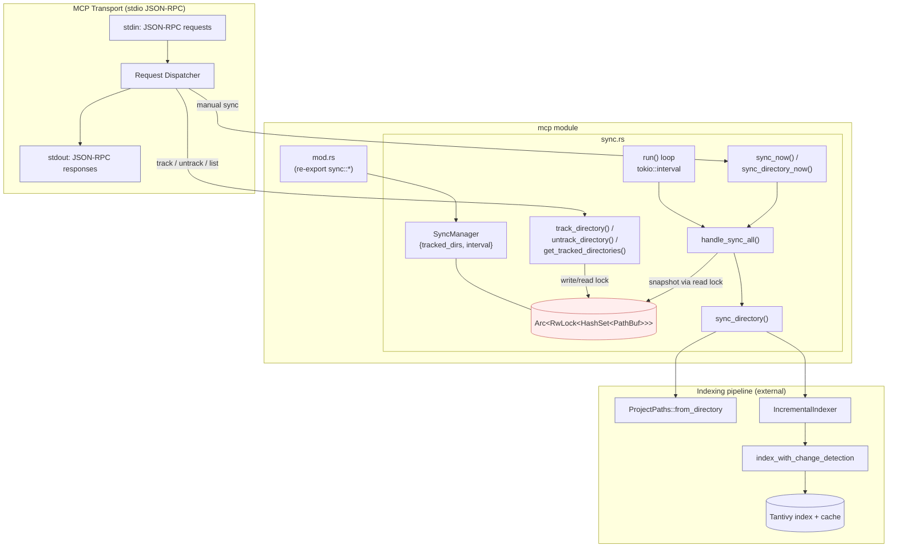

# mcp — Architecture

## Overview

The `mcp` module owns the background synchronization layer that keeps tracked project directories incrementally reindexed over time. It exposes a single `SyncManager` actor whose state is shared across the MCP server transport (stdio JSON-RPC) so request handlers can register directories, trigger manual syncs, or query the tracked set while a long-lived task drives periodic reindexing on a fixed interval.

## Mermaid diagram

## Module responsibilities

| Module | Role | Key types |
|--------|------|-----------|
| `mcp/mod.rs` | Module root; re-exports the sync API so the rest of the crate sees a flat `mcp::*` surface. | (none — `pub use sync::*`) |
| `mcp/sync.rs` | Owns the tracked-directory set and the periodic background sync loop; provides handlers for tracking, untracking, listing, and on-demand syncing. | `SyncManager`, `Arc<RwLock<HashSet<PathBuf>>>`, `Duration`, `ProjectPaths`, `IncrementalIndexer` |

## Data flow

JSON-RPC requests arrive on stdin and are decoded by the MCP transport dispatcher into typed tool calls. Sync-related calls flow into a shared `Arc<SyncManager>`:

1. **Track / untrack** — the dispatcher calls `track_directory(dir)` or `untrack_directory(&dir)`. Each acquires the `RwLock` write guard on `tracked_dirs`, mutates the `HashSet<PathBuf>`, and emits a `tracing::info!` event when membership actually changes. The response is encoded back as a JSON-RPC reply on stdout.
2. **List** — `get_tracked_directories()` takes a read guard, clones each `PathBuf` out of the set, and returns a `Vec<PathBuf>` for serialization.
3. **Manual sync** — `sync_now()` (all) or `sync_directory_now(&dir)` (single) log an info marker and delegate to `handle_sync_all` / `sync_directory`. Each `sync_directory` call constructs `ProjectPaths::from_directory`, instantiates an `IncrementalIndexer`, and runs `index_with_change_detection` against the target. Indexed-file count and chunk count are logged at info level when work was done; otherwise a debug "no changes" line is emitted.
4. **Background sync** — independent of any request, the long-lived `SyncManager::run` task wakes on each `tokio::time::interval` tick and calls `handle_sync_all`, which snapshots the tracked set under a read lock and iterates with per-directory error tolerance (errors are logged via `tracing::error!` and never abort the cycle).

In every path, results land in the tantivy index plus on-disk cache through the `IncrementalIndexer`; errors surface as `Result<()>` from `sync_directory` and are propagated to the JSON-RPC response only on the manual-single-directory path.

## Concurrency / integration model

- **Transport.** The MCP server speaks JSON-RPC over stdio. A single dispatcher task reads framed requests from stdin, fans them out to handlers, and serializes responses back on stdout. The `SyncManager` is shared across handlers as `Arc<SyncManager>`.
- **Shared state.** The only mutable state is `tracked_dirs: Arc<RwLock<HashSet<PathBuf>>>`. Reads (listing, snapshotting before a sync cycle) take the read lock; writes (track/untrack) take the write lock. The lock is async-aware (`tokio::sync::RwLock`), so handlers `.await` instead of blocking the runtime.
- **Tasks.** `SyncManager::run(self: Arc<Self>)` is intended to be spawned once at startup as a dedicated tokio task. It performs an initial 5-second warm-up `sleep`, runs an immediate `handle_sync_all`, then enters an unbounded loop driven by `tokio::time::interval`. Manual-sync RPCs run on the handler task that received the request and share the same code path (`handle_sync_all` / `sync_directory`), so manual and periodic syncs are concurrent but each individual `sync_directory` is serialized only by the indexing pipeline's own internal locking — there is no module-level mutex around indexing.
- **Channels.** None at this layer; coordination is purely through the `Arc<RwLock<…>>` and the periodic timer. The background loop never sends or receives on a channel — it pulls a snapshot each tick.
- **Error isolation.** `handle_sync_all` catches errors from each `sync_directory` call site and continues with the remaining directories, so one broken project cannot stall the periodic loop or block other tracked roots from being reindexed.
- **External boundaries.** Outbound: `ProjectPaths`, `IncrementalIndexer`, the tantivy index, and the on-disk cache (the `EMBEDDING_DIM` constant is fed in at construction). Inbound: the MCP stdio transport and any in-process caller holding the `Arc<SyncManager>`. Logging is routed through `tracing` and is the only side channel beyond the indexer.
