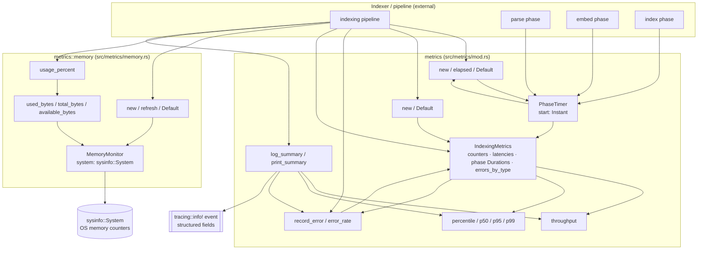

# metrics — Architecture

## Overview

The `metrics` module aggregates indexing-time observability data: file/error counters, per-phase durations, latency samples, and host memory snapshots. It exposes pure, single-threaded value types (`IndexingMetrics`, `PhaseTimer`, `MemoryMonitor`) that callers populate during indexing and then query for derived statistics (throughput, p50/p95/p99, error rate, memory percent), with a single structured `tracing::info!` event as the only external sink.

## Mermaid diagram

## Module responsibilities

| Module | Role | Key types |
|---|---|---|
| `metrics` (`src/metrics/mod.rs`) | Aggregate indexing counters, per-phase durations, latency samples, and error tallies; derive throughput / percentile / error-rate stats; emit a structured summary via `tracing`. Provides a monotonic phase timer for callers. | `IndexingMetrics`, `PhaseTimer` |
| `metrics::memory` (`src/metrics/memory.rs`) | Wrap `sysinfo::System` to expose current host memory in bytes (used / total / available) and as a utilization percentage. | `MemoryMonitor` |

## Data flow

1. **Construction.** The indexing pipeline builds an `IndexingMetrics` via `IndexingMetrics::new()` (delegates to `Default`, zeroed counters, empty `file_latencies`, empty `errors_by_type`, `Duration::ZERO` for all phase timers). It optionally builds a `MemoryMonitor::new()`, which calls `System::new_all()` and an initial `refresh_memory()`.
2. **Phase timing.** For each phase (parse, embed, index, total), the caller creates a `PhaseTimer::new()` (captures `Instant::now()`) at phase entry and reads `PhaseTimer::elapsed()` at phase exit, writing the resulting `Duration` into the corresponding field on `IndexingMetrics`.
3. **Per-file sampling.** As files are processed, the caller pushes per-file `Duration` values into `IndexingMetrics::file_latencies` and increments `total_files` / `indexed_files`.
4. **Error accounting.** On failure, the caller invokes `IndexingMetrics::record_error(error_type)`, which bumps the global `error_count` and the `errors_by_type` `HashMap` entry (via `Entry::or_insert(0)` then `+= 1`).
5. **Memory sampling.** Periodically (or at peak detection points) the caller invokes `MemoryMonitor::refresh()` and reads `used_bytes` / `total_bytes` / `available_bytes` / `usage_percent`, copying the peak into `IndexingMetrics::peak_memory_bytes`.
6. **Derivation.** On demand, `IndexingMetrics` computes:
   - `throughput()` = `indexed_files / total_duration.as_secs_f64()` (guarded against zero).
   - `percentile(p)` clones `file_latencies`, sorts, and indexes at `(len * p).min(len - 1)`; `p50/p95/p99` are thin wrappers.
   - `error_rate()` = `error_count / total_files` (guarded against zero).
7. **Reporting.** `IndexingMetrics::log_summary()` computes per-phase percentage shares of `total_duration`, then emits one `tracing::info!` event carrying counts, throughput, p50/p95/p99 in ms, per-phase durations and percentages, peak memory in MB, cache hit rate, error count and rate, and the `errors_by_type` map. `print_summary()` simply forwards to `log_summary()` so legacy callers do not write to stdout — important under the MCP stdio transport, where stdout is reserved for JSON-RPC frames.

## Concurrency / integration model

- **Single-threaded value types.** `IndexingMetrics`, `PhaseTimer`, and `MemoryMonitor` hold no locks, atomics, channels, or interior mutability. Mutation goes through `&mut self` on `IndexingMetrics` (e.g. `record_error`) and `MemoryMonitor` (`refresh`). Concurrency is the caller's responsibility — typically the indexing driver owns the `IndexingMetrics` and either keeps it on a single task or wraps it in an external `Mutex`/`RwLock`.
- **No background tasks.** The module spawns no Tokio tasks, threads, or timers. `PhaseTimer` is a passive `Instant`-based stopwatch; sampling cadence (memory refresh, latency push) is driven entirely by external callers.
- **Shared state.** There is no module-level static state. Each `IndexingMetrics` / `MemoryMonitor` is independently owned. `errors_by_type` (`HashMap<String, u64>`) and `file_latencies` (`Vec<Duration>`) live inside `IndexingMetrics` and are accessed only through its methods.
- **External boundaries.**
  - **`sysinfo` crate** — `MemoryMonitor` is the sole boundary; `System::new_all` / `refresh_memory` / `used_memory` / `total_memory` / `available_memory` are the only foreign calls.
  - **`tracing` crate** — `IndexingMetrics::log_summary` emits exactly one structured `tracing::info!` event per call. This is the module's only output side effect; it intentionally avoids `println!` / stdout to remain compatible with the MCP stdio JSON-RPC transport.
  - **`std::time`** — `Instant` (in `PhaseTimer`) and `Duration` (throughout) are the only timing primitives; no wall-clock / `SystemTime` dependency.
- **Integration points.** The indexing pipeline is the sole expected consumer: it constructs the metrics container, drives `PhaseTimer`s around each phase, samples `MemoryMonitor` for peak memory, calls `record_error` on failures, populates `file_latencies`, and finally invokes `log_summary()` to publish results to subscribers of the `tracing` infrastructure (which include the MCP server's stderr log sink).
