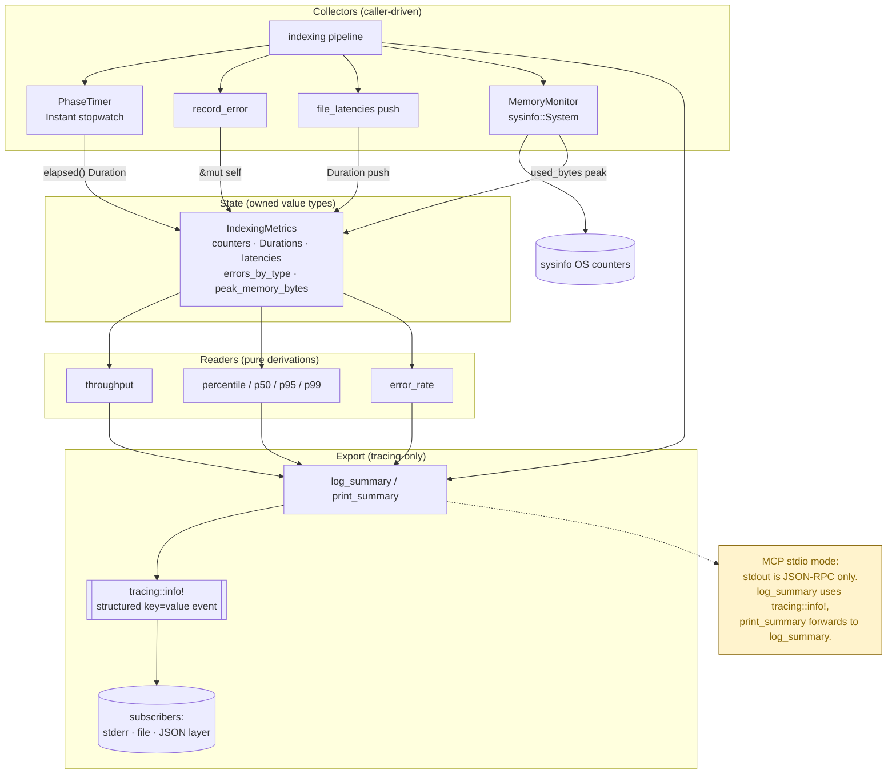

# metrics — Architecture

## Overview

The `metrics` module is the indexing pipeline's observability layer: it aggregates file/error counters, per-phase durations, per-file latency samples, and host memory snapshots into plain owned value types, then derives throughput/percentile/error-rate statistics on demand. Its single export path is a structured `tracing::info!` event — never `println!`/stdout, which the MCP stdio transport reserves for JSON-RPC frames.

## Mermaid diagram

## Module responsibilities

| Module | Role | Key types |
|---|---|---|
| `metrics` (`src/metrics/mod.rs`) | Aggregate indexing counters, per-phase `Duration`s, latency samples, and error tallies; derive throughput / percentile / error-rate; emit a single structured `tracing::info!` summary. Owns the monotonic `PhaseTimer` stopwatch. | `IndexingMetrics`, `PhaseTimer` |
| `metrics::memory` (`src/metrics/memory.rs`) | Wrap `sysinfo::System` to expose host memory counters (used / total / available bytes) and a utilization percentage, used to populate `IndexingMetrics::peak_memory_bytes`. | `MemoryMonitor` |

## Data flow

1. **Construction.** The pipeline builds `IndexingMetrics::new()` (zeroed counters, empty `file_latencies`, empty `errors_by_type`, `Duration::ZERO` for all phase fields) and optionally a `MemoryMonitor::new()` (calls `System::new_all()` then an initial `refresh_memory()`).
2. **Phase timing.** Each phase (parse, embed, index, total) is bracketed by a `PhaseTimer::new()` / `PhaseTimer::elapsed()` pair; the resulting `Duration` is written into the matching `IndexingMetrics` field. `PhaseTimer` is a passive `Instant`-based stopwatch — no background ticking.
3. **Per-file sampling.** As files are processed, the caller pushes `Duration` samples into `file_latencies` and bumps `total_files` / `indexed_files` / `skipped_files` / `unchanged_files` / `total_chunks`.
4. **Error accounting.** `record_error(error_type)` increments the global `error_count` and the `errors_by_type` `HashMap` entry (via `Entry::or_insert(0)` then `+= 1`), giving both a total and a per-type histogram.
5. **Memory sampling.** The caller polls `MemoryMonitor::refresh()` between phases and reads `used_bytes` (or `usage_percent`), copying the high-water mark into `IndexingMetrics::peak_memory_bytes`.
6. **Lazy derivation.** Readers compute on demand without caching: `throughput()` = `indexed_files / total_duration` (zero-guarded); `percentile(p)` clones `file_latencies`, sorts, and indexes at `(len * p) as usize` clamped by `min(len - 1)`; `p50/p95/p99` are thin wrappers; `error_rate()` = `error_count / total_files` (zero-guarded). Percentile clones the latency vec per call, so it is not for hot loops.
7. **Export.** `log_summary()` computes per-phase percentage shares of `total_duration`, then emits exactly one `tracing::info!("Indexing metrics summary", …)` event carrying counts, throughput, p50/p95/p99 (ms), per-phase `_secs`+`_percent` pairs, peak memory in MB, `cache_hit_rate_percent`, `error_count`, `error_rate_percent`, and `errors_by_type`. `print_summary()` forwards unconditionally to `log_summary()`.

## Concurrency / integration model

- **No atomic counters, no locks.** Despite the term "counters," `IndexingMetrics` fields are plain `u64`/`Duration`/`Vec`/`HashMap` mutated through `&mut self`. There are no `AtomicU64`s, `Mutex`es, channels, or interior mutability inside the module. Concurrency is delegated to the caller: typically the indexing driver owns the `IndexingMetrics` on a single task, or wraps it in an external `Mutex`/`RwLock` when sharing across tasks.
- **MemoryMonitor sampling is pull-based.** `MemoryMonitor::refresh()` calls `sysinfo::System::refresh_memory()` synchronously in the caller's thread; no background sampler thread is spawned. Cadence (per-phase, per-N-files, peak-detection) is the caller's choice. Reads (`used_bytes` / `total_bytes` / `available_bytes` / `usage_percent`) return whatever the last refresh captured.
- **Log-only summary export.** `log_summary` is the module's only output side effect. It emits one structured event via `tracing::info!` and routes it through whatever subscriber stack the binary installs (stderr layer, file layer, JSON layer). This is deliberate: under the MCP stdio transport, stdout is reserved for JSON-RPC frames, so the summary must never reach stdout. `print_summary` exists only for back-compat and forwards to `log_summary` — since commit `d43671be` it no longer touches stdout.
- **No module-level static state.** Each `IndexingMetrics` and `MemoryMonitor` is independently owned; there are no globals, no `OnceLock`s, no shared registries. Two concurrent indexing runs produce two independent summary events.
- **External boundaries.** `sysinfo` is reached only through `MemoryMonitor` (`System::new_all` / `refresh_memory` / `used_memory` / `total_memory` / `available_memory`). `tracing::info!` is the sole sink for `log_summary`. `std::time::Instant` (via `PhaseTimer`) and `std::time::Duration` are the only timing primitives — no `SystemTime`, no wall-clock dependency.
- **Integration point.** The indexing pipeline is the sole expected consumer: it constructs the container, drives the `PhaseTimer`s, polls `MemoryMonitor`, calls `record_error` on failures, pushes per-file latencies, and finally invokes `log_summary()` so the MCP server's `tracing` subscribers (notably its stderr log sink) can record the run.
