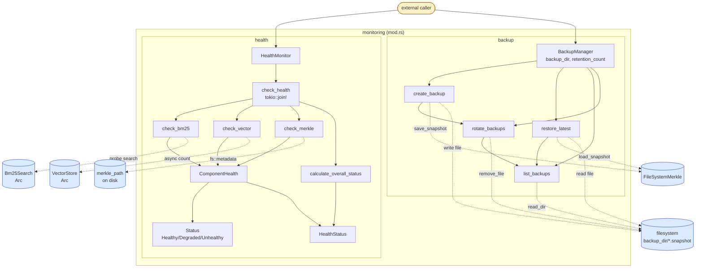

# monitoring — Architecture

## Overview

The `monitoring` module provides operational observability and durability for the indexing subsystem. Its `health` submodule probes BM25, vector store, and Merkle subsystems concurrently to produce a unified per-component status report, while its `backup` submodule manages versioned, timestamped Merkle snapshots on disk with retention-based rotation. Together they expose runtime health for diagnostics and a recovery path for the persistent Merkle index.

## Mermaid diagram

## Module responsibilities

| Module | Role | Key types |
|--------|------|-----------|
| `monitoring` (mod.rs) | Root module that re-exports the two operational submodules; carries no logic of its own. | — |
| `monitoring::health` | Concurrent liveness/latency probing of search and index subsystems; produces a structured, serializable health report. | `HealthMonitor`, `HealthStatus`, `ComponentHealth`, `Status` |
| `monitoring::backup` | On-disk versioned snapshot manager for the Merkle index, including timestamped naming, retention rotation, and restore. | `BackupManager` |

## Data flow

### Health checks

1. A caller constructs `HealthMonitor::new(bm25, vector_store, merkle_path)` with optional `Arc` handles to the live BM25 and vector subsystems plus the path of the persisted Merkle snapshot.
2. `HealthMonitor::check_health()` fans out three probes via `tokio::join!`:
   - `check_bm25` issues a sentinel `bm25.search("__health_check__", 1)` query, timing it with `Instant::now()` / `elapsed()`. Missing handle yields `Degraded`; query error yields `Unhealthy`; success yields `Healthy` with `latency_ms`.
   - `check_vector` awaits `vector_store.count()` on the same latency baseline, mapping outcomes the same way and embedding the vector count in the success message.
   - `check_merkle` runs purely against the filesystem: `Path::exists` then `fs::metadata().len()`. Existing → `Healthy`; existing-but-unreadable or missing → `Degraded`.
3. `calculate_overall_status` collapses the three `ComponentHealth` results into a single `Status`: `Unhealthy` only if both BM25 and vector are unhealthy; otherwise `Degraded` if any component is non-healthy or either search engine is unhealthy; otherwise `Healthy`.
4. The aggregated `HealthStatus { overall, bm25, vector, merkle }` is returned to the caller. Its `serde` derives (with `Status` rendered as lowercase strings and `latency_ms` skipped when `None`) make it ready for JSON exposure.

### Backup

1. `BackupManager::new(backup_dir, retention_count)` calls `fs::create_dir_all` to materialize the backup directory up front.
2. `create_backup(&merkle)` stamps the current `SystemTime::now().duration_since(UNIX_EPOCH).as_secs()` and writes `merkle_v{version}.{timestamp}.snapshot` via `merkle.save_snapshot`. It then invokes `rotate_backups` and logs the resulting path at info level.
3. `rotate_backups` (private) lists snapshots, returns early if the count is at or below `retention_count`, sorts by `Metadata::modified` ascending, and `fs::remove_file`s the `len - retention_count` oldest entries.
4. `restore_latest` lists snapshots, returns `Ok(None)` on empty, sorts by `modified` then reverses, and calls `FileSystemMerkle::load_snapshot` on the newest entry.
5. `list_backups` is the shared enumeration primitive: `read_dir` filtered to entries whose extension is `"snapshot"`. `backup_dir` and `retention_count` accessors expose configuration without copying the manager.

## Concurrency / integration model

- **Async runtime.** `health::check_health` is the only explicitly async path. It uses `tokio::join!` to drive `check_bm25`, `check_vector`, and `check_merkle` as concurrent futures on the current Tokio runtime. The vector probe is the only one that genuinely awaits a remote call; BM25 invokes a synchronous search and the Merkle probe blocks briefly on `std::fs` calls, but all three are bundled into the same join so total latency is bounded by the slowest probe.
- **Shared state.** `HealthMonitor` holds `Option<Arc<Bm25Search>>` and `Option<Arc<VectorStore>>`, so probes share the same engine instances used by the rest of the application without exclusive locking. The Merkle probe references state only through a `PathBuf`, decoupling health reporting from any in-memory `FileSystemMerkle`.
- **Channels / tasks.** Neither submodule spawns tasks or owns channels. `BackupManager` is fully synchronous and performs blocking `std::fs` operations; callers that schedule periodic backups are expected to wrap `create_backup` in `tokio::task::spawn_blocking` or an equivalent off-runtime executor.
- **External boundaries.**
  - Filesystem: `BackupManager` reads/writes `backup_dir/*.snapshot`; `HealthMonitor::check_merkle` reads `merkle_path` metadata.
  - BM25 search engine: `check_bm25` issues a probe query against `Bm25Search`.
  - Vector store: `check_vector` awaits `VectorStore::count()` (typically a remote/embedded DB call).
  - Merkle serializer: `BackupManager` delegates serialization to `FileSystemMerkle::{save,load}_snapshot`.
- **Integration / API points.**
  - `HealthMonitor::new` + `check_health` is the public surface for liveness endpoints; `HealthStatus` serializes directly to JSON for an HTTP/MCP `/health` route.
  - `BackupManager::new`, `create_backup`, and `restore_latest` form the public lifecycle for any scheduled snapshot job and for startup recovery; `backup_dir` / `retention_count` accessors support diagnostics and configuration display.
- **Failure semantics.** Backup operations propagate `anyhow::Result` with contextual messages on every IO boundary. Health checks never return `Result`; subsystem errors are folded into `ComponentHealth::unhealthy` / `degraded` so a single failing component cannot poison the overall report.
