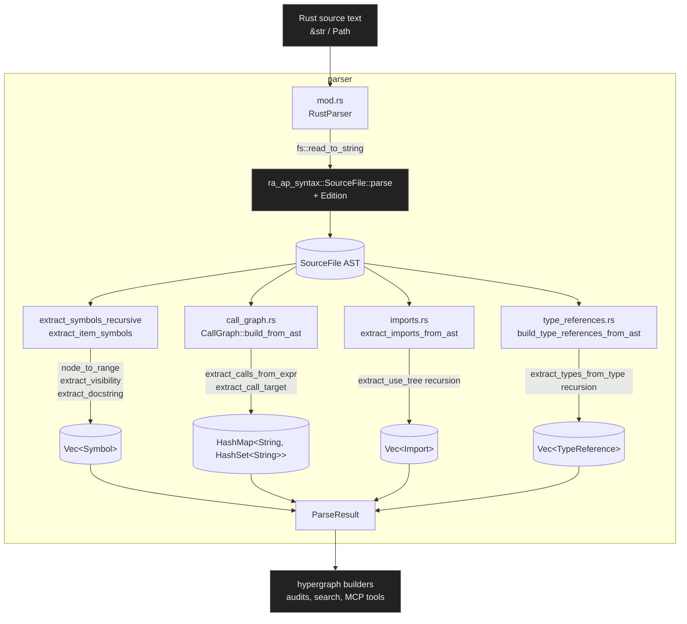

# parser — Architecture

## Overview

The `parser` module is the syntax-tree extraction layer of the codebase. It consumes raw Rust source text, drives the `ra_ap_syntax` parser bound to a configurable `Edition`, and harvests four orthogonal projections from a single AST: typed `Symbol`s, a caller→callee `CallGraph`, flattened `Import` records, and contextualized `TypeReference`s. All higher-level analyses (hypergraph builders, audits, search) consume the `ParseResult` bundle this module produces.

## Mermaid diagram

## Module responsibilities

| Module | Role | Key types |
| --- | --- | --- |
| `mod.rs` | Top-level parser facade; reads files, drives `ra_ap_syntax`, walks items into typed symbols, assembles the full `ParseResult`. | `RustParser`, `Symbol`, `SymbolKind`, `Visibility`, `Range`, `ParseResult` |
| `call_graph.rs` | Builds and queries the in-memory caller→callee edge map from function and method bodies. | `CallGraph`, `HashMap<String, HashSet<String>>` |
| `imports.rs` | Flattens `use` declarations (including nested trees, globs, renames) into a list of `Import`s and summarizes external crate roots. | `Import`, `Vec<Import>` |
| `type_references.rs` | Locates every type usage site in functions, structs, and impls and tags it with a `TypeUsageContext`. | `TypeReference`, `TypeUsageContext` |

## Data flow

1. **Source acquisition.** `RustParser::parse_file` / `parse_file_complete` read the file at a given `Path` via `fs::read_to_string`; source-text entry points (`parse_source`, `parse_source_complete`) skip this step.
2. **Single AST parse.** The source is passed once through `ra_ap_syntax::SourceFile::parse(source, edition)`. The resulting `SourceFile` tree is the single source of truth for every downstream extractor — there is no re-parsing.
3. **Four parallel extractions over the same AST.**
   - **Symbols**: `extract_symbols_recursive` iterates `file.items()`, and `extract_item_symbols` matches on `Fn` / `Struct` / `Enum` / `Trait` / `Impl` / `Module` / `Const` / `Static` / `TypeAlias`. Per-symbol metadata is derived by `node_to_range` (byte offsets → 1-indexed lines via `line_of_offset`), `extract_visibility` (textual classification of `pub`, `pub(crate)`, `pub(...)`), and `extract_docstring` (stripping `///` / `//!` and joining). `Module` and `Impl` items recurse to emit nested children.
   - **Calls**: `CallGraph::build_from_ast` walks each top-level `Fn` and each `Impl::AssocItem::Fn`, then `extract_calls_from_expr` descends the body's syntax. `CALL_EXPR` nodes are resolved by `extract_call_target` (last path segment of a `PathExpr`); `METHOD_CALL_EXPR` nodes contribute the bare method name. Each edge is inserted via `add_call`, deduplicated by the inner `HashSet`.
   - **Imports**: `extract_imports_from_ast` matches `ast::Item::Use`, then `extract_use_tree` recursively flattens nested groups (`{a, b}`), preserving `::`-joined prefixes, glob (`*`) markers, and `as`-renames into `Import` records. `get_external_dependencies` reduces these to a deduplicated set of root crate names.
   - **Type references**: `build_type_references_from_ast` walks `Fn` (parameters + return), `Struct` (record/tuple fields), and `Impl` (target type, trait name, associated function signatures). `extract_types_from_type` recurses into `PathType` (collecting last-segment names plus generic arguments) and `RefType` (preserving the outer `TypeUsageContext`).
4. **Bundling.** `parse_source_complete` packages the four collections into a single `ParseResult` returned to the caller.

## Concurrency / integration model

- **No internal concurrency.** The parser is fully synchronous. There are no tasks, channels, or shared state inside this module — each call to `parse_source` / `parse_source_complete` is self-contained and operates on stack-local accumulators (`Vec<Symbol>`, a fresh `CallGraph`, etc.).
- **Mutability is local.** `RustParser` carries only an `Edition`; its methods take `&mut self` purely for API symmetry. All internal state is owned `Vec` / `HashMap` / `HashSet` accumulators populated during the walk.
- **Failure modes.** IO errors from `fs::read_to_string` and parse failures from `SourceFile::parse` are surfaced through `Result<_, Box<dyn Error>>`. Sub-extractors (`extract_imports_from_ast`, `build_type_references_from_ast`, `CallGraph::build_from_ast`) are infallible by construction and silently skip unsupported AST variants.
- **External boundaries.**
  - *Inbound dependency*: `ra_ap_syntax` (`SourceFile`, `ast::*`, `AstNode`, `Edition`) provides the syntax tree and AST traits.
  - *Inbound callers*: higher layers (hypergraph construction, audit modules such as `channel_capacity_audit` / `fn_body_audit` / `recursion_check`, MCP tool handlers) invoke `RustParser::parse_source_complete` or the standalone `extract_imports*` / `build_type_references*` / `CallGraph::build*` entry points.
  - *Outbound surface*: the public types `RustParser`, `ParseResult`, `Symbol`, `SymbolKind`, `Visibility`, `Range`, `CallGraph`, `Import`, `TypeReference`, and `TypeUsageContext`, plus free functions `extract_imports`, `extract_imports_with_edition`, `extract_imports_from_ast`, `get_external_dependencies`, `build_type_references`, `build_type_references_with_edition`, `build_type_references_from_ast`, `find_type_references`, and `group_by_line`.
- **Edition handling.** Every parsing entry point has an explicit `*_with_edition` variant; defaults route through `Edition::Edition2021`. Callers that target a different edition pass it through without any global mutable state.
- **Reentrancy / threading.** Because there is no shared mutable state and `ra_ap_syntax` parse calls are pure, `RustParser` instances can be used freely across threads (one per thread); `ParseResult`, `CallGraph`, and the record vectors are plain owned data and can be moved between threads after construction.
