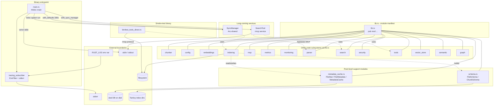

# root — Architecture

## Overview

The crate root files form the binary's outer shell: `lib.rs` is a pure module manifest that re-exports every subsystem, `main.rs` is the Tokio-driven MCP entrypoint that boots tracing and stitches together the long-running `SyncManager` and `SearchTool` services, and the supporting modules (`schema.rs`, `metadata_cache.rs`) define the on-disk contracts (Tantivy schemas + sled-backed metadata cache) that downstream indexing and search code build on. A standalone smoke-test binary (`bin/test_tools_direct.rs`) lives alongside but bypasses the MCP layer entirely. Together these files are the only place where process lifecycle, transport selection, and persistence schemas are decided — every other module consumes the types they declare.

## Mermaid diagram

## Module responsibilities

| Module | Role | Key types |
| --- | --- | --- |
| `src/lib.rs` | Crate-root manifest; declares every public subsystem and applies `#![warn(unreachable_pub, dead_code)]`. No executable code. | (none — only `pub mod` declarations) |
| `src/main.rs` | Binary entrypoint. Boots tracing to stderr, builds the shared `SyncManager`, spawns the periodic sync task, and serves the rmcp protocol over stdio until disconnect. | `main()` (async, `#[tokio::main]`) |
| `src/schema.rs` | Defines the two Tantivy schemas consumed by the indexing layer: per-file documents and symbol-aware chunk documents. | `FileSchema`, `ChunkSchema` |
| `src/metadata_cache.rs` | Sled-backed persistent metadata cache that drives incremental indexing via cheap stat checks and SHA-256 content hashing. | `FileStat`, `FileMetadata`, `MetadataCache` |
| `src/bin/test_tools_direct.rs` | Standalone smoke-test binary that drives `RustParser` and stdlib IO against a hard-coded sibling project, bypassing the MCP layer. | `main()` (`#[tokio::main]`, synchronous body) |

## Data flow

1. **Startup.** The Tokio multi-thread runtime is created by the `#[tokio::main]` macro wrapping `main`. `main` first builds a `tracing_subscriber::fmt` subscriber whose `EnvFilter` is parsed from `RUST_LOG` (falling back to `"warn,file_search_mcp=info"` to avoid the rust-analyzer log-flood regression in `build_hypergraph`) and whose writer is `std::io::stderr` with ANSI disabled — stdout is reserved for the MCP framing protocol. `tracing::info!("Starting MCP Server...")` is the first observable event.
2. **Shared state construction.** `SyncManager::with_defaults(300)` builds a 5-minute-interval background sync manager; it is wrapped in `Arc::new` so the same handle can live in two owners simultaneously.
3. **Background task spawn.** `Arc::clone(&sync_manager)` is moved into a `tokio::spawn` block whose body awaits `sync_manager_clone.run().await`. This is the long-running incremental-indexing loop; it consults `MetadataCache` (via `has_stat_changed` then `has_changed`) to decide which files to re-index and writes Tantivy documents shaped by `FileSchema`/`ChunkSchema`.
4. **Tool registration.** `SearchTool::with_sync_manager(Arc::clone(&sync_manager))` constructs the rmcp service object, binding it to the same shared `SyncManager`. The rmcp framework introspects the tool struct's `#[tool]` annotations (in the `tools` subsystem) to register the full MCP tool surface — `search`, `read_file_content`, `find_definition`, `build_hypergraph`, etc.
5. **Request handling.** `ServiceExt::serve(stdio())` plugs the tool into `rmcp::transport::stdio()`, producing a future that reads JSON-RPC frames from stdin, dispatches them to tool methods, and writes responses to stdout. `service.waiting().await` blocks until the client disconnects (typically when stdin closes). Tool methods may consult the shared `SyncManager`, the metadata cache, and the Tantivy indexes built from the root schemas.
6. **Shutdown.** When `serve(...).await` returns an error, `inspect_err` logs `tracing::error!("serving error: {:?}", e)` and the `?` propagates it out of `main`. Otherwise, `service.waiting().await`'s completion (clean disconnect) drops the rmcp service; the spawned `SyncManager::run` task is implicitly aborted as the runtime tears down. `main` returns `Ok(())` and the process exits.

## Concurrency / integration model

- **Tokio runtime.** `#[tokio::main]` installs the default multi-thread runtime; both the rmcp service future and the spawned sync loop run as Tokio tasks scheduled across worker threads. The single `Arc<SyncManager>` is the synchronization point — interior mutability inside `SyncManager` is what allows the spawned task and the tool callbacks to coexist.
- **Signal handling.** There is no explicit `tokio::signal` registration; lifecycle is driven entirely by the rmcp transport. The process exits when stdin is closed by the MCP client (which is the canonical signal for stdio-transport servers) or when the service errors out. The spawned `SyncManager` task has no graceful-shutdown handshake — it terminates with the runtime.
- **MCP transport.** `rmcp::transport::stdio()` provides newline-delimited JSON-RPC over stdin/stdout. Because stdout is the protocol channel, the tracing subscriber is deliberately pinned to stderr; any accidental `println!` in tool code would corrupt the wire format. Logs are also ANSI-stripped so they remain machine-parseable when the host captures stderr.
- **Persistence boundaries.** The root files own the two persistence contracts: `metadata_cache.rs` opens (and lazily creates parent dirs for) a sled database that is single-process-locked, and `schema.rs` produces `Schema` values that are cheap to clone (`Arc`-backed) and shared with whatever Tantivy `Index`/`IndexWriter` the indexing subsystem builds. Both contracts are stable across the process lifetime — schema changes require a cache/index rebuild via the `clear_cache` tool.
- **Smoke-test binary.** `bin/test_tools_direct.rs` runs on its own Tokio runtime but never touches the rmcp transport, the `SyncManager`, or the metadata cache. It is intentionally decoupled so that core parser/IO regressions can be reproduced without bringing up the full server, and its hard-coded path to a sibling project is a known caveat rather than a configuration point.
