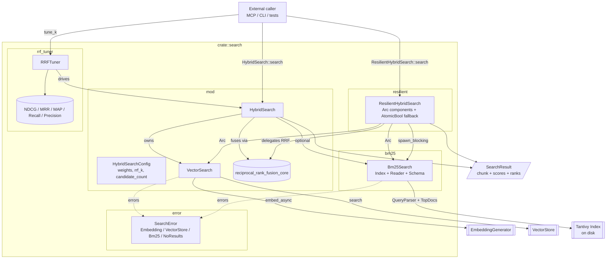

# search — Architecture

## Overview

The `search` module is the query-time core of the system: it combines BM25 keyword search (Tantivy-backed) with dense vector search (embedding + vector store) and fuses the two ranked lists via Reciprocal Rank Fusion (RRF). It exposes both a strict `HybridSearch` orchestrator and a fault-tolerant `ResilientHybridSearch` wrapper that degrades gracefully when one backend fails, plus an offline `RRFTuner` that sweeps the RRF `k` parameter against ground-truth queries.

## Mermaid diagram

## Module responsibilities

| Module | Role | Key types |
| --- | --- | --- |
| `mod` | Orchestrates vector-only and hybrid search; owns RRF fusion math and configuration defaults. | `HybridSearchConfig`, `VectorSearch`, `HybridSearch`, `RrfScore` (private), `reciprocal_rank_fusion_core` (private) |
| `bm25` | Wraps a Tantivy index for multi-field BM25 keyword search over code chunks; supports open/create, reload, and cheap clone for parallel use. | `Bm25Search`, `ChunkSchema` (re-exported), `Index`, `IndexReader` |
| `resilient` | Provides fault-tolerant hybrid search with `Arc`-shared components and an `AtomicBool` fallback flag; runs both backends concurrently and degrades to whichever survives. | `ResilientHybridSearch`, `Arc<Bm25Search>`, `Arc<VectorStore>`, `Arc<EmbeddingGenerator>`, `AtomicBool` |
| `error` | Defines the unified error type for all search operations with `thiserror`-derived `Display`/`From` impls. | `SearchError` (`Embedding`, `VectorStore`, `Bm25`, `NoResults`) |
| `rrf_tuner` | Offline RRF `k` tuner and quality evaluator; runs a candidate sweep over ground-truth queries and computes ranking-quality metrics. | `RRFTuner`, `TestQuery`, `TuningResult`, `EvaluationMetrics` |

## Data flow

A typical hybrid query traverses the module like this:

1. **Entry.** Caller invokes `HybridSearch::search(query, limit)` (or `ResilientHybridSearch::search` for the fault-tolerant variant). `search` immediately delegates to `search_with_k` so the configured `rrf_k` from `HybridSearchConfig` is used.
2. **Fan-out.** `search_with_k` reads `candidate_count` from config and uses `tokio::join!` to launch two arms concurrently:
   - **Vector arm.** `VectorSearch::search` calls `EmbeddingGenerator::embed_async` to produce a query vector, then `VectorStore::search` to retrieve the top-`candidate_count` `VectorSearchResult`s. Errors lift into `SearchError::Embedding` or `SearchError::VectorStore`.
   - **BM25 arm.** A cloned `Bm25Search` (cheap, `Arc`-backed inside Tantivy) is moved into `tokio::task::spawn_blocking`, where `Bm25Search::search` builds a `QueryParser` over `content`/`symbol_name`/`docstring`, executes against `TopDocs::with_limit(candidate_count)`, hydrates each hit into `(ChunkId, f32, CodeChunk)` by deserializing `chunk_json`, and returns the list. Join errors and inner Tantivy errors both fold into `SearchError::Bm25`.
3. **Fusion.** Both candidate lists feed `HybridSearch::reciprocal_rank_fusion_with_k`, which converts the vector results into `(ChunkId, f32, CodeChunk)` triples and forwards everything to the private `reciprocal_rank_fusion_core`. Core logic accumulates `RrfScore` entries in a `HashMap<ChunkId, _>`, adding `vector_weight / (k + rank+1)` for vector hits and `bm25_weight / (k + rank+1)` for BM25 hits, then drains and sorts descending by fused score.
4. **Trim and return.** The merged list is truncated to `limit` and returned as `Vec<SearchResult>`, where each result carries the chunk plus optional `bm25_score`/`vector_score` and `bm25_rank`/`vector_rank` so callers can inspect provenance.
5. **Resilient overlay.** When invoked through `ResilientHybridSearch::search`, the same fan-out happens inside `try_hybrid_search` but with explicit branching: if both backends succeed, `merge_results` calls `HybridSearch::reciprocal_rank_fusion_static` (canonical equal-weight RRF); if one fails, the surviving list is returned as-is and a `tracing::warn!` is emitted; if both fail, control flows to `fallback_search`, which retries BM25 first (no network deps), then vector-only, finally erroring with `anyhow!`. The `fallback_mode` `AtomicBool` is flipped accordingly and exposed via `is_fallback_mode()`.
6. **Tuning loop (offline).** `RRFTuner::tune_k` repeats step 1-3 across a hard-coded `k_values` grid, calling `HybridSearch::search_with_k` per query, scoring results with `calculate_ndcg` (and `calculate_mrr` in the verbose path), and selecting the `k` with the highest average NDCG@10.

## Concurrency / integration model

**Tasks and threading.**
- `HybridSearch::search_with_k` uses `tokio::join!` to overlap the vector arm (async) with a `tokio::task::spawn_blocking` call wrapping `Bm25Search::search`. BM25 is sync-on-disk via Tantivy, so `spawn_blocking` keeps the runtime healthy. The blocking task receives a *clone* of `Bm25Search`; cloning is cheap because the inner Tantivy `Index`/`IndexReader` are `Arc`-backed.
- `ResilientHybridSearch` follows the same pattern but wraps every shared component (`Bm25Search`, `VectorStore`, `EmbeddingGenerator`) in `Arc` at construction so the same instance can be cheaply handed to multiple concurrent search calls.
- `RRFTuner::tune_k` is sequential per query and per `k`, but each underlying `HybridSearch::search_with_k` call still parallelizes its two backends.

**Shared state.**
- `Bm25Search` holds an `Index`, `IndexReader`, and `ChunkSchema`; its `Clone` impl is the primary concurrency primitive (cheap, share-friendly). `reload(&mut self)` refreshes the reader to pick up newly committed segments.
- `ResilientHybridSearch::fallback_mode` is an `Arc<AtomicBool>` toggled with `Ordering::Relaxed`. It is purely informational - searches always re-attempt the full hybrid path on every call regardless of the flag.
- No interior mutex/RwLock is used inside this module; all coordination is via task fan-out plus immutable `Arc` shares.

**Channels.** None. All inter-arm coordination is `tokio::join!` over futures; no `mpsc`/`broadcast`/`oneshot` traffic crosses this module's boundary.

**External integration points.**
- **Inbound.** Public surface for callers is `HybridSearch::{new, with_defaults, search, search_with_k, vector_only_search, reciprocal_rank_fusion_static}`, `VectorSearch::{new, search}`, `ResilientHybridSearch::{new, with_defaults, search, is_fallback_mode}`, plus `Bm25Search::{new, from_index, search, index, schema, reload, clone}` and the `RRFTuner` quality-tuning toolkit.
- **Outbound.**
  - `EmbeddingGenerator` (sibling crate) — `embed_async` / `embed`.
  - `VectorStore` (sibling crate) — `search(query_embedding, limit)`.
  - **Tantivy** — `Index::open_in_dir` / `Index::create_in_dir`, `IndexReader`, `QueryParser`, `TopDocs`, `Searcher` for BM25.
  - **Filesystem** — `Bm25Search::new` creates/reads the on-disk index directory (`meta.json` probe, `std::fs::create_dir_all`).
  - **Tracing** — `ResilientHybridSearch` and `RRFTuner` emit `tracing::{info, warn, debug}` for backend failures, fallback transitions, and tuning sweeps.
- **Error contract.** `SearchError` is the canonical return type for the strict path; `ResilientHybridSearch` lifts everything into `anyhow::Result` with `.context(...)` and `anyhow!` messages so it can absorb heterogeneous failures (join errors, missing-component errors, embedding errors, vector-store errors, BM25 errors) into a single fallback decision.
