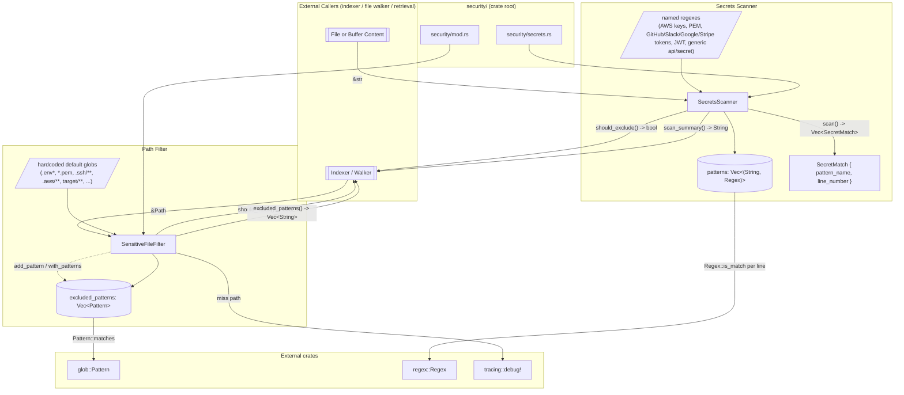

# security — Architecture

## Overview

The `security` module is a two-pronged content-safety layer: a glob-based **sensitive file filter** that decides whether a path is safe to index, and a regex-based **secrets scanner** that inspects text for embedded credentials. Together they gate ingestion and reporting so that env files, key material, build artifacts, and high-confidence secret strings (API keys, tokens, PEM blocks, JWTs, etc.) never reach downstream indexing or retrieval consumers.

## Mermaid Diagram

## Module Responsibilities

| Module | Role | Key types |
| --- | --- | --- |
| `security/mod.rs` | Compile and apply glob patterns to exclude sensitive files from indexing; expose default and caller-extended pattern sets. | `SensitiveFileFilter`, `glob::Pattern`, `glob::PatternError` |
| `security/secrets.rs` | Compile named regexes for common secret formats; scan text content line-by-line; produce structured matches, boolean exclusion verdicts, and human-readable summaries. | `SecretsScanner`, `SecretMatch` |

## Data Flow

**Path check (sensitive file filter):**

1. Caller constructs a `SensitiveFileFilter` either via `default()` (hardcoded list of env/credential/key/build globs, with bad patterns silently dropped) or `with_patterns()` (caller-supplied, errors propagated).
2. Optional `add_pattern()` calls extend `excluded_patterns: Vec<Pattern>` at runtime.
3. For each candidate path the caller invokes `should_index(&Path)`:
   - The path is rendered via `Path::to_string_lossy`.
   - Every stored `Pattern` is tested with `Pattern::matches`.
   - First match logs a `tracing::debug!` line and returns `false` (exclude); otherwise returns `true` (admit).
4. `excluded_patterns()` exposes the active glob strings (recovered via `Pattern::as_str`) for diagnostics or UI.

**Content scan (secrets scanner):**

1. Caller constructs a `SecretsScanner` via `new()` / `Default::default()`, which compiles the static set of named regex literals once (unwrap is safe — literals are static).
2. For each text buffer the caller calls one of:
   - `scan(&str) -> Vec<SecretMatch>`: outer loop over `(name, regex)` pairs, inner loop over `content.lines().enumerate()`; every line that satisfies `Regex::is_match` produces a `SecretMatch { pattern_name: name.clone(), line_number: idx + 1 }`.
   - `should_exclude(&str) -> bool`: thin wrapper — `!scan(content).is_empty()`.
   - `scan_summary(&str) -> String`: returns `"No secrets detected"` on empty, otherwise a header with the total count followed by one bullet line per match (pattern name, optional line number).
3. The caller chooses how to react: skip ingestion, redact, warn, or surface the summary in tool output.

## Concurrency / Integration Model

- **No tasks, no channels, no shared mutable state.** Both `SensitiveFileFilter` and `SecretsScanner` are plain owned values; methods take `&self` (or `&mut self` only for `add_pattern`). Filtering and scanning are pure CPU work over local data.
- **Thread-safety by construction:** `glob::Pattern` and `regex::Regex` are `Send + Sync`, and the wrappers hold them in a `Vec`. An `Arc<SensitiveFileFilter>` or `Arc<SecretsScanner>` can be shared across rayon/tokio workers (typical pattern for the indexer) without locking. Mutation (`add_pattern`) requires exclusive access and is intended for setup-time only.
- **Construction cost is paid once.** Default constructors compile every glob/regex up front, so per-call work is reduced to pattern matching. The secrets scanner's `unwrap` on regex compilation is safe because all patterns are static literals.
- **External integration points** — the module is consumed, not consuming:
  - `SensitiveFileFilter::should_index` is called by the file-walker / indexer before reading or hashing a path.
  - `SecretsScanner::should_exclude` / `scan_summary` is called by ingestion or retrieval layers on already-loaded text content.
  - Diagnostic output is emitted via `tracing::debug!` only (no direct stdout/stderr or MCP plumbing inside this module).
- **External crate boundaries:** `glob` (pattern compilation + matching), `regex` (regex compilation + matching), `tracing` (structured logging). No I/O, no async, no FFI.
