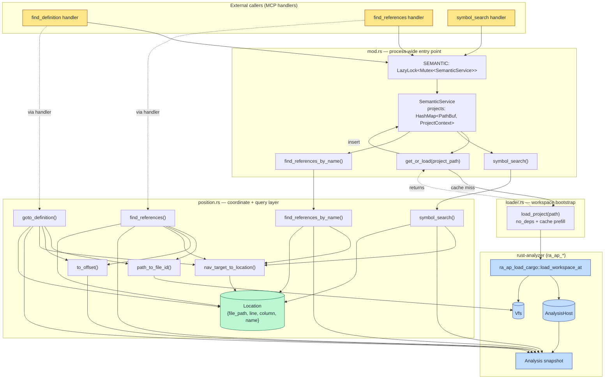

# semantic — Architecture

## Overview

The `semantic` module is a thin, process-wide wrapper around rust-analyzer's IDE crates that powers `find_definition` and `find_references` (plus name-based symbol search) for the MCP server. It lazily loads an `AnalysisHost` + `Vfs` per Cargo workspace using a fast, dependency-free Cargo configuration, caches them behind a single `Mutex`, and translates between portable `file:line:column` coordinates and rust-analyzer's internal `FileId` / `TextSize` / `NavigationTarget` types.

## Mermaid diagram

## Module responsibilities

| Module | Role | Key types |
|--------|------|-----------|
| `mod` | Owns the process-wide `SEMANTIC` singleton and the `SemanticService` cache; routes name-based queries through `position` after ensuring the project's IDE state is loaded. | `SEMANTIC: LazyLock<Mutex<SemanticService>>`, `SemanticService`, `ProjectContext` (= `(AnalysisHost, Vfs)`) |
| `loader` | Bootstraps a rust-analyzer workspace with `no_deps = true`, no proc-macro server, and prefilled caches for ~120ms cold loads; produces the `(AnalysisHost, Vfs)` pair stored in the cache. | `CargoConfig`, `LoadCargoConfig`, `AnalysisHost`, `Vfs` |
| `position` | Converts between real file paths and VFS `FileId`s, between 1-based `line`/`column` and `TextSize` offsets, and between rust-analyzer `NavigationTarget`s and the public `Location` record; implements all four query verbs (`goto_definition`, `find_references`, `symbol_search`, `find_references_by_name`). | `Location`, `FileId`, `FilePosition`, `TextSize`, `LineIndex`, `NavigationTarget`, `ReferenceSearchResult` |

## Data flow

A query of the form `(project_path, file_path, line, column)` flows through the module as follows:

1. **Lock & cache lookup.** The MCP handler acquires the `SEMANTIC` mutex. `SemanticService::get_or_load` canonicalizes `project_path` and checks `self.projects`. On a hit, it reuses the cached `(AnalysisHost, Vfs)`; on a miss it logs an info trace and calls `loader::load_project`.
2. **Workspace load (cold path only).** `load_project` builds a `CargoConfig { sysroot: None, no_deps: true, .. }` and a `LoadCargoConfig` with cache prefill enabled and `num_cpus::get_physical()` worker threads, then calls `ra_ap_load_cargo::load_workspace_at` to produce a `RootDatabase` + `Vfs`. The database is wrapped in `AnalysisHost::with_database` and the pair is inserted into the cache under the canonical project path.
3. **Snapshot.** The chosen `position::*` function calls `host.analysis()` to obtain an immutable `Analysis` snapshot.
4. **Coordinate translation.** `path_to_file_id` canonicalizes the input file path, wraps it in a `VfsPath::new_real_path`, and looks up its `FileId` in the VFS. `to_offset` fetches the file's `LineIndex`, decrements the 1-based `(line, column)` to the 0-based `LineCol` rust-analyzer expects, and resolves it to a `TextSize`. The two are combined into a `FilePosition`.
5. **Query.** Depending on the verb:
   - `goto_definition` calls `Analysis::goto_definition(FilePosition, GotoDefinitionConfig)` and walks the returned `RangeInfo<Vec<NavigationTarget>>`.
   - `find_references` calls `Analysis::find_all_refs` with imports + tests included and no scope, then walks the declaration plus per-file `(range, _category)` entries.
   - `symbol_search` runs `Analysis::symbol_search(Query, limit)`.
   - `find_references_by_name` runs `symbol_search(limit=50)` first, then re-issues `find_all_refs` at each match's `focus_range.start()` (or `full_range` fallback).
6. **Result mapping.** Every `NavigationTarget` is converted by `nav_target_to_location`: VFS path → `PathBuf`, `LineIndex` lookup of `focus_range.start()` (or `full_range.start()`), 1-based line/column reconstruction (`+1` to each component), and the target's `name`. Raw reference ranges in `find_references` / `find_references_by_name` are converted directly via the file's `LineIndex` and tagged with the literal name `"reference"`.
7. **Post-processing.** `find_references_by_name` sorts by `(file_path, line, column)` and `dedup_by` adjacent equal triples before returning. Other verbs return their `Vec<Location>` as-is.
8. **Return.** Results bubble back to the MCP handler, the mutex is released, and the handler serializes `Location` values (via `Display: "{path}:{line}:{col} ({name})"` or struct fields) to the JSON-RPC response.

## Concurrency / integration model

- **Process-wide singleton.** `SEMANTIC: LazyLock<Mutex<SemanticService>>` is the sole entry point; it is initialized on first access and survives for the life of the process. `AnalysisHost` is not `Sync`, which forces the outer `Mutex` rather than an `RwLock`.
- **Coarse-grained locking.** Every public verb (`get_or_load`, `symbol_search`, `find_references_by_name`, plus the handler-level `goto_definition` / `find_references` paths) takes the same mutex for the full duration of the query. There is no per-project lock — concurrent MCP requests targeting different workspaces still serialize through the global mutex.
- **Per-project IDE cache.** `SemanticService::projects: HashMap<PathBuf, ProjectContext>` is keyed by `Path::canonicalize`'d project paths so relative-path callers hit the same entry. Once inserted, an entry is never invalidated within the module — cache invalidation, if any, is the caller's responsibility (e.g. via the surrounding `clear_cache` MCP tool).
- **Internal parallelism.** The cold-load path inside `load_project` is the only place that fans out: `LoadCargoConfig` is given `num_cpus::get_physical()` worker threads and `with_proc_macro_server` is set to one process. `prefill_caches = true` warms common queries up-front so subsequent `Analysis` snapshots are fast and lock-free.
- **Snapshot isolation.** Each query calls `host.analysis()` to get an immutable `Analysis` snapshot, so even though the host itself is mutex-guarded, the snapshot can be reasoned about as a stable view for the duration of the call.
- **External boundaries.**
  - **Inbound:** MCP tool handlers (`find_definition`, `find_references`, `symbol_search`, `find_references_by_name`) — each takes `&mut self` on the locked `SemanticService`.
  - **Outbound (rust-analyzer):** `ra_ap_load_cargo::load_workspace_at`, `ra_ap_ide::{AnalysisHost, Analysis, FilePosition, NavigationTarget, Query, GotoDefinitionConfig, FindAllRefsConfig}`, `ra_ap_vfs::{Vfs, VfsPath, FileId}`, `ra_ap_ide_db::base_db::FileId` (bridged to VFS via `FileId::from_raw(index())`).
  - **Outbound (filesystem):** `Path::canonicalize` for both project and file paths.
  - **Outbound (logging):** `tracing::info` traces around the cold-load path.
- **Error model.** All fallible paths return `anyhow::Result`; failures are contextualized with strings like `"Failed to load workspace"`, `"goto_definition query failed"`, `"find_all_refs query failed"`, and `"symbol_search query failed"` so the MCP layer can surface them verbatim.
