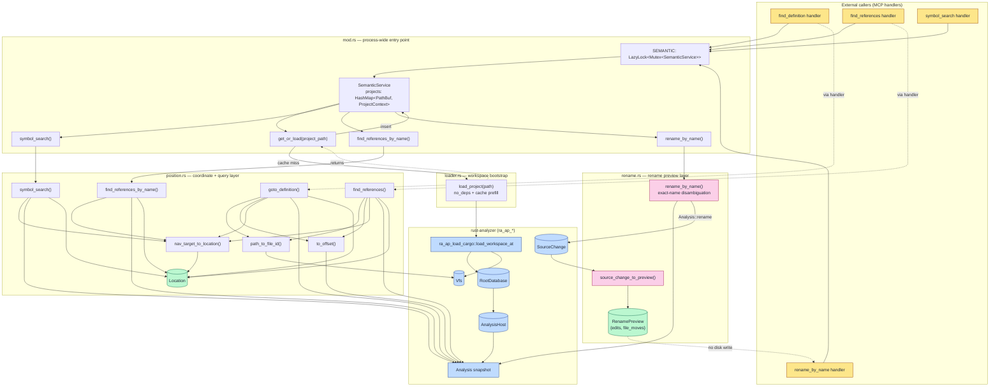

# semantic — Architecture

## Overview

The `semantic` module is a thin, process-wide wrapper around rust-analyzer's IDE crates that powers `find_definition`, `find_references`, name-based symbol search, and the new `rename_by_name` preview path for the MCP server. It lazily loads an `AnalysisHost` + `Vfs` per Cargo workspace, caches them behind a single `Mutex`, and translates between portable `file:line:column` coordinates and rust-analyzer's internal `FileId` / `TextSize` / `NavigationTarget` / `SourceChange` types — the rename path returns a `RenamePreview` (deterministic textual edits + file moves) without ever writing to disk.

## Mermaid diagram

## Module responsibilities

| Module | Role | Key types |
|--------|------|-----------|
| `mod` | Owns the process-wide `SEMANTIC` singleton and the `SemanticService` cache; routes name-based queries (search, references, rename) through `position` / `rename` after ensuring the project's IDE state is loaded. | `SEMANTIC: LazyLock<Mutex<SemanticService>>`, `SemanticService`, `ProjectContext` (= `(AnalysisHost, Vfs)`) |
| `loader` | Bootstraps a rust-analyzer workspace with `no_deps = true`, no proc-macro server, and prefilled caches for ~120ms cold loads; produces the `(AnalysisHost, Vfs)` pair stored in the cache. | `CargoConfig`, `LoadCargoConfig`, `AnalysisHost`, `Vfs` |
| `position` | Converts between real file paths and VFS `FileId`s, between 1-based `line`/`column` and `TextSize` offsets, and between rust-analyzer `NavigationTarget`s and the public `Location` record; implements `goto_definition`, `find_references`, `symbol_search`, and `find_references_by_name`. | `Location`, `FileId`, `FilePosition`, `TextSize`, `LineIndex`, `NavigationTarget`, `ReferenceSearchResult` |
| `rename` | Disambiguates a symbol by exact name, invokes `Analysis::rename`, and materializes the resulting `SourceChange` into a deterministic `RenamePreview` (text edits + file moves) without touching the filesystem. | `RenameEdit`, `RenameFileMove`, `RenamePreview`, `RenameConfig`, `SourceChange`, `FileSystemEdit` |

## Data flow

A query of the form `(project_path, symbol_name [, new_name])` or `(project_path, file_path, line, column)` flows through the module as follows:

1. **Lock & cache lookup.** The MCP handler acquires the `SEMANTIC` mutex. `SemanticService::get_or_load` canonicalizes `project_path` and checks `self.projects`. On a hit, it reuses the cached `(AnalysisHost, Vfs)`; on a miss it logs an info trace and calls `loader::load_project`.
2. **Workspace load (cold path only).** `load_project` builds a `CargoConfig { sysroot: None, no_deps: true, .. }` and a `LoadCargoConfig` with cache prefill enabled and `num_cpus::get_physical()` worker threads, then calls `ra_ap_load_cargo::load_workspace_at` to produce a `RootDatabase` + `Vfs`. The database is wrapped in `AnalysisHost::with_database` and the pair is inserted into the cache under the canonical project path.
3. **Snapshot.** The chosen `position::*` / `rename::*` function calls `host.analysis()` to obtain an immutable `Analysis` snapshot over the shared `RootDatabase`.
4. **Coordinate / symbol resolution.**
   - Position-based verbs use `path_to_file_id` + `to_offset` to compose a `FilePosition` from the input path and 1-based coordinates.
   - Name-based verbs (`symbol_search`, `find_references_by_name`, `rename_by_name`) run `Analysis::symbol_search(Query, limit)` and select target(s) from the returned `NavigationTarget`s; rename additionally filters by exact `name.as_str() == symbol_name` to refuse fuzzy or ambiguous matches.
5. **Query.** Depending on the verb:
   - `goto_definition` calls `Analysis::goto_definition`.
   - `find_references` / `find_references_by_name` call `Analysis::find_all_refs` (imports + tests included, no scope) and walk the declaration plus per-file `(range, _category)` entries.
   - `rename_by_name` calls `Analysis::rename(position, new_name, &RenameConfig { show_conflicts: true, prefer_prelude: true, .. })`, mapping cancellation and `RenameError` into contextualized `anyhow` errors.
6. **Result mapping.**
   - Navigation results are converted by `nav_target_to_location` into `Location { file_path, line(1-based), column(1-based), name }`.
   - Rename results are converted by `source_change_to_preview`: each `TextEdit` `Indel` becomes a `RenameEdit { file_path, start/end line+column (1-based), new_text }`; each `FileSystemEdit` variant (`CreateFile`, `MoveFile`, `MoveDir`) becomes a `RenameFileMove { from, to_anchor, to_path }`.
7. **Post-processing.** `find_references_by_name` sorts and `dedup_by`s adjacent triples. `source_change_to_preview` sorts `preview.edits` by `(file_path, start_line, start_column)` for determinism. No verb writes to disk.
8. **Return.** Results bubble back to the MCP handler; the mutex is released; the handler serializes `Location` / `RenamePreview` (via `Display` or struct fields) to the JSON-RPC response. Applying a `RenamePreview` to the filesystem is the caller's responsibility.

## Concurrency / integration model

- **Process-wide singleton.** `SEMANTIC: LazyLock<Mutex<SemanticService>>` is the sole entry point; it is initialized on first access and survives for the life of the process. `AnalysisHost` is not `Sync`, which forces the outer `Mutex` rather than an `RwLock`.
- **Coarse-grained locking.** Every public verb (`get_or_load`, `symbol_search`, `find_references_by_name`, `rename_by_name`, plus handler-level `goto_definition` / `find_references` paths) takes the same mutex for the full duration of the query. There is no per-project lock — concurrent MCP requests targeting different workspaces still serialize through the global mutex. Rename queries, which can fan out across many files inside rust-analyzer, hold the mutex for the entire `Analysis::rename` + `source_change_to_preview` span.
- **Per-project IDE cache.** `SemanticService::projects: HashMap<PathBuf, ProjectContext>` is keyed by `Path::canonicalize`'d project paths so relative-path callers hit the same entry. Once inserted, an entry is never invalidated within the module — cache invalidation, if any, is the caller's responsibility (e.g. via the surrounding `clear_cache` MCP tool).
- **Internal parallelism.** The cold-load path inside `load_project` is the only place that fans out: `LoadCargoConfig` is given `num_cpus::get_physical()` worker threads and `with_proc_macro_server` is set to one process. `prefill_caches = true` warms common queries up-front so subsequent `Analysis` snapshots are fast and lock-free.
- **Snapshot isolation & cancellation.** Each query calls `host.analysis()` to get an immutable `Analysis` snapshot rooted in the shared `RootDatabase`; rust-analyzer queries may return cancellation errors when a newer snapshot would invalidate them — `rename_by_name` converts that case via `.context("rename query cancelled")`, and the inner `Result<SourceChange, RenameError>` surfaces refusals (invalid identifier, cross-crate rename) as `"rust-analyzer rename refused: {e}"`.
- **Side-effect boundary.** No code in the module writes to the filesystem. `RenamePreview` is pure data; the caller — typically an MCP tool handler — decides whether to materialize it. This keeps the semantic layer deterministic and testable.
- **External boundaries.** Inbound: MCP tool handlers (`find_definition`, `find_references`, `symbol_search`, `find_references_by_name`, `rename_by_name`), each holding `&mut self` on the locked `SemanticService`. Outbound: `ra_ap_load_cargo::load_workspace_at`; `ra_ap_ide::{AnalysisHost, Analysis, FilePosition, NavigationTarget, Query, GotoDefinitionConfig, FindAllRefsConfig, RenameConfig, SourceChange, FileSystemEdit}`; `ra_ap_vfs::{Vfs, VfsPath, FileId}`; `ra_ap_ide_db::base_db::FileId` (bridged via `FileId::from_raw(index())`); `Path::canonicalize` for project/file paths (never `write`); `tracing::info` traces around the cold-load path.
- **Error model.** All fallible paths return `anyhow::Result`; failures are contextualized with strings like `"Failed to load workspace"`, `"goto_definition query failed"`, `"find_all_refs query failed"`, `"symbol_search query failed"`, `"rename query cancelled"`, and `"rust-analyzer rename refused: …"` so the MCP layer can surface them verbatim.
