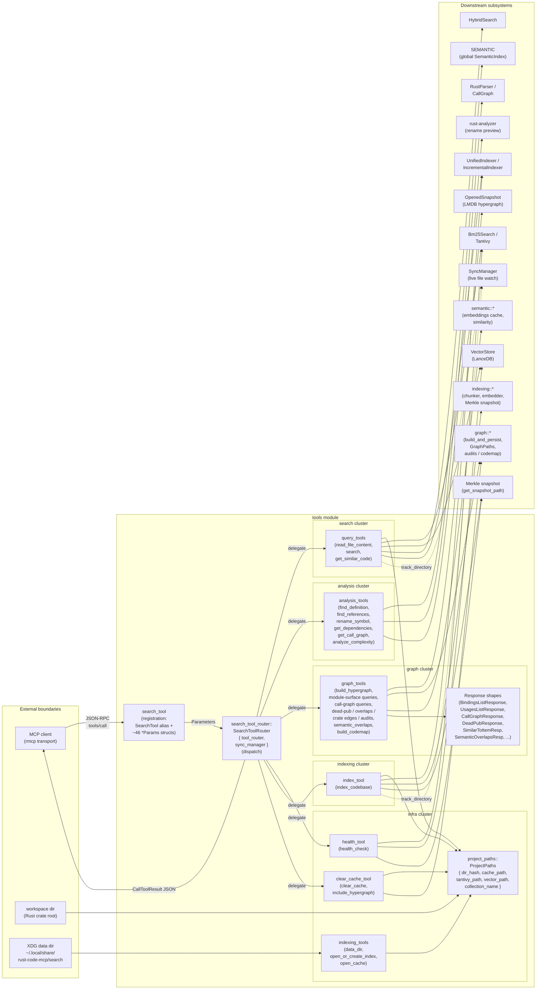

# tools — Architecture

## Overview

The `tools` module is the MCP tool surface of the rust-code-mcp server: an rmcp `ToolRouter` shell (`SearchToolRouter`) that exposes 35+ tools spanning keyword/semantic search, on-demand and incremental indexing, per-file static analysis (including a rust-analyzer-backed rename preview), persisted-hypergraph queries (imports / exports / call graph / dead-pub / cross-crate edges / overlaps / audits / codemap), and operational health/cache controls. Registration happens once through `search_tool` (legacy alias) and `search_tool_router` (the `#[tool_router]` host); dispatch fans every JSON-RPC `tools/call` out to one of seven domain submodules (`query_tools`, `analysis_tools`, `graph_tools`, `indexing_tools`, `index_tool`, `clear_cache_tool`, `health_tool`). The module owns no business logic of its own — its responsibility is request validation, dispatch, response shaping, and JSON serialization.

## Mermaid diagram

## Module responsibilities

| Module | Role | Key MCP tools / types |
| --- | --- | --- |
| `mod` | Pure submodule declarations; public face of the tools surface. | (none) |
| `project_paths` | Derive per-project on-disk layout from a workspace directory using a SHA-256 directory hash. | `ProjectPaths` |
| `indexing_tools` | Resolve the XDG data root and open/create the shared Tantivy index + metadata cache. | `data_dir`, `open_or_create_index`, `open_cache` |
| `health_tool` | Probe BM25, vector store, and Merkle snapshot health for one project or globally; render JSON + interpretation. | `health_check` |
| `clear_cache_tool` | Remove cache/Tantivy/vector dirs for one project or workspace-wide; optionally wipe the persisted hypergraph snapshot at `GraphPaths::for_workspace(...).root_dir`. | `clear_cache` (with `include_hypergraph`) |
| `index_tool` | Validate dir, force-clear if requested (including the Merkle snapshot), run incremental indexing, register with `SyncManager`. | `index_codebase` |
| `search_tool` | Backward-compat registration wrapper: re-exports `SearchToolRouter as SearchTool` and declares every MCP `*Params` struct (Deserialize + JsonSchema; audit structs also Serialize). | `SearchTool` alias + ~46 `*Params` (e.g. `SearchParams`, `RenameSymbolParams`, `WhoCallsParams`, `BuildCodemapParams`) |
| `query_tools` | File reads and hybrid/vector search; transparently rebuilds the Tantivy index when stale or corrupt and ensures the workspace is indexed. | `read_file_content`, `search`, `get_similar_code` |
| `analysis_tools` | Per-file static analyses driven by the global `SEMANTIC` index, `RustParser`, and rust-analyzer (rename preview only — never writes). | `find_definition`, `find_references`, `rename_symbol`, `get_dependencies`, `get_call_graph`, `analyze_complexity` |
| `search_tool_router` | The rmcp `#[tool_router]` host; one async handler per tool, each unwraps `Parameters<T>` and forwards to a sibling submodule. Implements `ServerHandler` to advertise capabilities and per-tool documentation. | `SearchToolRouter`, `ToolRouter<Self>`, `ServerInfo` |
| `graph_tools` | All hypergraph-backed tools: open the LMDB workspace snapshot, resolve user-supplied qualified names to `NodeId`s, dispatch to `OpenedSnapshot` (or sibling audit modules), enrich raw rows with file/span and human-readable labels, and serialize as pretty JSON. | See "graph_tools tool inventory" below. |

### graph_tools tool inventory

`graph_tools` is the largest cluster (35+ MCP tools alone). The table below groups its tools by purpose; every entry is a `#[tool]` method on `SearchToolRouter` that forwards to the matching `graph_tools::*` function.

| Category | Tools | Backend |
| --- | --- | --- |
| Extraction & build | `build_hypergraph` | `graph::build_and_persist` (offloaded via `spawn_blocking`) |
| Module-surface queries | `get_imports`, `get_exports`, `get_reexports`, `get_declared_reexports` | `OpenedSnapshot::{imports_of, exports_of, reexports_of, declared_reexports_of}` |
| Reverse lookups | `who_imports`, `who_uses`, `who_uses_summary` | `OpenedSnapshot::{importers_of, users_of, usage_summary_of}` |
| Call-graph queries (Layer 10) | `who_calls`, `calls_from`, `call_graph`, `callers_in_crate`, `recursive_callers_count` | `OpenedSnapshot::{callers_of, callees_of, recursive_call_graph, callers_in_crate, recursive_caller_count}` |
| Dead-pub & cross-crate edges | `dead_pub_in_crate`, `dead_pub_report`, `crate_edges`, `overlaps`, `forbidden_dependency_check`, `crate_dependency_metric` | `OpenedSnapshot::{dead_pub_in_crate, dead_pub_report, crate_edges, overlaps, forbidden_dependency_check}`, `graph::metrics::crate_dependency_metric` |
| Tree / stats / signatures | `module_tree`, `workspace_stats`, `function_signature`, `functions_with_filter`, `enum_variants` | `OpenedSnapshot::*` + filter helpers |
| Attributes & re-exports | `item_attributes`, `items_with_attribute`, `pub_use_pub_type_audit`, `re_export_chain` | `OpenedSnapshot::*` + `pub_use_pub_type_audit` module (offloaded) |
| Safety / guideline audits (Phases 6–8) | `unsafe_audit`, `mut_static_audit`, `missing_docs_audit`, `derive_audit`, `recursion_check`, `channel_capacity_audit`, `fn_body_audit` | `graph::audits::*` via `loader::load` (offloaded) |
| Semantic neighbors | `similar_to_item`, `semantic_overlaps` | `semantic::*` + per-`NodeId` embedding cache (`ensure_embeddings_for`, `EMBEDDER_VERSION`, `EMBED_CHUNK`) |
| Codemap | `build_codemap` (handler: `handle_build_codemap`) | `graph::codemap::*` (JSON / mermaid / outline rendering) |

Key response shapes: `BuildHypergraphResponse`, `BindingsListResponse`, `EnrichedBinding`, `UsagesListResponse`, `EnrichedUsage`, `UsageSummaryResponse`, `CallGraphResponse`, `CallSitesResponse`, `CallersInCrateResponse`, `DeadPubResponse`, `DeadPubReportResponse`, `CrateEdgesResponse`, `ForbiddenDependencyCheckResponse`, `CrateDependencyMetricResponse`, `ModuleTreeResponse`, `FunctionSignatureResponse`, `FunctionsWithFilterResponse`, `EnumVariantsResponse`, `ItemAttributesResponse`, `ItemsWithAttributeResponse`, `PubUsePubTypeAuditResponse`, `ReExportChainResponse`, `SimilarToItemResp`, `SemanticOverlapsResp`, `RecursionCycleRendered`; plus per-audit local `Resp` + `*FindingRendered` shapes.

## Router tool catalog

The router exposes the following tool families (each row is one `#[tool]` async method on `SearchToolRouter`, declared with `description` for client-side discovery):

| Family | Router methods | Forwards to |
| --- | --- | --- |
| File reads | `read_file_content` | `query_tools::read_file_content` |
| Keyword + semantic search | `search`, `get_similar_code` | `query_tools::{search, get_similar_code}` |
| Per-file static analysis | `find_definition`, `find_references`, `rename_symbol`, `get_dependencies`, `get_call_graph`, `analyze_complexity` | `analysis_tools::*` (and rust-analyzer for `rename_symbol`) |
| Indexing & operations | `index_codebase`, `clear_cache`, `health_check` | `index_tool::index_codebase`, `clear_cache_tool::clear_cache`, `health_tool::health_check` |
| Hypergraph (extract / surface / reverse / call graph / audits / similarity / codemap) | 35+ tools, see "graph_tools tool inventory" | `graph_tools::*` |

The router constructor (`SearchToolRouter::new` or `with_sync_manager(Arc<SyncManager>)`) wires the optional `SyncManager` once at boot; every per-call dispatch is stateless aside from that shared handle and the global `SEMANTIC` index.

## Data flow

A typical MCP tool call traverses these stages:

1. **Transport intake (registration side).** The rmcp transport receives a JSON-RPC `tools/call` from the MCP client. The `#[tool_router]` macro on `SearchToolRouter` exposes one MCP tool per annotated method; the `*Params` struct for each tool is declared in `search_tool` (the legacy alias module) so that schemas are advertised under a stable set of types. rmcp resolves the method by tool name, deserializes the JSON `arguments` into the matching `*Params` struct, and wraps it in a `Parameters<T>` envelope.
2. **Router dispatch.** The annotated async handler on `SearchToolRouter` unwraps `Parameters<T>` and forwards to the domain submodule. The router performs no business logic — only `Option` defaulting (e.g. `limit.unwrap_or(5)` for `get_similar_code`) and threading `self.sync_manager.as_ref()` where relevant (`search`, `index_codebase`).
3. **Path & state resolution.** Search/indexing tools call `ProjectPaths::from_directory(dir)` to compute the SHA-256-keyed cache, Tantivy, and vector paths; analysis tools acquire the global `SEMANTIC` mutex; graph tools call `open_workspace_snapshot(directory)` (private helper in `graph_tools`) to open the LMDB hypergraph snapshot for the workspace and use `resolve_required_node` (with a Crate-to-root-Module fallback) to map a qualified name to a `NodeId`.
4. **Domain work.** The submodule executes its workload:
   - **search cluster** (`query_tools::search`): try `Bm25Search::new`; if open succeeds, reuse it; otherwise mark `rebuilt=true`, `clean_stale_index`, run `ensure_indexed` via `UnifiedIndexer`, and re-open BM25. Build a `HybridSearch` (BM25 + LanceDB vectors), call `search(keyword, 10).await`, and format hits via `format_results`.
   - **indexing cluster** (`index_tool::index_codebase`): construct an `IncrementalIndexer`, optionally `clear_all_data` and delete the Merkle snapshot at `get_snapshot_path(dir)`, run `index_with_change_detection(dir).await`, and report `IndexStats`.
   - **analysis cluster** (`analysis_tools::*`): lock `SEMANTIC` and call `symbol_search` / `find_references_by_name`, or build a `RustParser`, run `parse_file_complete`, and walk the resulting `CallGraph`. `rename_symbol` invokes a rust-analyzer-backed preview and never modifies files.
   - **graph cluster** (`graph_tools::*`): resolve user-supplied qualified names to `NodeId`s, dispatch to the appropriate `OpenedSnapshot` query (`imports_of`, `exports_of`, `who_calls`, `dead_pub_in_crate`, `crate_edges`, `module_tree`, …) or sibling audit module (`unsafe_audit`, `mut_static_audit`, `missing_docs_audit`, `derive_audit`, `recursion_check`, `channel_capacity_audit`, `fn_body_audit`), enrich the raw rows with file/span and human-readable labels (`enrich_bindings`, `enrich_usages`, `enrich_dead_pub`, `enrich_crate_dead_pub`), and serialize a typed response struct.
   - **codemap & semantic neighbors** (`graph_tools::handle_build_codemap`, `similar_to_item`, `semantic_overlaps`): consult the per-`NodeId` embedding cache (managed by `ensure_embeddings_for` with content-hash and `EMBEDDER_VERSION` invalidation), compute cosine similarity, optionally cluster with union-find, and render JSON / mermaid / outline.
5. **Side effects.** When relevant, `query_tools::search` and `index_tool::index_codebase` call `SyncManager::track_directory(dir).await` so the live file watcher keeps the project indexed; `index_tool::index_codebase` deletes the Merkle snapshot when `force_reindex` is set; `clear_cache_tool::clear_cache` optionally wipes the persisted hypergraph snapshot directory at `GraphPaths::for_workspace(...).root_dir` (or the parent under `graph::storage::default_data_dir()` for workspace-wide wipes) when `include_hypergraph` is set, forcing the next `build_hypergraph` call to do a full re-index.
6. **Response shaping.** Each tool returns `CallToolResult::success(Content::text(...))`. Graph tools serialize a typed response struct via `json_result` (pretty JSON, with `NodeId`s rendered as 64-char hex); search/analysis tools render a human-readable text block (e.g. `format_results` for hits, multi-line metric reports for complexity); errors are mapped to `McpError` via `internal_error` / `invalid_params`. The router hands the result back to the rmcp transport, which encodes it as the JSON-RPC response.

## Concurrency / integration model

- **Async handlers, one router per process.** Every tool method on `SearchToolRouter` is `async fn`. The router is constructed once in `main` (`SearchToolRouter::new()` or `with_sync_manager(Arc<SyncManager>)`) and shared across rmcp's request loop; rmcp calls the handlers concurrently as JSON-RPC requests arrive.
- **Blocking-safe wrappers.** CPU-heavy work that cannot be made async is offloaded with `tokio::task::spawn_blocking`. This covers the hypergraph build (`graph::build_and_persist` in `graph_tools::build_hypergraph`) and the heavy `loader::load`-backed audits (`unsafe_audit`, `mut_static_audit`, `missing_docs_audit`, `derive_audit`, `recursion_check`, `channel_capacity_audit`, `fn_body_audit`, `pub_use_pub_type_audit`). Indexing uses async I/O directly (`index_with_change_detection().await`).
- **Shared state.**
  - `Arc<SyncManager>` is held optionally on the router and threaded into `query_tools::search` and `index_tool::index_codebase` so that any indexed workspace becomes a tracked directory for the live watcher.
  - The global `SEMANTIC: Mutex<SemanticIndex>` is locked synchronously inside `analysis_tools::find_definition` and `find_references`; poisoned locks map to `internal_error`.
  - Per-workspace LMDB hypergraph snapshots are opened on demand by `graph_tools::open_workspace_snapshot` and dropped when the handler returns; readers are independent across tool calls.
  - The per-`NodeId` embedding cache used by `similar_to_item`, `semantic_overlaps`, and `build_codemap` is keyed by content hash and `EMBEDDER_VERSION`; stale entries are re-embedded transparently on access.
  - Tantivy indexes are opened freshly per tool call (`Bm25Search::new`); LanceDB stores are opened via `VectorStore::new_embedded(path, EMBEDDING_DIM)` per call.
- **Hypergraph wipe semantics in `clear_cache`.** When `include_hypergraph=true` is supplied:
  - Single-project wipe (`directory` present): canonicalize the directory, compute `GraphPaths::for_workspace(&canonical)`, and `remove_dir_all` `paths.root_dir` if it exists, recording the path under `cleared`.
  - Workspace-wide wipe (no `directory`): also remove the parent under `graph::storage::default_data_dir()` if present.
  - A trailing line is appended to the response noting that the next `build_hypergraph` call will perform a full re-index.
  - The flag defaults to `false`, so existing callers that omit it continue to leave the hypergraph snapshot intact (backward-compatible).
- **External API points.**
  - **MCP transport (inbound)** — rmcp `ServerHandler::get_info` advertises `ProtocolVersion::V_2024_11_05`, prompts/resources/tools capabilities, and a long human-readable `instructions` block enumerating every tool. The `#[tool_handler]` macro synthesizes the dispatch glue.
  - **Filesystem (XDG)** — `indexing_tools::data_dir()` resolves `dev/rust-code-mcp/search` via `ProjectDirs::from`, falling back to `.rust-code-mcp/`. All cache/index/vector/Merkle paths derive from this root + `ProjectPaths::dir_hash`. The hypergraph snapshot lives under a parallel root resolved by `graph::storage::default_data_dir()`.
  - **Sub-systems** — `Bm25Search` (Tantivy), `VectorStore` (embedded LanceDB), `UnifiedIndexer`/`IncrementalIndexer` (chunker → embedder → store pipeline), `SemanticIndex` (global static), `RustParser`/`CallGraph`/rust-analyzer (per-file static analysis + rename preview), `OpenedSnapshot` (LMDB persisted hypergraph), the `graph::*` audit / codemap helpers, the `semantic::*` embedding + similarity helpers, `SyncManager` (live watcher), and `HealthMonitor` (BM25/vector/Merkle probe).
- **Error handling convention.** Validation failures (missing directory, empty keyword, non-file path, binary file, unresolved qualified name) become `McpError::invalid_params`. Runtime failures (poisoned mutex, snapshot open failure, build error, join failure) become `McpError::internal_error`. Both surface back to the MCP client as JSON-RPC errors. Stale-index recovery in `query_tools::search` is non-fatal: the path is cleaned and re-indexed transparently within the same call.

## Failure modes & recovery

- **Stale or corrupt Tantivy index** — `query_tools::search` detects this on `Bm25Search::new`, calls `clean_stale_index` to remove the offending Tantivy directory, runs `ensure_indexed` via `UnifiedIndexer`, re-opens BM25, and proceeds. The response notes `rebuilt=true` for observability.
- **Missing Merkle snapshot** — `index_tool::index_codebase` treats this as a full reindex naturally; `force_reindex=true` deletes the snapshot first so the incremental layer cannot short-circuit.
- **Snapshot open failure (graph tools)** — `open_workspace_snapshot` maps the underlying LMDB error to `McpError::internal_error` with the workspace path included. The caller can run `build_hypergraph` to (re-)materialize the snapshot.
- **Unresolved qualified name** — `resolve_required_node` returns `invalid_params` with the user-supplied name, including the Crate-to-root-Module fallback in its error message so the client knows both forms were tried.
- **Embedding cache invalidation** — When a `NodeId`'s content hash or `EMBEDDER_VERSION` changes, `ensure_embeddings_for` silently re-embeds before answering `similar_to_item` / `semantic_overlaps` / `build_codemap`. No special error is surfaced.
- **Hypergraph snapshot wiped underneath a live process** — Each graph tool opens a fresh `OpenedSnapshot` per call, so a wipe via `clear_cache(include_hypergraph=true)` simply fails the next graph call with `internal_error` until `build_hypergraph` runs.
- **Sync manager absent** — `SearchToolRouter::new()` constructs a router with `sync_manager = None`; in that case `query_tools::search` and `index_tool::index_codebase` skip the `track_directory` step and the tools still return successfully. Production callers use `with_sync_manager(Arc<SyncManager>)` to opt in.
