# tools — Architecture

## Overview

The `tools` module is the user-facing MCP surface of the server: an rmcp `ToolRouter` shell (`SearchToolRouter`) that exposes ~50 tools spanning keyword/semantic search, on-demand and incremental indexing, per-file static analysis, persisted-hypergraph queries (imports/exports/call graph/dead-pub/audits), and operational health/cache controls. Every tool is a thin async handler that unwraps a `Parameters<T>` envelope and forwards to a domain submodule, which in turn drives the lower layers (Tantivy BM25, LanceDB vectors, semantic index, Rust parser, hypergraph snapshot). The module owns no business logic of its own — its responsibility is request validation, dispatch, response shaping, and JSON serialization.

## Mermaid diagram

```mermaid
graph TD
    subgraph External["External boundaries"]
        MCPClient["MCP client<br/>(rmcp transport)"]
        Workspace["workspace dir<br/>(Rust crate root)"]
        XDGData["XDG data dir<br/>~/.local/share/<br/>rust-code-mcp/search"]
    end

    subgraph tools["tools module"]
        Router["search_tool_router::<br/>SearchToolRouter<br/>{ tool_router, sync_manager }"]
        SearchTool["search_tool<br/>(legacy re-export +<br/>Param structs)"]

        subgraph infra["infra cluster"]
            ProjectPaths["project_paths::<br/>ProjectPaths<br/>{ dir_hash, cache_path,<br/>tantivy_path, vector_path,<br/>collection_name }"]
            IndexingTools["indexing_tools<br/>(data_dir,<br/>open_or_create_index,<br/>open_cache)"]
            HealthTool["health_tool<br/>(health_check)"]
            ClearCache["clear_cache_tool<br/>(clear_cache)"]
        end

        subgraph indexing["indexing cluster"]
            IndexTool["index_tool<br/>(index_codebase)"]
        end

        subgraph search["search cluster"]
            QueryTools["query_tools<br/>(read_file_content,<br/>search,<br/>get_similar_code)"]
        end

        subgraph analysis["analysis cluster"]
            AnalysisTools["analysis_tools<br/>(find_definition,<br/>find_references,<br/>get_dependencies,<br/>get_call_graph,<br/>analyze_complexity)"]
        end

        subgraph graph["graph cluster"]
            GraphTools["graph_tools<br/>(build_hypergraph,<br/>imports/exports/reexports,<br/>who_calls / calls_from,<br/>dead_pub, overlaps,<br/>audits, semantic_overlaps)"]
            GraphResp["Response shapes<br/>(BindingsListResponse,<br/>UsagesListResponse,<br/>CallGraphResponse,<br/>DeadPubResponse, ...)"]
        end

        subgraph query["query cluster (params)"]
            ParamStructs["Parameter structs<br/>(SearchParams,<br/>WhoCallsParams,<br/>FunctionsWithFilterParams,<br/>...46 total)"]
        end
    end

    subgraph Downstream["Downstream subsystems"]
        BM25["Bm25Search /<br/>Tantivy index"]
        VectorStore["VectorStore<br/>(LanceDB)"]
        Hybrid["HybridSearch"]
        Indexer["UnifiedIndexer /<br/>IncrementalIndexer"]
        Semantic["SEMANTIC<br/>(global SemanticIndex)"]
        Parser["RustParser /<br/>CallGraph"]
        Snapshot["OpenedSnapshot<br/>(LMDB hypergraph)"]
        Sync["SyncManager<br/>(live file watch)"]
        Merkle["Merkle snapshot<br/>(get_snapshot_path)"]
    end

    MCPClient -->|JSON-RPC<br/>Parameters<T>| Router
    Router -->|delegate| QueryTools
    Router -->|delegate| AnalysisTools
    Router -->|delegate| GraphTools
    Router -->|delegate| HealthTool
    Router -->|delegate| IndexTool
    Router -->|delegate| ClearCache
    SearchTool -.re-export.-> Router
    ParamStructs -.deserialized into.-> Router

    Workspace --> ProjectPaths
    XDGData --> IndexingTools
    IndexingTools --> ProjectPaths

    QueryTools --> ProjectPaths
    QueryTools --> BM25
    QueryTools --> VectorStore
    QueryTools --> Hybrid
    QueryTools --> Indexer
    QueryTools -.track_directory.-> Sync

    IndexTool --> ProjectPaths
    IndexTool --> Indexer
    IndexTool --> Merkle
    IndexTool -.track_directory.-> Sync

    AnalysisTools --> Semantic
    AnalysisTools --> Parser

    GraphTools --> Snapshot
    GraphTools --> GraphResp

    HealthTool --> BM25
    HealthTool --> VectorStore
    HealthTool --> Merkle
    ClearCache --> ProjectPaths

    Router -->|CallToolResult JSON| MCPClient
```

## Module responsibilities

| Module | Role | Key types |
| --- | --- | --- |
| `mod` | Pure submodule declarations; the public face of the tools surface. | (none) |
| `project_paths` | Derive per-project on-disk layout from a workspace directory using a SHA-256 directory hash. | `ProjectPaths` |
| `indexing_tools` | Resolve the XDG data root and open/create the shared Tantivy index + metadata cache. | `Index`, `FileSchema`, `MetadataCache` |
| `health_tool` | MCP `health_check`: probe BM25, vector store, and Merkle snapshot health for one project or globally; render JSON + interpretation. | `HealthCheckParams`, `HealthMonitor` |
| `clear_cache_tool` | MCP `clear_cache`: remove cache/Tantivy/vector dirs for one project or workspace-wide. | `ClearCacheParams` |
| `index_tool` | MCP `index_codebase`: validate dir, force-clear if requested, run incremental indexing, register with `SyncManager`. | `IndexCodebaseParams`, `IncrementalIndexer`, `IndexStats` |
| `search_tool` | Backward-compat wrapper: re-exports `SearchToolRouter as SearchTool` and declares all 46+ MCP `*Params` structs (Deserialize + JsonSchema). | `SearchTool` alias + every `*Params` |
| `query_tools` | File reads and hybrid/vector search; transparently rebuilds the Tantivy index when stale or corrupt and ensures the workspace is indexed. | `HybridSearch`, `Bm25Search`, `EmbeddingGenerator`, `VectorStore`, `UnifiedIndexer` |
| `analysis_tools` | Per-file static analyses driven by the global `SEMANTIC` index and `RustParser` (definitions, references, imports, call graph, complexity). | `SemanticIndex`, `RustParser`, `CallGraph` |
| `search_tool_router` | The rmcp `#[tool_router]` host; one async handler per tool, each unwraps `Parameters<T>` and forwards to a sibling submodule. Implements `ServerHandler` to advertise capabilities and per-tool documentation. | `SearchToolRouter`, `ToolRouter<Self>`, `ServerInfo` |
| `graph_tools` | All hypergraph-backed tools: open the LMDB snapshot, resolve qualified names to `NodeId`s, dispatch to `OpenedSnapshot` query methods, enrich raw rows, and serialize as pretty JSON. Hosts every audit (`unsafe_audit`, `mut_static_audit`, `missing_docs_audit`, `derive_audit`, `recursion_check`, `channel_capacity_audit`, `fn_body_audit`) and the semantic-similarity tools. | `OpenedSnapshot`, `NodeId`, `BuildHypergraphResponse`, `BindingsListResponse`, `UsagesListResponse`, `CallGraphResponse`, `DeadPubResponse`, `CrateEdgesResponse`, `ModuleTreeResponse`, `FunctionsWithFilterResponse`, `SimilarToItemResp`, `SemanticOverlapsResp`, etc. |

## Data flow

A typical MCP tool call traverses these stages:

1. **Transport intake.** The rmcp transport receives a JSON-RPC `tools/call` from the MCP client and routes it to the `SearchToolRouter` instance by tool name. The `#[tool_router]` macro resolves the method, deserializes the JSON `arguments` into the matching `*Params` struct (declared in `search_tool`), and wraps it in a `Parameters<T>` envelope.
2. **Router dispatch.** The annotated async handler on `SearchToolRouter` unwraps `Parameters<T>` and forwards to the domain submodule. The router performs no business logic — only `Option` defaulting (e.g. `limit.unwrap_or(5)` for `get_similar_code`) and threading `self.sync_manager.as_ref()` where relevant (`search`, `index_codebase`).
3. **Path & state resolution.** Search/indexing tools call `ProjectPaths::from_directory(dir)` to compute the SHA-256-keyed cache, Tantivy, and vector paths; analysis tools acquire the global `SEMANTIC` mutex; graph tools call `open_workspace_snapshot(directory)` to open the LMDB hypergraph snapshot for the workspace.
4. **Domain work.** The submodule executes its workload:
   - **search cluster** (`query_tools::search`): try `Bm25Search::new`; if open succeeds, reuse it; otherwise mark `rebuilt=true`, `clean_stale_index`, run `ensure_indexed` via `UnifiedIndexer`, and re-open BM25. Build a `HybridSearch` (BM25 + LanceDB vectors), call `search(keyword, 10).await`, and format hits.
   - **indexing cluster** (`index_tool::index_codebase`): construct an `IncrementalIndexer`, optionally `clear_all_data`, run `index_with_change_detection(dir).await`, and report `IndexStats`.
   - **analysis cluster** (`analysis_tools::*`): lock `SEMANTIC` and call `symbol_search` / `find_references_by_name`, or build a `RustParser`, run `parse_file_complete`, and walk the resulting `CallGraph`.
   - **graph cluster** (`graph_tools::*`): resolve user-supplied qualified names to `NodeId`s via `resolve_required_node`, dispatch to an `OpenedSnapshot` query (`imports_of`, `exports_of`, `who_calls`, `dead_pub_in_crate`, `crate_edges`, etc.), enrich the raw rows with file/span and human-readable labels (`enrich_bindings`, `enrich_usages`, `enrich_dead_pub`), and serialize a typed response struct.
5. **Side effects.** When relevant, `query_tools::search` and `index_tool::index_codebase` call `SyncManager::track_directory(dir).await` so the live file watcher keeps the project indexed; `index_tool` may also delete the Merkle snapshot at `get_snapshot_path(dir)` when `force_reindex` is set.
6. **Response shaping.** Each tool returns `CallToolResult::success(Content::text(...))`. Graph tools serialize a typed response struct via `json_result` (pretty JSON); search/analysis tools render a human-readable text block (e.g. `format_results` for hits, multi-line metric reports for complexity); errors are mapped to `McpError` via `internal_error` / `invalid_params`. The router hands the result back to the rmcp transport, which encodes it as the JSON-RPC response.

## Concurrency / integration model

- **Async handlers, one router per process.** Every tool method on `SearchToolRouter` is `async fn`. The router is constructed once in `main` (`SearchToolRouter::new()` or `with_sync_manager(Arc<SyncManager>)`) and shared across rmcp's request loop; rmcp calls the handlers concurrently as JSON-RPC requests arrive.
- **Blocking-safe wrappers.** CPU-heavy work that cannot be made async (notably hypergraph builds via `graph::build_and_persist` in `graph_tools::build_hypergraph`) is offloaded with `tokio::task::spawn_blocking`. Indexing uses async I/O directly (`index_with_change_detection().await`).
- **Shared state.**
  - `Arc<SyncManager>` is held optionally on the router and threaded into `query_tools::search` and `index_tool::index_codebase` so that any indexed workspace becomes a tracked directory for the live watcher.
  - The global `SEMANTIC: Mutex<SemanticIndex>` is locked synchronously inside `analysis_tools::find_definition` and `find_references`; poisoned locks map to `internal_error`.
  - Per-workspace LMDB snapshots are opened on demand by `graph_tools::open_workspace_snapshot` and dropped when the handler returns; readers are independent across tool calls.
  - Tantivy indexes are opened freshly per tool call (`Bm25Search::new`); LanceDB stores are opened via `VectorStore::new_embedded(path, EMBEDDING_DIM)` per call.
- **External API points.**
  - **MCP transport (inbound)** — rmcp `ServerHandler::get_info` advertises `ProtocolVersion::V_2024_11_05`, prompts/resources/tools capabilities, and a long human-readable `instructions` block enumerating every tool. The `#[tool_handler]` macro synthesizes the dispatch glue.
  - **Filesystem (XDG)** — `indexing_tools::data_dir()` resolves `dev/rust-code-mcp/search` via `ProjectDirs::from`, falling back to `.rust-code-mcp/`. All cache/index/vector/Merkle paths derive from this root + `ProjectPaths::dir_hash`.
  - **Sub-systems** — `Bm25Search` (Tantivy), `VectorStore` (embedded LanceDB), `UnifiedIndexer`/`IncrementalIndexer` (chunker → embedder → store pipeline), `SemanticIndex` (global static), `RustParser`/`CallGraph` (per-file static analysis), `OpenedSnapshot` (LMDB persisted hypergraph), `SyncManager` (live watcher), and `HealthMonitor` (BM25/vector/Merkle probe).
- **Error handling convention.** Validation failures (missing directory, empty keyword, non-file path, binary file) become `McpError::invalid_params`. Runtime failures (poisoned mutex, snapshot open failure, build error, join failure) become `McpError::internal_error`. Both surface back to the MCP client as JSON-RPC errors. Stale-index recovery in `query_tools::search` is non-fatal: the path is cleaned and re-indexed transparently within the same call.
