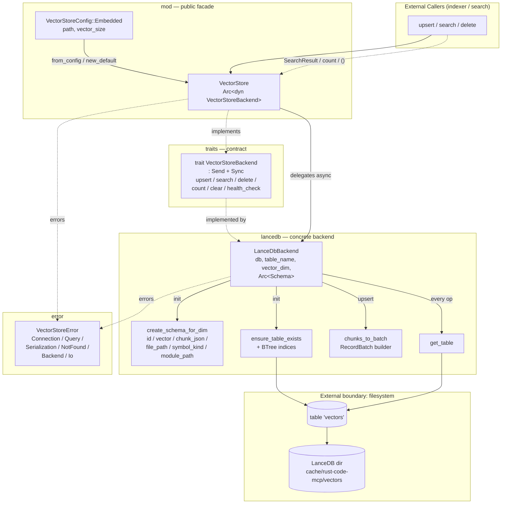

# vector_store — Architecture

## Overview

The `vector_store` module provides on-disk vector storage and similarity search for embedded code chunks, backed by LanceDB. It exposes a unified async `VectorStore` facade over a pluggable `VectorStoreBackend` trait, with the `LanceDbBackend` implementation handling Arrow schema construction, table lifecycle, and SQL-style filtered operations.

## Mermaid diagram

## Module responsibilities

| Module | Role | Key types |
| --- | --- | --- |
| `mod` | Public facade and config; owns the `Arc<dyn VectorStoreBackend>` and forwards every async call to it. Resolves the default on-disk cache path via `directories::ProjectDirs`. | `VectorStore`, `VectorStoreConfig` (`Embedded { path, vector_size }`), `SearchResult` |
| `traits` | Declares the async backend contract that any concrete vector store must satisfy; requires `Send + Sync` so the store is shareable across tasks. | `trait VectorStoreBackend` |
| `lancedb` | Concrete `VectorStoreBackend` implementation against LanceDB. Owns the connection, the cached six-column Arrow `Schema`, table creation/indexing, batch construction, merge-insert, vector search, and SQL-filtered deletes. | `LanceDbBackend { db, table_name, vector_dim, schema: Arc<Schema> }` |
| `error` | Unified error type with ergonomic constructors; bridges into `Box<dyn Error + Send>` and from `std::io::Error`. | `VectorStoreError` (`Connection`, `Query`, `Serialization`, `NotFound`, `Backend`, `Io`) |

## Data flow

**Write path (`upsert_chunks`):**
1. Caller hands `Vec<(ChunkId, Embedding, CodeChunk)>` to `VectorStore::upsert_chunks`, which forwards to the backend.
2. `LanceDbBackend::upsert_chunks` short-circuits on empty input, then opens the `vectors` table via `get_table`.
3. `chunks_to_batch` allocates six column buffers of length `n` (with `n * vector_dim` flat floats), JSON-serializes each `CodeChunk`, and assembles a single Arrow `RecordBatch` matching the cached schema.
4. The batch is wrapped in a `RecordBatchIterator` and fed to `Table::merge_insert(["id"])` configured with `when_matched_update_all` + `when_not_matched_insert_all`, executed atomically by LanceDB.

**Query path (`search`):**
1. Caller calls `VectorStore::search(query_vector, limit)`.
2. `LanceDbBackend::search` opens the table, builds a `vector_search` query with `DistanceType::Cosine` and the supplied limit, and `try_collect`s the resulting `RecordBatch` stream.
3. For each batch, `id` / `chunk_json` / `_distance` columns are downcast to `StringArray` / `Float32Array`; `ChunkId::from_string` parses the id and `serde_json::from_str` rehydrates the `CodeChunk`.
4. Cosine distance is converted to a similarity score via `1.0 - distance / 2.0`; results accumulate into `Vec<SearchResult { chunk_id, score, chunk }>`.

**Delete paths:** `delete_chunks` builds a `id IN ('id1', 'id2', …)` SQL filter and calls `Table::delete`; `delete_by_file_path` builds `file_path = '<escaped>'` (single quotes doubled). Both are issued against the open table.

**Lifecycle:** `LanceDbBackend::new` creates the directory (`std::fs::create_dir_all`), opens the LanceDB connection, builds and caches the Arrow schema, and runs `ensure_table_exists` — which creates the `vectors` table from an empty `RecordBatch` on first use and adds BTree indices on `id`, `file_path`, and `symbol_kind`.

## Concurrency / integration model

- **Shared state.** A single `VectorStore` holds an `Arc<dyn VectorStoreBackend>`. Cloning the `VectorStore` (or its inner `Arc`) is cheap and yields handles usable from many async tasks concurrently. The `Send + Sync` bound on `VectorStoreBackend` is what makes this safe.
- **Async runtime.** Every public method is `async`; the `LanceDbBackend` relies on `tokio` via the `lancedb` crate (connections, table opens, merge-insert, vector search, deletes, `count_rows`, `table_names`). Result streams are consumed with `futures::TryStreamExt::try_collect`.
- **No internal channels or background tasks.** The module is purely request/response — there is no spawn, no mpsc, no worker pool. Concurrency is whatever the caller layer supplies.
- **External boundaries.**
  - Filesystem: the LanceDB directory (default `<cache>/rust-code-mcp/vectors`, resolved by `ProjectDirs`) and its tables/indices on disk.
  - LanceDB / Arrow: `lancedb::Connection`, `lancedb::Table`, `arrow_array::*`, `arrow_schema::Schema` are the only external dependencies the backend surfaces.
  - Domain types in: `ChunkId`, `Embedding`, `CodeChunk` flow through `upsert_chunks` and `search` and define the wire format on disk via the JSON-encoded `chunk_json` column.
- **Integration API points** (all on `VectorStore`): `new_default`, `new_embedded`, `from_config`, `upsert_chunks`, `search`, `delete_chunks`, `delete_by_file_path`, `count`, `clear_collection`, `delete_collection` (alias of clear — LanceDB clears rows rather than dropping the table), `health_check`. All return `Result<_, VectorStoreError>`, giving the caller layer a single error type to handle.
