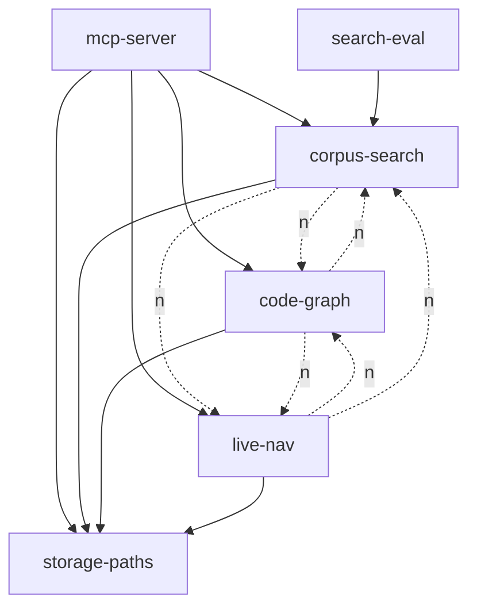

# Capability-Keyed Workspace Layout (Refined)

## Crate list

Five capability crates plus one composition root. The "right" count is **5 + 1 server**, justified below.

| Crate | Capability | Owns |
| --- | --- | --- |
| `mcp-server` | composition + transport | MCP params, tool router, response formatting, sync manager, error mapping |
| `corpus-search` | searchable corpus + retrieval | parse-for-corpus, chunk, retrieval embeddings, Tantivy text index, LanceDB vector index, hybrid RRF, `SearchService`, `CorpusWriter` |
| `code-graph` | persisted hypergraph + graph audits | rust-analyzer load (graph profile), HIR extraction, heed/LMDB snapshots, all snapshot-backed queries, AST-driven audits, file-scoped structural tools (`get_dependencies`, `get_call_graph`, `analyze_complexity`) |
| `live-nav` | live IDE navigation | rust-analyzer load (live profile), `goto_definition`, `find_references`, `symbol_search`, `IdeService` |
| `storage-paths` | XDG path resolution + project-keyed dir hashing | `ProjectPaths`, `dir_hash`, default-data-dir resolution, per-workspace subtree layout |
| `search-eval` | offline retrieval evaluation | nDCG/MAP/MRR, RRF tuner, ranked-hit fixtures (non-runtime) |

**Why five capability crates, not three or seven?**
Three (`corpus`, `graph`, `ide`) collapses `storage-paths` into every consumer and forces `mcp-server` to know XDG layout — that pulls path conventions into transport code and creates three independent copies of `dir_hash`. Seven (splitting `text-index`, `vector-index`, `embeddings`, `parse-corpus` as peer crates) recreates the backend-technology layout the previous proposal explicitly rejected. Five lets `storage-paths` exist as a tiny, dependency-free, technology-neutral crate that all three runtime capabilities share without forming a generic dumping ground; it is the single legitimate cross-capability primitive identified in the current source (`tools/project_paths.rs` is referenced by every subsystem).

## Dependency graph

## Ownership rules

**Embedding contradiction — resolved one direction.**
The previous proposal allowed `code-graph` to own a private, feature-gated copy of fastembed for `semantic_overlaps`, while implementation actually routed `semantic_overlaps` through `code-search`. This refinement picks **one direction**: `corpus-search` exposes a narrow, public, batch-only embedding primitive (`SearchService::embed_texts(Vec<String>) -> Vec<EmbeddingVector>`) that is provider-neutral in its signature. `code-graph` calls this primitive for `semantic_overlaps` via a thin port type re-declared inside `code-graph` (`trait BatchEmbedder`) implemented by `mcp-server` over `SearchService`. No `graph -> corpus-search` Cargo edge; no duplicate fastembed ONNX session; no feature flag duplication. The cost is one more port trait; the gain is a single embedder process-wide, which matches the `Arc<Mutex<TextEmbedding>>` reality.

**rust-analyzer placement.**
Two distinct profiles exist: snapshot-build load (`no_deps=true`, `prefill_caches=true`, full HIR walk) and live navigation (`prefill_caches=true`, kept alive in `LazyLock<Mutex<...>>`). They are not interchangeable. **`code-graph` owns the snapshot profile; `live-nav` owns the live profile.** Both depend privately on `ra_ap_*`. No shared `ra-loader` crate — duplication of ~200 lines of loader glue is cheaper than the abstraction debt from a shared crate that has to satisfy two different lifecycle models.

**Parser placement.**
The `RustParser` (`ra_ap_syntax`-driven AST extraction for symbols/imports/calls/types) is **owned by `corpus-search`** because its only runtime caller is the chunker. `code-graph` does not reuse it; it goes directly through HIR via `ra_ap_hir`. Where `code-graph` needs AST access for turbofish-safe call resolution (`ast_resolve`), it parses inline using `ra_ap_syntax` — the duplication is small (~3 modules) and prevents `code-graph` from depending on `corpus-search`.

**Storage paths placement.**
`ProjectPaths::from_directory`, `dir_hash`, XDG resolution, and the per-workspace subtree convention live in `storage-paths`. Every runtime capability crate consumes it. It has no workspace dependencies, no async, no provider SDKs. It is the *only* crate allowed to know the on-disk subtree shape (`tantivy/<hash>/`, `vectors/<hash>/`, `graph/<hash>/`, `cache/<hash>/`).

## Invariants (tooling-enforceable)

1. **No peer-capability Cargo edges.** Enforced via `forbidden_dependency_check` rule set: `corpus-search`, `code-graph`, `live-nav` may not appear in each other's `Cargo.toml` `[dependencies]` or `[dev-dependencies]`. CI grep over manifests rejects violations.
2. **No provider-SDK leakage in public signatures.** Enforced by a `cargo-public-api`-driven check: public items of `corpus-search`, `code-graph`, `live-nav`, `storage-paths` must not mention `tantivy::`, `lancedb::`, `arrow::`, `fastembed::`, `ort::`, `ra_ap_`, `heed::`, `sled::`, or `rmcp::`. A small script over `cargo public-api --simplified` output fails the build on any match.
3. **(bonus) `storage-paths` purity.** `storage-paths/Cargo.toml` may depend only on `directories`, `sha2`, and `std`. Enforced by a manifest schema test.

## Top 3 weaknesses

1. **The `BatchEmbedder` port adds indirection that may not pay off.** If `code-graph` is the only consumer ever, the port trait is over-engineering; a simple `graph -> corpus-search` edge restricted to `SearchService::embed_texts` would be simpler. The port becomes worthwhile only when a second graph-side consumer (e.g. an audit) needs embeddings. This is a bet on future need.
2. **`storage-paths` may grow into the dumping ground the previous proposal warned about.** Path resolution is innocuous, but "stuff every crate needs" tends to accrete (logging tags, dir-hash variants, retention policies). Without an explicit non-goal list in its crate doc, drift is the default failure mode.
3. **Parser duplication between `corpus-search` and `code-graph` is real, not nominal.** `ast_resolve` in `code-graph` already duplicates `ra_ap_syntax` setup that `corpus-search/parse` does. If the AST-driven audit set grows (channel, fn-body, more arrive), the duplication ratio worsens. The honest answer is "we accept this until the third audit lands, then we revisit," not "duplication is fine forever."

## When this is the right choice

Pick this layout when: (a) the team wants a small fixed number of capability boundaries that map 1:1 to user-visible MCP tool clusters; (b) the embedding model is shared at the process level and adding a second one is genuinely undesirable; (c) on-disk layout conventions are stable enough to centralize but volatile enough that three copies would drift; (d) the audit set is mostly snapshot-backed with a small AST-driven minority. Avoid this layout if: the embedding model is expected to fork per-capability (graph-local vs retrieval-local with different dimensions), or if `live-nav` is expected to absorb structural analysis tools currently owned by `code-graph` — in either case, three crates with explicit duplication is cleaner than five with shared ports.
