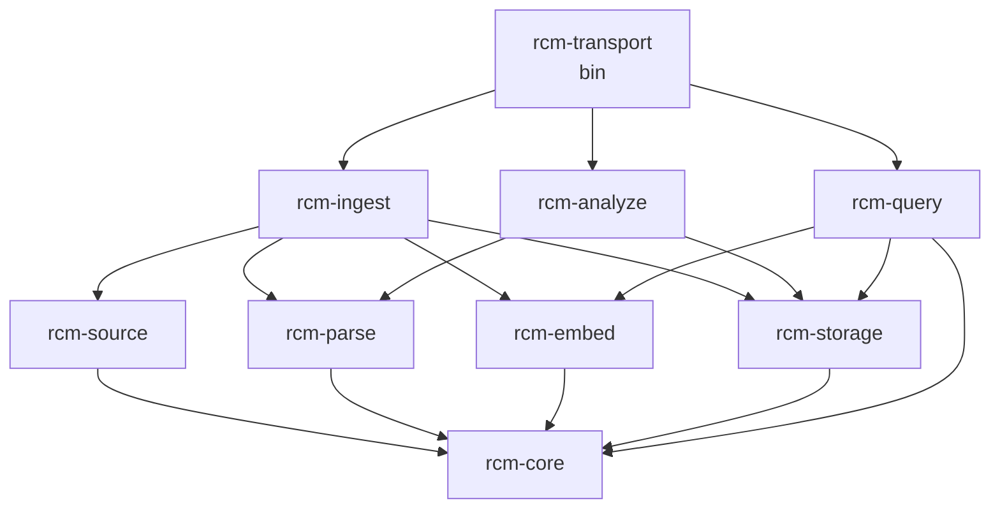

# Pattern 02 — Pipeline / Data-Flow-Keyed Workspace

Crates correspond to **stages of data flow**, not user-visible capabilities. The four pipelines visible in `ARCHITECTURE.md` (indexing, search, graph/audit, semantic) are decomposed along their actual processing axis: produce → transform → persist → consume. Shared concerns that *cross* pipelines (parser, schema, config) are pushed down into a foundation layer; the MCP transport sits on top as a thin composition shell.

## Crate list

| # | Crate | Stage role | Owns from current `src/` |
| - | --- | --- | --- |
| 1 | `rcm-core` | Foundation: types, errors, config, schemas, IDs, paths. | `config/`, `schema.rs`, `chunker/` types, `metadata_cache` types, `tools/project_paths`, error enums. |
| 2 | `rcm-source` | **Ingest stage A — discover & read.** File walk, sensitive-file filter, secrets scan, Merkle change detection, metadata cache I/O. | `indexing/merkle.rs`, `indexing/file_processor.rs` read-side, `security/`, `metadata_cache.rs` impl. |
| 3 | `rcm-parse` | **Parse stage** (shared by ingest + graph). `ra_ap_syntax` AST, call graph, imports, type refs, `ast_resolve`. | `parser/`, `chunker/` (chunking is post-parse, pre-embed). |
| 4 | `rcm-embed` | **Embed stage.** fastembed/ONNX model, sync/async/batched inference, `EmbeddingBatcher`, memory monitor. | `embeddings/`, `metrics/memory.rs`. |
| 5 | `rcm-storage` | **Persist stage** (write + read primitives). Tantivy adapter, LanceDB backend, sled metadata, heed/LMDB env, snapshot publish. | `vector_store/`, `indexing/tantivy_adapter.rs`, `graph/storage.rs`, `graph/snapshot.rs`, `metadata_cache.rs` backend. |
| 6 | `rcm-ingest` | **Ingest pipeline composition.** Wires source → parse → chunk → embed → storage; Rayon Phase 1, async Phase 2, retries, consistency, incremental driver. | `indexing/{unified,incremental,indexer_core,embedding_batcher,consistency,retry,errors}`. |
| 7 | `rcm-analyze` | **Analysis pipeline.** ra-analyzer load, HIR extraction (bindings/impls/attrs/sigs/statics/usages) → `ExtractionModel` → snapshot build. Snapshot-only + AST-driven audits read here. | `graph/{loader,extract,bindings,impls,attributes,signatures,statics,usages,model,ids,hir_trim,*_audit,recursion_check}`, `semantic/`. |
| 8 | `rcm-query` | **Query pipeline.** BM25 + vector fan-out, RRF fusion, resilient fallback, RRF tuner, snapshot read API (`OpenedSnapshot::*`), graph queries. | `search/`, `graph/queries.rs`, snapshot read-side, `monitoring/health.rs`. |
| 9 | `rcm-transport` | **MCP framing & routing only.** rmcp `#[tool_router]`, `*Params` deserialization, `SyncManager`, tracing setup, the `main` binary. Composition wiring lives here because that is its job; no domain logic. | `tools/`, `mcp/sync.rs`, `main.rs`, `bin/test_tools_direct.rs`, `monitoring/backup.rs`. |

## Dependency graph

`rcm-parse` is the canonical example of a shared stage: it has exactly one upstream (`rcm-core`) and is consumed by both the ingest pipeline (`rcm-ingest` → chunking) and the analysis pipeline (`rcm-analyze` → HIR extraction). It must never grow a dependency on `rcm-storage` — that would invert the data-flow direction.

## Ownership rules

1. **Direction is sacred.** Edges point downstream-to-upstream only: `transport → query → storage → core`. A `cargo deny` rule forbids reverse edges (e.g. `rcm-parse` depending on `rcm-ingest`).
2. **One stage owns the type at the boundary.** `CodeChunk` lives in `rcm-core` (boundary between parse and embed). `ChunkId`, `Location`, `FileStat`, `IndexingError`, `ProjectPaths` all live in `rcm-core`.
3. **Pipelines compose, stages do not.** `rcm-ingest` may call `rcm-parse` and `rcm-storage`; `rcm-parse` may not call `rcm-storage`. If a stage needs a sibling stage, the dependency is wrong — lift the call into the pipeline crate.
4. **Storage is multi-backend but single-crate.** Tantivy, LanceDB, sled, and heed share lifecycle/path/locking concerns; splitting them buys nothing because every pipeline touches ≥2 of them.
5. **Transport is thin but holds composition.** `rcm-transport` is the only crate allowed to depend on all three pipelines. It contains no domain logic — only param structs, routing, tracing, and `SyncManager` glue.

## Invariants

- `rcm-core` has zero deps on tantivy, lancedb, heed, sled, ra_ap_*, fastembed.
- `rcm-parse` depends on `ra_ap_syntax` only — never on `ra_ap_ide`/`ra_ap_hir` (those belong to `rcm-analyze`).
- `rcm-storage` exposes typed handles (`TantivyWriter`, `VectorStore`, `OpenedSnapshot`) but never mixes them; pipelines coordinate.
- `rcm-query` is read-only against storage — the type system enforces it (separate `*Reader` traits).
- `rcm-transport` re-exports nothing from below; consumers of the MCP server use the binary, not a library API.
- The process-wide singletons (`SEMANTIC` mutex, `EmbeddingGenerator` mutex) live in their stage crates (`rcm-analyze`, `rcm-embed`), not in `rcm-transport`.

## Top 3 weaknesses

1. **Parser cuts hurt.** `rcm-parse` is consumed by two very different pipelines (chunking wants spans + symbol kinds; analysis wants HIR resolution helpers like `ast_resolve`). Either it grows two dialects or the analysis pipeline ends up duplicating logic. Realistically `rcm-parse` will leak ra-analyzer types and become a de-facto "syntax + lite-HIR" crate.
2. **Storage as one crate is a compromise.** A pipeline-pure split would have `rcm-store-bm25`, `rcm-store-vec`, `rcm-store-graph`, `rcm-store-cache`. Keeping them fused makes `rcm-storage` the heaviest crate (tantivy + lancedb + heed + sled) and its compile time dominates. Splitting it explodes the graph for little payoff because pipelines bundle multiple backends per call.
3. **MCP tools don't cleanly map to one pipeline.** Tools like `index_codebase` (ingest) and `search` (query + occasional reindex) span pipelines. `rcm-transport` becomes the only place that can express that, so it gets thicker than "thin transport" implies — it ends up owning real workflow code (stale-index recovery, sync-manager-driven track-and-search). Pipeline purity leaks through the top.

## When this is the right choice

Pick this layout when the system is **dominated by data flow that must be reasoned about end-to-end**, when stages have **measurably different runtime profiles** (Rayon CPU vs. async I/O vs. blocking ONNX), and when you want **enforceable directionality** between produce and consume sides — exactly the shape of an indexing + search engine. It is *not* the right choice if user-visible capabilities (e.g. "graph audits", "semantic nav") evolve independently of the pipelines that feed them; in that case a capability-keyed split scales better.
