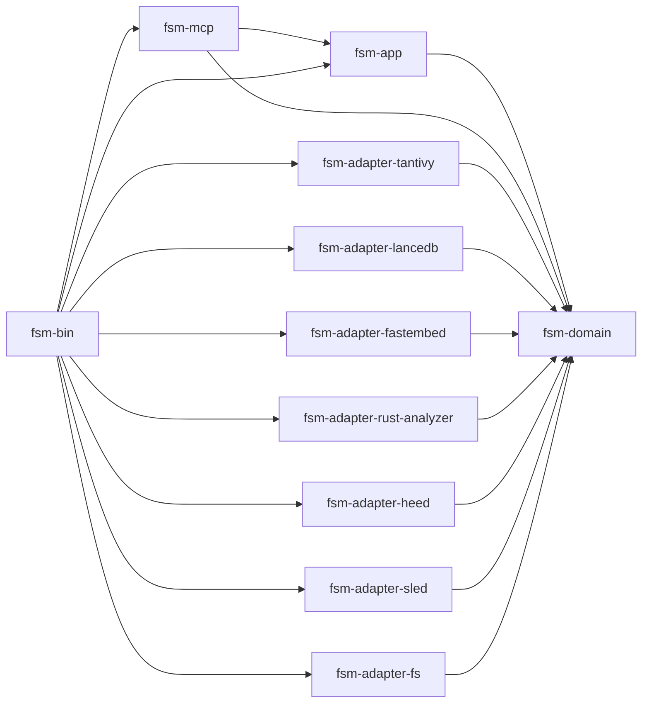

# Hexagonal / Ports-and-Adapters Layout

## Crate list

| Crate | Role | Workspace deps |
| --- | --- | --- |
| `fsm-domain` | Domain core: types, ports (traits), pure algorithms (RRF, Merkle change-set, chunk-context windowing, fingerprinting). No I/O, no async runtime, no third-party backend types in its public API. | none |
| `fsm-adapter-tantivy` | Implements `BM25Port`, `BM25WriterPort`. | `fsm-domain` |
| `fsm-adapter-lancedb` | Implements `VectorStorePort`. | `fsm-domain` |
| `fsm-adapter-fastembed` | Implements `EmbedderPort` (ONNX session, CUDA fallback, batched inference). | `fsm-domain` |
| `fsm-adapter-rust-analyzer` | Implements `SyntaxPort`, `SemanticPort`, `HirExtractorPort` over `ra_ap_*`. | `fsm-domain` |
| `fsm-adapter-heed` | Implements `GraphSnapshotPort` (typed sub-DBs, `CURRENT` swap). | `fsm-domain` |
| `fsm-adapter-sled` | Implements `MetadataCachePort`. | `fsm-domain` |
| `fsm-adapter-fs` | Implements `FileWalkerPort`, `SecretsScannerPort`, `SensitiveFilterPort`. | `fsm-domain` |
| `fsm-app` | Use-cases / orchestrators (the indexing pipeline, hybrid search fan-out, audits). Depends on `fsm-domain` ONLY through ports. Generic over `<S: BM25Port, V: VectorStorePort, E: EmbedderPort, …>` or stores `Arc<dyn …>` handles. | `fsm-domain` |
| `fsm-mcp` | rmcp adapter: `#[tool_router]`, `Parameters<T>`, `SyncManager`. Translates JSON-RPC calls to `fsm-app` use-cases. | `fsm-domain`, `fsm-app` |
| `fsm-bin` | Composition root: parses `Config`, instantiates concrete adapters, builds the app, serves stdio. | all adapters + `fsm-app` + `fsm-mcp` |

11 crates. Adapters are split per backend, NOT per concept, because each backend's failure modes, version cadence, and feature flags differ enough that grouping them ("storage", "ml") creates feature-flag knots and forces shared dependency sets.

## Dependency graph

The graph is a strict DAG with a single sink (`fsm-domain`) and a single source (`fsm-bin`). Adapters never reference each other.

## Ownership rules

1. `fsm-domain` ships zero `tokio`, zero `serde_json`, zero backend types in any public signature. `serde` derives are allowed for portable DTOs (`CodeChunk`, `Symbol`, `ChunkId`, `SearchResult`, `RrfWeights`, `Fingerprint`).
2. Domain owns: ID types, score types, RRF fusion, Merkle leaf hashing, chunk windowing, fingerprint computation, retry policy values, error taxonomy enums (`Permanent`/`Transient`). Algorithms that have no I/O live here.
3. Ports live in `fsm-domain::ports`. One module per port. Each port is the minimum surface the use-case needs, not the union of what an adapter exposes.
4. Adapters MAY depend on multiple `ra_ap_*` versions or pull large transitive trees; the rest of the workspace is shielded by the port boundary.
5. Use-cases live in `fsm-app` and are written against ports. The hybrid search fan-out, the indexing pipeline, the audit drivers, and `SyncManager`'s tick logic are all here. The MCP shell does not contain business logic.
6. `fsm-bin` is the only crate allowed to mention concrete adapter types. Switching the embedder = editing one builder function.

## Trait shape rationale

- **Object-safe `async fn` ports via `#[async_trait]`.** Search and indexing fan-out store `Arc<dyn BM25Port>`, `Arc<dyn VectorStorePort>`. Erasure pays a vtable cost but is dwarfed by Tantivy/LanceDB latency, and it lets `ResilientHybridSearch` swap an arm at runtime. Native `async fn` in traits is avoided for object-safe ports because `dyn Trait` requires boxed futures regardless and `#[async_trait]` keeps error messages clean.
- **Generic, monomorphized ports for hot pure paths.** `EmbedderPort::embed_batch` and `MetadataCachePort::has_stat_changed` are tight inner loops; `fsm-app` takes them as `<E: EmbedderPort>` so the call devirtualizes. RRF stays a free function on plain slices in `fsm-domain` — it has no port at all.
- **Sealed traits.** `SyntaxPort` and `HirExtractorPort` are sealed (`pub trait Foo: sealed::Sealed`) so users cannot supply a non-`ra_ap_*` impl that would break invariants downstream queries depend on (qualified-name shape, FileId stability). The other ports are open.
- **Cancellation + back-pressure stay outside ports.** Ports return `Result<T, DomainError>` only. Tokio cancellation, retry budgets, and memory-monitor cool-downs live in `fsm-app` use-cases.

## Top 3 weaknesses

1. **DTO duplication.** `CodeChunk`, `Symbol`, and `SearchResult` already serialize to Tantivy fields, LanceDB rows, and JSON-RPC responses. A pure domain forces an extra mapping layer at every adapter — easy to write, easy to drift.
2. **Async-trait ergonomics.** `Arc<dyn EmbedderPort>` plus `#[async_trait]` plus `Send + Sync + 'static` bounds compose into noisy signatures and unhelpful compile errors. Lifetimes around borrowed query strings in search ports are particularly painful.
3. **Hot-path indirection.** The hybrid search and indexing pipelines today inline backend calls; under hexagonal they pass through one `dyn` boundary per backend per request. The cost is small (nanoseconds), but stack traces, profiler flame graphs, and `tracing` spans get harder to read because frames now live in different crates.

## When this is the right choice (and when it's NOT)

Right when: a second backend is genuinely planned (Qdrant alongside LanceDB, Meilisearch alongside Tantivy, OpenAI embeddings alongside fastembed), or the team wants to unit-test orchestration logic with in-memory fakes, or the project has multiple binaries (CLI, MCP, HTTP) sharing one core.

Wrong when: the project is one binary serving one transport against one set of backends with no near-term swap on the roadmap. That matches `rust-code-mcp-final` today. The boundary work pays off only after the second backend lands; before then it taxes every change with an extra port edit and a DTO round-trip, and it complicates the genuinely hot indexing inner loop with abstractions that buy nothing.
