# rust-code-mcp

An MCP server for semantic code search in Rust codebases. Combines BM25 full-text search with vector embeddings for hybrid search, plus tree-sitter based code analysis.

## Architecture



## Features

- **Hybrid search** - BM25 keyword search + semantic vector similarity
- **Symbol navigation** - Find definitions and references across the codebase
- **Call graph analysis** - Trace function call relationships
- **Complexity metrics** - LOC, cyclomatic complexity, function counts
- **Incremental indexing** - Merkle tree change detection for fast re-indexing
- **Background sync** - Automatic index updates every 5 minutes

## Tools

| Tool | Description |
|------|-------------|
| `search` | Keyword search using hybrid BM25 + vectors |
| `get_similar_code` | Find semantically similar code snippets |
| `find_definition` | Locate where a symbol is defined |
| `find_references` | Find all usages of a symbol |
| `get_dependencies` | List imports for a file |
| `get_call_graph` | Show function call relationships |
| `analyze_complexity` | Calculate code complexity metrics |
| `read_file_content` | Read file contents |
| `index_codebase` | Manually trigger indexing |
| `health_check` | Check system status |

## Prerequisites

A [Qdrant](https://qdrant.tech/) instance must be running for vector storage. By default, the server connects to `localhost:6334`.

```bash
# Using Docker
docker run -p 6333:6333 -p 6334:6334 qdrant/qdrant
```

## Building

```bash
cargo build --release
```

## Nix

A Nix flake is provided for easy setup:

```bash
# Enter dev shell with all dependencies
nix develop github:molaco/rust-code-mcp

# Build the binary
nix build github:molaco/rust-code-mcp
```

The dev shell includes nightly Rust, CUDA support, and Qdrant.

## Configuration

The server uses stdio transport. Add to your MCP client config:

```json
{
  "mcpServers": {
    "rust-code-mcp": {
      "command": "/path/to/rust-code-mcp"
    }
  }
}
```

## Stack

- [tantivy](https://github.com/quickwit-oss/tantivy) - Full-text search
- [fastembed](https://github.com/Anush008/fastembed-rs) - Local embeddings (ONNX)
- [qdrant](https://qdrant.tech/) - Vector storage
- [tree-sitter](https://tree-sitter.github.io/) - AST parsing
- [rmcp](https://github.com/modelcontextprotocol/rust-sdk) - MCP protocol

## License

MIT
