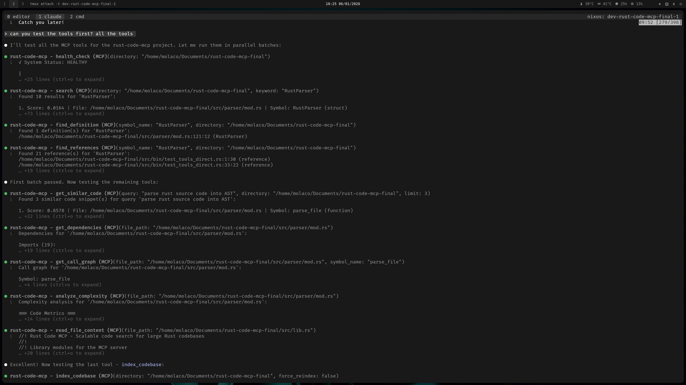
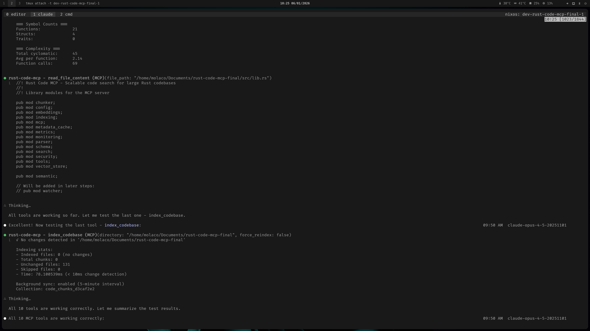
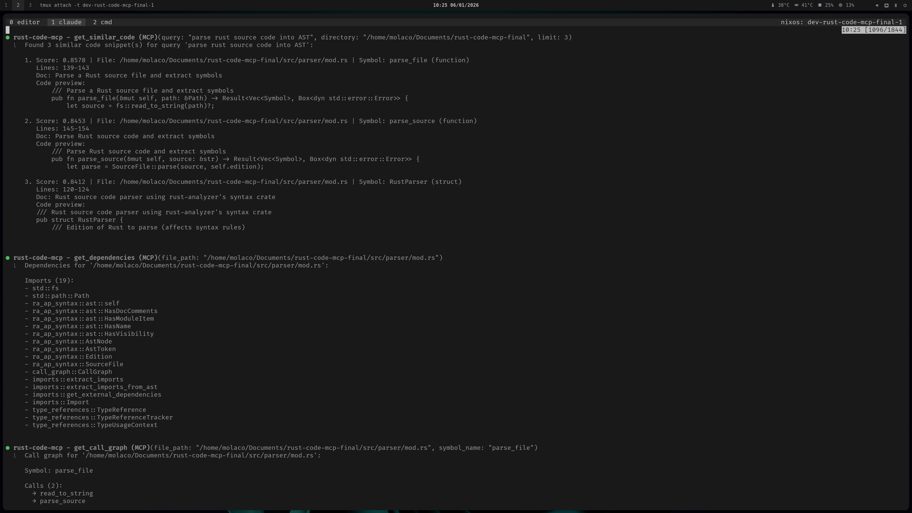
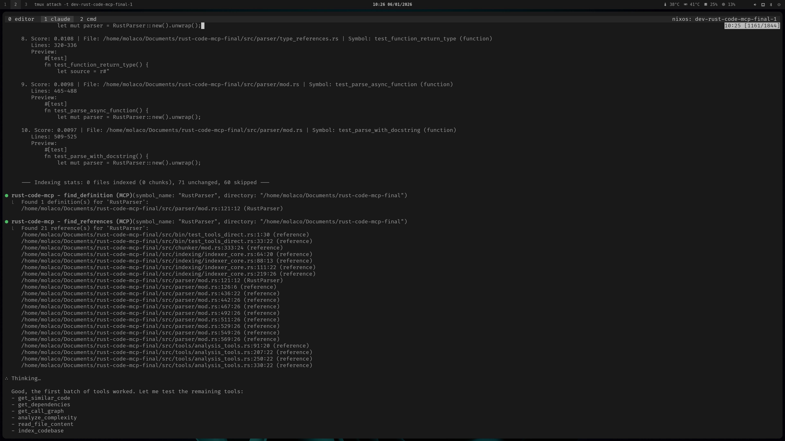
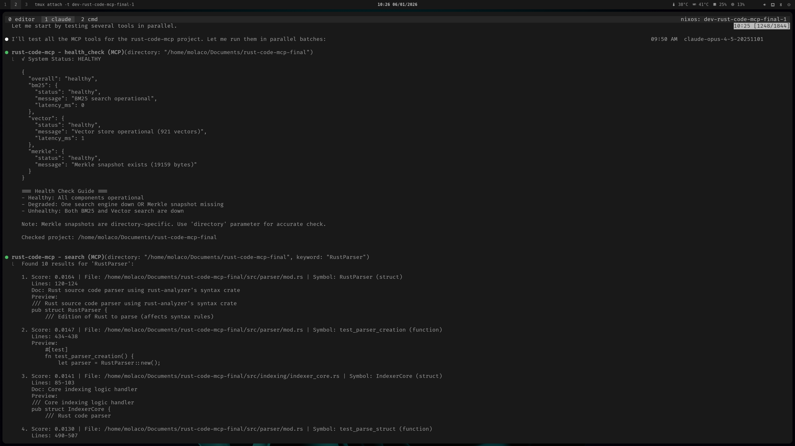

# rust-code-mcp

An MCP server for semantic code search in Rust codebases. Combines BM25 full-text search with vector embeddings for hybrid search, plus rust-analyzer based code analysis.

## Architecture


## Features

- **Hybrid search** - BM25 keyword search + semantic vector similarity
- **Symbol navigation** - Find definitions and references across the codebase
- **Call graph analysis** - Trace function call relationships
- **Complexity metrics** - LOC, cyclomatic complexity, function counts
- **Incremental indexing** - Merkle tree change detection for fast re-indexing
- **Background sync** - Automatic index updates every 5 minutes

## Tools

| Tool | Description |
|------|-------------|
| `search` | Keyword search using hybrid BM25 + vectors |
| `get_similar_code` | Find semantically similar code snippets |
| `find_definition` | Locate where a symbol is defined (by name) |
| `find_references` | Find all usages of a symbol (by name) |
| `get_dependencies` | List imports for a file |
| `get_call_graph` | Show function call relationships |
| `analyze_complexity` | Calculate code complexity metrics |
| `read_file_content` | Read file contents |
| `index_codebase` | Manually trigger indexing |
| `health_check` | Check system status |

## Building

```bash
cargo build --release
```

## Nix

A Nix flake is provided for easy setup:

```bash
# Enter dev shell with all dependencies
nix develop github:molaco/rust-code-mcp

# Build the binary
nix build github:molaco/rust-code-mcp
```

The dev shell includes nightly Rust and CUDA support.

## Configuration

The server uses stdio transport. Add to your MCP client config:

```json
{
  "mcpServers": {
    "rust-code-mcp": {
      "command": "/path/to/rust-code-mcp"
    }
  }
}
```

## GPU Acceleration

Embedding generation uses ONNX Runtime with CUDA support for 10-15x faster indexing on NVIDIA GPUs.

### Requirements

- NVIDIA GPU (Maxwell or newer)
- CUDA 12.x + cuDNN 9.x
- The `ort` crate downloads ONNX Runtime binaries to `~/.cache/ort.pyke.io/`

### MCP Server CUDA Configuration

For CUDA to work when the MCP server is spawned by Claude Code (or other MCP clients), the `LD_LIBRARY_PATH` must include:

1. **ORT cache** - Contains `libonnxruntime_providers_shared.so` and `libonnxruntime_providers_cuda.so`
2. **CUDA libraries** - `libcudart.so`, `libcublas.so`, `libcublasLt.so`
3. **cuDNN libraries** - `libcudnn.so`

Example configuration with [mcp-servers-nix](https://github.com/natsukium/mcp-servers-nix):

```nix
mcpConfig = mcp-servers-nix.lib.mkConfig pkgs {
  settings.servers = {
    rust-code-mcp = {
      command = "./target/release/file-search-mcp";
      env = {
        CUDA_HOME = "${pkgs.cudaPackages.cudatoolkit}";
        CUDA_PATH = "${pkgs.cudaPackages.cudatoolkit}";
        LD_LIBRARY_PATH = lib.concatStringsSep ":" [
          "/home/user/.cache/ort.pyke.io/dfbin/x86_64-unknown-linux-gnu/<hash>/onnxruntime/lib"
          "${pkgs.cudaPackages.cudatoolkit}/lib"
          "${pkgs.cudaPackages.cudnn.lib}/lib"
          "${pkgs.stdenv.cc.cc.lib}/lib"
        ];
      };
    };
  };
};
```

> **Note:** The ORT cache path contains a hash that may change when ONNX Runtime is updated. Check `~/.cache/ort.pyke.io/dfbin/x86_64-unknown-linux-gnu/` for the current hash.

### Performance

| Mode | Throughput |
|------|-----------|
| CPU only | ~50 chunks/sec |
| GPU (RTX 3090) | ~500 chunks/sec (full pipeline) |
| GPU isolated embedding | ~8000 chunks/sec |

## Stack

- [tantivy](https://github.com/quickwit-oss/tantivy) - Full-text search
- [fastembed](https://github.com/Anush008/fastembed-rs) - Local embeddings (ONNX)
- [lancedb](https://lancedb.com/) - Embedded vector storage
- [ra_ap_syntax](https://github.com/rust-lang/rust-analyzer) - AST parsing
- [ra_ap_ide](https://github.com/rust-lang/rust-analyzer) - Semantic analysis (goto definition, find references)
- [rmcp](https://github.com/modelcontextprotocol/rust-sdk) - MCP protocol

## Screenshots



<details>
<summary>More screenshots</summary>






</details>

## License

MIT
