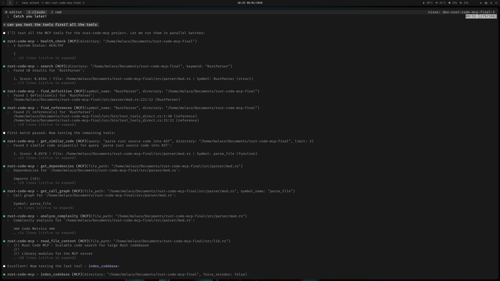
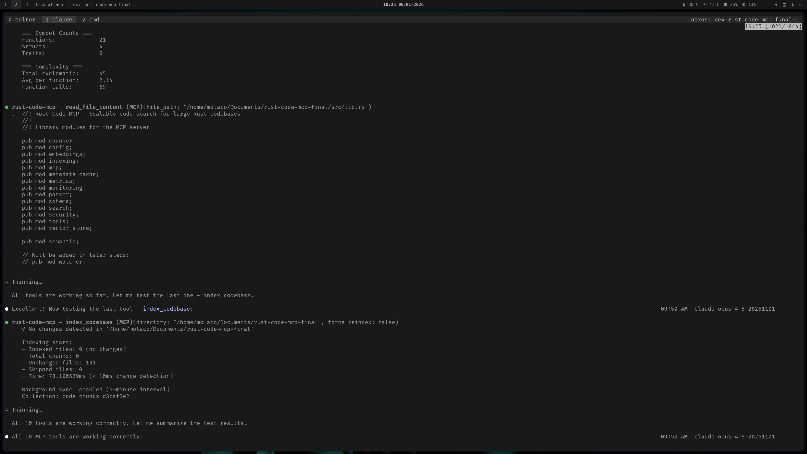
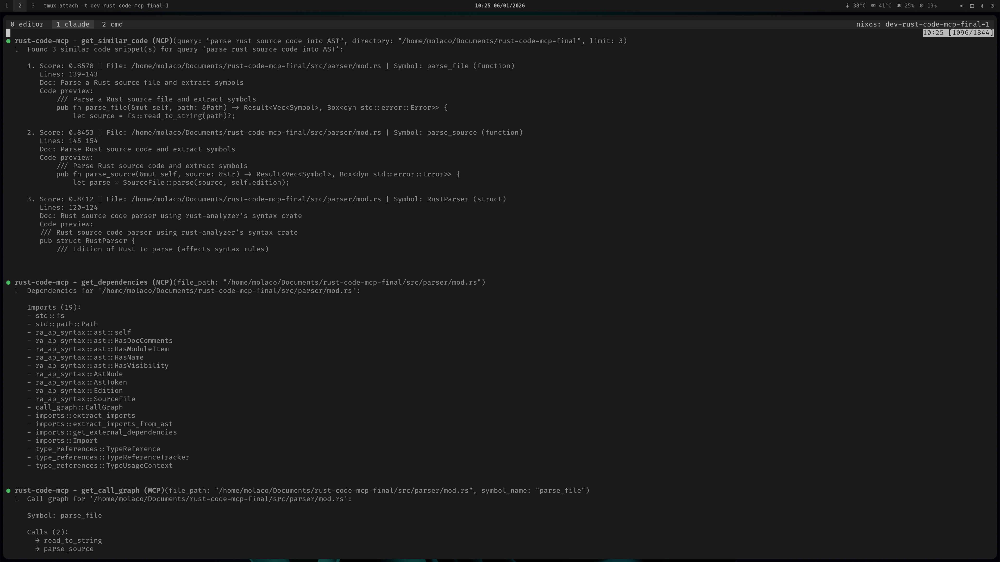
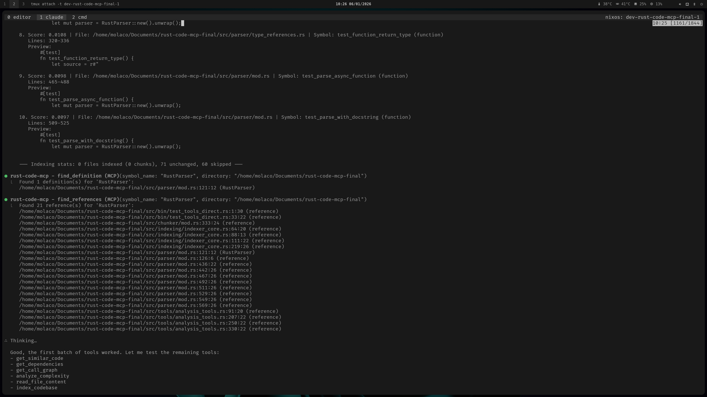
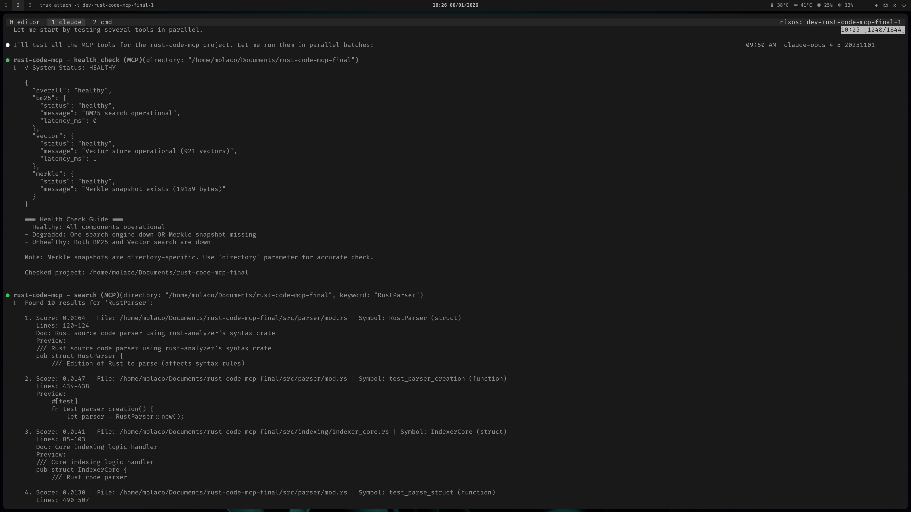

# rust-code-mcp

An MCP server for searching and analyzing Rust codebases. Combines hybrid BM25 + vector search with a HIR-driven workspace **hypergraph** built on rust-analyzer, exposing 45+ tools for symbol navigation, call-graph traversal, structural audits, and semantic neighborhood queries.

## Architecture



See [.docs/ARCHITECTURE.md](.docs/ARCHITECTURE.md) for the per-module breakdown, [TOOLS.md](TOOLS.md) for the full MCP tool reference, and [THEORY.md](THEORY.md) for the principles each diagnostic maps to.

## Features

- **Hybrid search** - BM25 keyword search + semantic vector similarity (RRF fusion)
- **Symbol navigation** - rust-analyzer–backed `find_definition` / `find_references` / `rename_symbol` (rename returns a preview; no files are modified)
- **Persisted hypergraph** - HIR-driven workspace snapshot (LMDB) with cross-crate imports, exports, re-exports, call edges, attributes, signatures, statics, and `unsafe` blocks
- **Call-graph traversal** - `who_calls` / `calls_from` / `call_graph` / `callers_in_crate` / `recursive_callers_count`
- **Structural audits** - dead public items, name collisions, module shadowing, forbidden cross-crate edges, Robert Martin instability/abstractness
- **Safety audits** - `unsafe_audit`, `mut_static_audit`, `recursion_check`, `channel_capacity_audit`, `fn_body_audit` (unwrap/panic/lock-across-await detection)
- **Doc & API hygiene audits** - `missing_docs_audit`, `derive_audit`, `pub_use_pub_type_audit`, `re_export_chain`
- **Semantic neighbors** - `similar_to_item` and workspace-wide `semantic_overlaps` clustering via cached embeddings
- **Codemap** - `build_codemap` produces a task-conditioned subgraph (seeded by symbols, expanded over hypergraph edges) with Mermaid + outline rendering
- **Complexity metrics** - LOC, cyclomatic complexity, function counts
- **Incremental indexing** - Merkle-tree change detection; background re-sync every 5 minutes

## Tools

45+ MCP tools grouped by category. Full parameter reference in [TOOLS.md](TOOLS.md).

| Category | Tools |
|----------|-------|
| Query | `search`, `get_similar_code`, `read_file_content` |
| Symbol analysis | `find_definition`, `find_references`, `rename_symbol`, `get_dependencies`, `get_call_graph`, `analyze_complexity` |
| Index lifecycle | `index_codebase`, `health_check`, `clear_cache` |
| Hypergraph build | `build_hypergraph` |
| Imports / exports | `get_imports`, `get_exports`, `get_reexports`, `get_declared_reexports` |
| Reverse lookup | `who_imports`, `who_uses`, `who_uses_summary` |
| Call graph | `who_calls`, `calls_from`, `call_graph`, `callers_in_crate`, `recursive_callers_count` |
| Workspace structure | `dead_pub_in_crate`, `dead_pub_report`, `crate_edges`, `overlaps`, `module_tree`, `workspace_stats` |
| Architecture rules | `forbidden_dependency_check`, `crate_dependency_metric` |
| Signatures & attributes | `function_signature`, `functions_with_filter`, `enum_variants`, `item_attributes`, `items_with_attribute` |
| Safety & quality audits | `unsafe_audit`, `mut_static_audit`, `recursion_check`, `channel_capacity_audit`, `fn_body_audit` |
| Doc / API audits | `missing_docs_audit`, `derive_audit`, `pub_use_pub_type_audit`, `re_export_chain` |
| Semantic | `similar_to_item`, `semantic_overlaps` |
| Codemap | `build_codemap` |

## Installation

### 1. Build the binary

```bash
git clone https://github.com/molaco/rust-code-mcp.git
cd rust-code-mcp
cargo build --release
```

The binary is at `target/release/file-search-mcp`.

Optionally, copy it somewhere on your PATH:

```bash
cp target/release/file-search-mcp ~/.local/bin/
```

### 2. Add to Claude Code

In your Rust project directory, create `.mcp.json`:

```json
{
  "mcpServers": {
    "rust-code-mcp": {
      "command": "/absolute/path/to/file-search-mcp"
    }
  }
}
```

Or add it globally in `~/.claude.json` so it's available in all projects:

```json
{
  "mcpServers": {
    "rust-code-mcp": {
      "command": "/absolute/path/to/file-search-mcp"
    }
  }
}
```

### 3. Index your codebase

Once Claude Code starts, the server is running. Use the `index_codebase` tool to index your project:

```
> index my codebase at /absolute/path/to/my-rust-project
```

Or call the tool directly with the `directory` parameter set to your project root. Indexing is incremental — subsequent runs only process changed files (via Merkle tree change detection). A background sync also re-indexes every 5 minutes automatically.

### 4. Start using it

All tools accept a `directory` parameter pointing to your project root. Examples:

- **Search code**: `search` with a query like "error handling in parser"
- **Find definitions**: `find_definition` for a symbol name
- **Find references**: `find_references` to see all usages of a symbol
- **Preview a rename**: `rename_symbol` returns the full edit set without touching files
- **Call graph**: `get_call_graph` or `who_calls` / `calls_from` to trace function relationships
- **Similar code**: `get_similar_code` for semantic similarity search

For Rust-specific workspace analysis, first call `build_hypergraph` once (reuses a fingerprinted snapshot on subsequent calls), then run audits like `unsafe_audit`, `dead_pub_report`, `overlaps`, `crate_dependency_metric`, or `semantic_overlaps`. The codemap tool (`build_codemap`) produces a Mermaid-renderable subgraph seeded by symbols of interest.

Index data is stored in `~/Library/Application Support/dev.rust-code-mcp.search/` (macOS) or `~/.local/share/search/` (Linux), keyed by a hash of the project path — it never writes to your project directory. The persisted hypergraph lives alongside it (under `graph/<workspace_hash>/`, in LMDB). `clear_cache` with `include_hypergraph=true` wipes both.

## Nix

A Nix flake is provided for easy setup:

```bash
# Enter dev shell with all dependencies
nix develop github:molaco/rust-code-mcp

# Build the binary
nix build github:molaco/rust-code-mcp
```

The dev shell includes nightly Rust and CUDA support.

## GPU Acceleration

Embedding generation uses ONNX Runtime with CUDA support for 10-15x faster indexing on NVIDIA GPUs.

### Requirements

- NVIDIA GPU (Maxwell or newer)
- CUDA 12.x + cuDNN 9.x
- The `ort` crate downloads ONNX Runtime binaries to `~/.cache/ort.pyke.io/`

### MCP Server CUDA Configuration

For CUDA to work when the MCP server is spawned by Claude Code (or other MCP clients), the `LD_LIBRARY_PATH` must include:

1. **ORT cache** - Contains `libonnxruntime_providers_shared.so` and `libonnxruntime_providers_cuda.so`
2. **CUDA libraries** - `libcudart.so`, `libcublas.so`, `libcublasLt.so`
3. **cuDNN libraries** - `libcudnn.so`

#### Option 1: Using flake.nix (recommended)

The included `flake.nix` automatically generates `.mcp.json` with the correct `LD_LIBRARY_PATH`:

```bash
nix develop
# Generates .mcp.json with dynamically discovered ORT cache path
```

#### Option 2: Manual configuration

First, find your ORT cache path:

```bash
find ~/.cache/ort.pyke.io/dfbin -name "libonnxruntime_providers_shared.so" -printf '%h\n' | head -1
# Example output: /home/user/.cache/ort.pyke.io/dfbin/x86_64-unknown-linux-gnu/8BBB.../onnxruntime/lib
```

Then configure your MCP client (e.g., `~/.claude.json` for Claude Code):

```json
{
  "mcpServers": {
    "rust-code-mcp": {
      "command": "/path/to/file-search-mcp",
      "args": [],
      "env": {
        "RUST_LOG": "info",
        "CUDA_HOME": "/usr/local/cuda",
        "CUDA_PATH": "/usr/local/cuda",
        "LD_LIBRARY_PATH": "/home/user/.cache/ort.pyke.io/dfbin/x86_64-unknown-linux-gnu/<HASH>/onnxruntime/lib:/usr/local/cuda/lib64:/usr/lib/x86_64-linux-gnu"
      }
    }
  }
}
```

Replace:
- `/path/to/file-search-mcp` with your binary path
- `<HASH>` with the hash from the `find` command above
- CUDA paths with your system's CUDA installation

> **Note:** The ORT cache hash changes when ONNX Runtime is updated. If CUDA stops working, re-run the `find` command to get the new path.

### Performance

| Mode | Throughput |
|------|-----------|
| CPU only | ~50 chunks/sec |
| GPU (RTX 3090) | ~500 chunks/sec (full pipeline) |
| GPU isolated embedding | ~8000 chunks/sec |

## Stack

- [tantivy](https://github.com/quickwit-oss/tantivy) - Full-text search
- [fastembed](https://github.com/Anush008/fastembed-rs) - Local embeddings (ONNX)
- [lancedb](https://lancedb.com/) - Embedded vector storage
- [ra_ap_syntax](https://github.com/rust-lang/rust-analyzer) - AST parsing
- [ra_ap_ide](https://github.com/rust-lang/rust-analyzer) - Semantic analysis (goto definition, find references, rename)
- [ra_ap_hir](https://github.com/rust-lang/rust-analyzer) - HIR-driven hypergraph extraction
- [heed](https://github.com/meilisearch/heed) - LMDB-backed persisted hypergraph store
- [sled](https://github.com/spacejam/sled) - Embedded KV for indexing metadata cache
- [rmcp](https://github.com/modelcontextprotocol/rust-sdk) - MCP protocol

## Screenshots



<details>
<summary>More screenshots</summary>






</details>

## License

MIT
