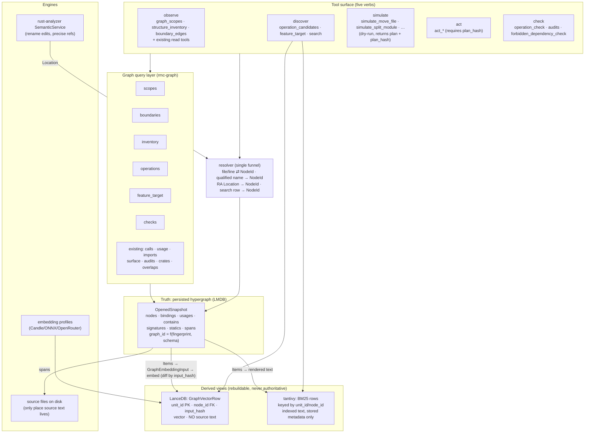

# Final Architecture: Graph-Primary, Derived-Views

Companion to `graph-truth-plan.md`. That document is the step list; this one is the
study behind it: what the codebase actually looks like today, which redesign wins,
what the end-state architecture is, and where the plan should be corrected.

## 1. Findings From The Code (What Is Actually True Today)

These facts drive the design. File references are to the current workspace.

### 1.1 The two identity systems are fully disjoint

- `rmc-engine` + `rmc-indexing` (~32k LOC combined) have **zero** references to
  `rmc-graph` or `NodeId`. The chunk pipeline is completely graph-unaware.
- Chunk identity is a random UUID (`ChunkId`) plus `file_path + line_start/line_end +
  symbol_name + symbol_kind` carried in `ChunkContext`
  (`crates/rmc-engine/src/chunker/types.rs:66`).
- The parser maintains its own private `CallGraph`
  (`crates/rmc-engine/src/parser/call_graph.rs`) used only to populate
  `ChunkContext::outgoing_calls` — a duplicate, weaker version of what the
  hypergraph already knows.

### 1.2 NodeId is already a durable canonical identity

This is the single most important finding. `NodeId` is **not** an opaque
per-snapshot handle:

- It is a content-addressed SHA-256 of path-like components —
  `[workspace_hash, "module", crate_name, ...segments, item_name]`
  (`crates/rmc-graph/src/graph/ids.rs`, `extract.rs:242-288`).
- It is therefore **stable across rebuilds** and across any edit that does not
  rename or move the symbol. Body edits preserve NodeIds.
- Option 8 from the redesign survey ("durable content-addressed identity") is
  already ~80% implemented. What is missing is the *embedding unit* layer on top
  (`unit_id`, `input_hash` — see §3.2).

### 1.3 The snapshot is fingerprint-gated and rebuilt whole

- Workspace fingerprint = SHA-256 over every `.rs` + `Cargo.{toml,lock}`
  (`storage.rs:221-276`). Exact match → reuse in ~1ms; any change → **full
  rebuild**, 4–18s wall-clock.
- `graph_id = SHA-256(workspace_hash ‖ SCHEMA_VERSION ‖ fingerprint)` — a clean
  snapshot version (`storage.rs:278-291`).
- Publication is atomic (staging → write → `CURRENT` pointer swap).

### 1.4 LMDB layout is clean; one wart

Thirteen sub-databases, hash-keyed, structure only — except
`embeddings_by_target` (schema v11), a lazily-populated vector table used only by
`semantic_overlaps`. That makes vectors live in **three** places today (LMDB,
LanceDB, plus tantivy's stored `chunk_json` copies of source). The final
architecture removes two of them.

### 1.5 The bridge code is exactly where the pain is

- `similar_to_item` drops self-matches by *file-path suffix comparison*
  (`crates/rmc-server/src/tools/graph/similarity.rs:135`) — wrong when a file
  holds several similar items.
- `build_codemap` converts search hits to seeds keeping only
  `(file_path, line_range, score)` — Item identity is discarded then re-guessed
  (`codemap.rs:187-199`).
- `resolve_chunk_to_item` in `graph/response.rs:198` — the intended bridge —
  exists as a dead stub. The architecture below makes it unnecessary rather than
  finishing it.

### 1.6 rust-analyzer tools are a third, unintegrated identity source

`SemanticService` keeps per-project `AnalysisHost`s, returns `Location`
(file/line/column) with no NodeId, and has **no invalidation** other than manual
`clear_runtime`. It is the right engine for rename *edits* and precise
references, but today its results cannot be joined with graph results.

### 1.7 Vector/BM25 stores duplicate source text

- LanceDB rows store the full serialized `CodeChunk` (`chunk_json` column).
- Tantivy stores `chunk_json` too.
- The graph stores **no** source text, only `(file, byte_span)` — and already has
  lazy `span_index` / `line_to_byte` tables for fast location↔node resolution.

### 1.8 None of the planned graph modules exist yet

`scopes.rs`, `boundaries.rs`, `inventory.rs`, `operations.rs`,
`feature_target.rs`, `checks.rs`, `embedding_input.rs` — all absent. No
`simulate_*`/`act_*` scaffolding exists. The field is clear; nothing must be
un-built first except the bridges.

## 2. The Decision: Which Redesign Wins

Candidate strategies considered: pipeline inversion; foreign-key annotation;
materialized views; event-sourced derivation; single-store unification (vectors
in LMDB); type-level ID discipline; resolver funnel; durable content IDs; RA as
live oracle; canonical scope schema over federated stores.

**Chosen: graph-primary with derived views** — pipeline inversion (the plan's
core bet) as the end state, entered through the scope schema + resolver funnel +
type-level ID discipline, with staleness handled by fingerprint contracts and
incremental cost handled by content-hash embedding reuse.

Why the alternatives lose, given §1:

- **Foreign-key annotation** (stamp chunks with node_ids): keeps `CodeChunk` and
  the duplicate parser `CallGraph` alive forever, and keeps the lossy
  file/line→item resolution inside the indexer. Acceptable as a bridge, wrong as
  a destination.
- **Event-sourced derivation**: designed for when rebuilds are expensive. Here
  the graph rebuild is 4–18s and embedding is ~95% of indexing cost — and
  embedding becomes incremental via `input_hash` regardless (§3.3). The event
  log buys nothing that content hashing doesn't already buy, at much higher
  complexity.
- **Vectors inside LMDB** (extend `embeddings_by_target`): forces one vector
  table per embedding profile into the structural store, bloats snapshots,
  couples vector lifetime to snapshot lifetime (exactly wrong — see §3.3), and
  loses Arrow/LanceDB tooling. The existing v11 table should be *removed*, not
  grown.
- **RA as live oracle**: the persisted snapshot exists precisely because HIR
  extraction is too slow for per-query use; `SemanticService` already shows the
  warm-instance cost. RA stays as an *engine* (rename, precise refs), never as
  the identity source.
- **Federated stores with only a shared schema**: necessary but not sufficient —
  it leaves `chunk_json` source duplication and UUID identity in place.

The winning combination, in one sentence: **LMDB structure is the only truth;
LanceDB and tantivy become rebuildable indexes over graph items; one resolver
module is the only place coordinates become identities; and the tool surface is
reorganized into observe → discover → simulate → act → check.** The sibling
iteration of this project already ships the five-verb surface (observe /
discover / simulate / act / check as MCP tools), which validates that target.

## 3. The Final Architecture

### 3.1 Layers

Invariants (the architecture *is* these rules):

1. **One truth.** Code identity exists only as `NodeId` (and `unit_id` for
   embedding units). LanceDB, tantivy, and RA never mint identity.
2. **No source text outside the filesystem.** Stores carry `(file, byte_span)`
   and read source on demand through the snapshot's span tables. `chunk_json`
   dies in both LanceDB and tantivy.
3. **Derived views are disposable.** Deleting LanceDB/tantivy data loses nothing
   but compute. Every derived row carries `graph_id` for span validity and
   `input_hash + embedder_identity + input_policy_version` for vector validity.
4. **One funnel for coordinates.** All file/line ⇄ node, name → node, and RA
   `Location` → node conversions live in one resolver module
   (`rmc-graph::graph::query::resolve`), built on the existing `span_index` /
   `line_to_byte` tables. Tools never do ad-hoc path/suffix matching.
5. **Embeddings are similarity-only.** Never used for imports, exports, usages,
   calls, signatures, or dependency checks (plan non-goal, kept verbatim).
6. **Writes are gated.** `act_*` requires a `plan_hash` from a prior `simulate_*`
   whose `graph_id` still matches the current snapshot. Check gates run after.

### 3.2 The identity model (three tiers)

| Tier | Key | Derived from | Changes when |
|------|-----|--------------|--------------|
| Structural | `NodeId` | hash(workspace, kind, path segments) | symbol renamed or moved |
| Snapshot | `graph_id` | hash(workspace, schema ver, source fingerprint) | any source/schema change |
| Embedding unit | `unit_id` = hash(node_id, unit_kind, split_part, policy_ver) | stable across content edits | unit policy or split shape changes |
| Embedding content | `input_hash` | hash of rendered embedding input | the item's rendered text changes |

`GraphVectorRow` (LanceDB) per `graph-truth-plan.md` §9, with the precise cache
semantics below.

### 3.3 Cache coherence (resolves the plan's main open question)

The plan left "what happens to vector rows when the snapshot rebuilds?"
unresolved. Answer: **decouple vector validity from snapshot validity.**

- `unit_id`, `input_hash`, `embedder_identity`, `input_policy_version` are all
  content-derived — none are scoped to `graph_id`.
- On re-index after a snapshot rebuild: enumerate Items → render
  `GraphEmbeddingInput` → compare `input_hash` against existing rows by
  `unit_id` → **re-embed only changed units**, rewrite metadata (spans,
  `graph_id`) for unchanged ones.
- Consequence: full graph rebuilds (4–18s) are fine, because the expensive part
  (embedding, ~95% of indexing time) stays incremental through content hashing.
  This is why event-sourcing is unnecessary.
- `graph_id` on a row gates only its *structural* fields (file, span, qualified
  name). A row with stale `graph_id` but matching `input_hash` keeps its vector
  and gets fresh metadata.
- Rename/move changes `NodeId` (and the qualified name in the rendered input, so
  `input_hash` changes too): those units re-embed. Correct and self-limiting —
  and `act_*` operations, which are exactly renames/moves, emit their old→new
  NodeId mapping in the plan output so derived rows can be re-keyed eagerly.
- `input_policy_version` bumps manually when the rendering policy changes
  (it is a constant next to the renderer); `embedder_identity` already exists
  (`emb;v=2;…` codec) and is reused as-is.

### 3.4 What each store keeps / loses

| Store | Keeps | Loses |
|-------|-------|-------|
| LMDB (rmc-graph) | all structure, signatures, statics, spans, meta | `embeddings_by_target` table (v11) — superseded by GraphVectorRow |
| LanceDB | vectors + graph metadata, `merge_insert` upserts | `chunk_json`, ChunkId UUIDs, file-path delete granularity (replaced by node/unit delete) |
| tantivy | BM25-indexed rendered text, `unit_id`/`node_id`/metadata fields | stored `chunk_json`; snippet text re-read from disk via span |
| sled metadata cache | — | retired; `input_hash` on rows *is* the freshness cache |
| Merkle tree | a cheap "anything changed?" trigger for background sync | its role as the indexing source of truth |

### 3.5 What each subsystem becomes

- **`index_codebase`** (inverted, plan §10): ensure snapshot → enumerate Items →
  render inputs → diff by `input_hash` → batch-embed changed → upsert
  GraphVectorRow + tantivy rows → report graph item count, rows written, skipped,
  truncated, `graph_id`, embedder identity. The `UnifiedIndexer`/`CodeChunk`
  path moves behind an explicit fallback flag (no snapshot / build failed /
  non-Rust mode) and is deleted once milestones pass.
- **Search** (`search`, `get_similar_code`): same RRF fusion, but hits are
  graph-native — `node_id`, `unit_id`, qualified name, spans. `EmbeddingBatcher`,
  profile system, and RRF logic are reused unchanged; only row identity changes.
- **`similar_to_item` / `semantic_overlaps` / codemap seeds**: resolve seeds to
  `node_id` up front; self-match drop by `node_id`; split rows aggregate back to
  `node_id`; codemap consumes node ids directly. The three §1.5 bridges are
  deleted, not repaired.
- **RA tools**: `find_definition` / `find_references` keep their engine but pass
  results through the resolver so every `Location` gains an optional `node_id`.
  `rename_symbol` stays preview-only and becomes the edit engine behind
  `act_rename`.
- **Chunker**: survives only as the token-budget splitter inside the
  `GraphEmbeddingInput` renderer (functions: signature+body within budget;
  oversized: structural split with `split_part/split_total`; impls/modules:
  summaries; types: declaration+member summary). The parser-level `CallGraph`
  and `ChunkContext` die.

### 3.6 Net deletion estimate

The chunk pipeline (~32k LOC across rmc-engine + rmc-indexing) loses its
orchestration layer (`UnifiedIndexer`, `FileProcessor` chunk flow, incremental
chunk diffing, sled cache, `chunk_json` plumbing) while keeping embeddings,
batching, vector backend, tantivy adapter (re-schemaed), and RRF. Rough
expectation: **-8–12k LOC net**, plus one fewer storage technology (sled) and
one fewer vector location (LMDB v11 table).

## 4. Corrections To `graph-truth-plan.md`

The 14 steps are right; the ordering and two contracts need fixing.

1. **Invert the order: identity before intelligence.** The plan builds the
   structural suite (steps 2–7) before touching embeddings/indexing (8–11). But
   `feature_target` (step 5) and codemap-style discovery *consume* graph-native
   search, and every week the dual identity survives, new bridge code accretes.
   Run two tracks after the foundations instead:
   - **Track A (identity):** step 1 (scopes) + resolver → 8 → 9 → 10 → 11.
   - **Track B (structure):** 2 → 3 → 4 → 5 (5 lands best after A's step 11).
   - **Converge:** 6 → 7 → 12 → 13 → 14.
2. **Add the resolver module to step 1.** `scopes.rs` defines the vocabulary;
   the resolver (`resolve.rs`) is the enforcement point that makes every other
   tool stop doing path-suffix matching. It is small (the span tables already
   exist) and pays off immediately.
3. **Specify cache coherence** as §3.3 above — the plan's `graph_id`-scoped
   wording would force full re-embedding per snapshot rebuild, which would make
   graph-first indexing *slower* than the current Merkle path and doom adoption.
4. **Retire `embeddings_by_target` (LMDB v11)** in step 11. The plan routes
   `semantic_overlaps` through `GraphEmbeddingInput` but doesn't say where the
   vectors live; keeping the LMDB table would mean two graph-keyed vector
   stores.
5. **Re-key tantivy in step 9, not later.** The plan only re-schemas LanceDB.
   Leaving tantivy on ChunkId/`chunk_json` would keep the fallback pipeline
   alive as a hidden dependency of hybrid search.
6. **Type-level discipline as a ratchet:** once step 11 lands, make `NodeId`
   construction private to rmc-graph (minted only by extraction and the
   resolver). New tools then *cannot* bypass the graph — canonicality becomes a
   compile-time property instead of a review rule.
7. **`act_*` gating concretized:** `simulate_*` returns `{plan, plan_hash,
   graph_id}`; `act_*` takes `plan_hash` and refuses if the current snapshot's
   `graph_id` differs (source changed since simulation). This answers the
   plan's open "when is hash-based approval valid" question: only against the
   same snapshot.

Out of scope, deliberately (matching the plan's non-goals): git-history
ingestion for co-change/stability principles (THEORY P11/P12) — a future
`history` provider, orthogonal to identity; incremental graph extraction
(per-crate fingerprints) — only worth it if 4–18s rebuilds become a measured
bottleneck after §3.3 lands.

## 5. Migration Phases (Strangler Order)

| Phase | Contents | Exit condition |
|-------|----------|----------------|
| 0. Foundations | `scopes.rs`, `resolve.rs`, `graph_scopes` tool | any (file,line) / name / Location resolves to a NodeId via one module; fixture tests pass |
| 1. Embedding contract | `embedding_input.rs`, `GraphVectorRow`, `VectorStoreBackend::{upsert,search,delete}_graph_rows`, tantivy re-schema | rows carry `node_id`/`unit_id`; no source text stored anywhere |
| 2. Pipeline inversion | graph-first `index_codebase`; chunk path behind fallback flag; sled cache + Merkle demoted; reroute `similar_to_item`, `semantic_overlaps`, codemap; drop LMDB v11 table | default index is graph-native; re-index with no source change embeds 0 units; self-match drop by `node_id` |
| 3. Structural intelligence | `boundaries.rs`, `inventory.rs`, `operations.rs`, `feature_target.rs` + tools | plan §§2–5 exit conditions |
| 4. Simulate + check | `simulate_*` (dry-run plans + `plan_hash`), `checks.rs`, `operation_check` | plans are reviewable, no FS writes; widened-API fixture detected |
| 5. Act + verbs | `act_*` gated on `plan_hash`+`graph_id`; router reorganized observe/discover/simulate/act/check; delete fallback chunk path | five-verb surface visible from tool names; legacy path removed |

Each phase is shippable; the server works (with the old pipeline as fallback)
at every intermediate point. Verification milestones from plan §14 apply
unchanged, with one addition: **milestone 9 — re-indexing an unchanged
workspace after a forced snapshot rebuild re-embeds zero units** (the §3.3
contract, and the difference between this architecture surviving or not).
